<p align="center">
  <a href="./README.md">English</a> · <a href="./README.zh-CN.md">简体中文</a> · <strong>日本語</strong>
</p>

<p align="center">
  
</p>

<h1 align="center">splatoon3-bot</h1>

<p align="center">
  Splatoon 3 のスクリーンショットを再現可能に生成し、各サービスに最適化したリッチ通知を配信します。<br>
  Template から自分専用の Private repository を作成すれば、運用は GitHub Actions に任せられます。
</p>

<p align="center">
  <a href="https://github.com/TenviLi/splatoon3-bot/generate"></a>
  <a href="https://github.com/TenviLi/splatoon3-bot/actions/workflows/ci.yml"></a>
  
  
  
</p>

<p align="center">
  <a href="#クイックスタート">クイックスタート</a> ·
  <a href="#スクリーンショット">スクリーンショット</a> ·
  <a href="#設定">設定</a> ·
  <a href="#自動化">自動化</a> ·
  <a href="#通知プラットフォーム">通知</a> ·
  <a href="#ローカル開発">ローカル開発</a>
</p>

## このプロジェクトでできること

`splatoon3-bot` は、GitHub Actions 上で動作する [Splatoon 3](https://splatoon3.ink/) 通知 Bot です。毎回同じ一式のゲームデータから最大 13 種類の安定した画像を生成し、S3 互換サービスへ公開して、設定した宛先ごとに最適なリッチメッセージを届けます。

<table>
  <tr>
    <td width="33%" align="center"><strong>13 種類の安定した画像</strong><br><sub>一覧・個別バトルスケジュール、イベントマッチ、サーモンラン、ギア、4 地域のフェスを正確な 16:9 で生成。</sub></td>
    <td width="33%" align="center"><strong>S3 サービスを自由に選択</strong><br><sub>AWS S3、Cloudflare R2、MinIO、Upyun S3 などの SigV4 互換サービス。</sub></td>
    <td width="33%" align="center"><strong>各サービスらしい通知</strong><br><sub>カード、Embed、Flex Message、Block Kit、承認済みメディアテンプレートを活用。</sub></td>
  </tr>
  <tr>
    <td width="33%" align="center"><strong>1 サービスに複数の宛先</strong><br><sub>同じサービスで複数のルーム、ユーザー、グループ、Webhook を設定可能。</sub></td>
    <td width="33%" align="center"><strong>成功した配信を保持</strong><br><sub>1 つの宛先が失敗しても、ほかの宛先へ送信済みの通知は失われません。</sub></td>
    <td width="33%" align="center"><strong>自動検証</strong><br><sub>設定確認、画像検証、Secret scan、Test、再現可能な Linux Workflow。</sub></td>
  </tr>
</table>

**WeCom、Discord、Telegram、QQ、Feishu、DingTalk、WhatsApp、LINE、Slack** の 9 アダプターを搭載しています。各サービス向けレイアウトの設計根拠は [通知プラットフォーム能力監査](./docs/notification-platform-capabilities.md) を参照してください。

## クイックスタート

次の 7 ステップを順番に進めてください。Step 1–4 でインストールを作成・設定し、Step 5 ではアップロードも送信もせずに構成を確認します。Step 6 で実際のエンドツーエンドテストを 1 回行い、Step 7 で運用を GitHub Actions に引き継ぎます。

### 始める前に用意するもの

| 必要なもの | 用途 | 管理する場所 |
| --- | --- | --- |
| GitHub アカウント | 自分専用のインストールを作成して Bot を実行する | GitHub |
| Public HTTPS URL で読み取れる S3 互換 Bucket | 通知サービスが表示する画像を保存する | 利用する Object Storage サービス |
| 対応する通知先 1 つ以上の認証情報 | Bot の通知を受け取る | LINE、Discord、Telegram、Slack などの対応サービス |

実行環境は GitHub Actions が提供します。**Node.js、pnpm、Chrome、Docker、常駐サーバーを自分で用意する必要はありません。**

### Step 1 — Private インストールを作成する

<kbd>Use this template</kbd> → <kbd>Create a new repository</kbd> を選択し、Owner と Repository 名を指定して、Visibility を **Private** にしてから作成します。GitHub はプロジェクト全体をコピーしますが、インストール先を Fork として関連付けません。

<p align="center">
  <a href="https://github.com/TenviLi/splatoon3-bot/generate"><strong>Use this template →</strong></a>
</p>

この Repository がデプロイと信頼の境界になります。スケジュール、認証情報、設定、配信先はここで管理し、公開ソース Repository には利用者の認証情報を保存しません。

**完了条件：** 自分のアカウントで新しい Private repository が開いていること。

### Step 2 — 画像ストレージを設定する

新しい Repository で <kbd>Settings</kbd> → <kbd>Secrets and variables</kbd> → <kbd>Actions</kbd> → <kbd>Secrets</kbd> を開き、[コピーして設定できる例とサービス別ガイド](#s3_config)から Repository Secret `S3_CONFIG` を作成します。`publicBaseUrl` は通知サービスが生成画像を Public HTTPS で読み取れる URL にし、書き込み認証情報は Secret 内だけに保存します。

**完了条件：** Repository Secrets の一覧に `S3_CONFIG` が表示されること。

### Step 3 — 通知先を 1 つ設定する

通知サービス用の Secret を 1 つ以上作成します。たとえば LINE Messaging API を利用する場合は、次の YAML を Repository Secret `BOT_LINE_CONFIG` として保存します。

```yaml
- name: personal-line
  channelAccessToken: "..."
  targetType: user
  targetId: U0123456789abcdef0123456789abcdef
  notificationDisabled: false
```

LINE の [Messaging API 導入手順](https://developers.line.biz/ja/docs/messaging-api/getting-started/) と [Channel access token](https://developers.line.biz/ja/docs/basics/channel-access-token/) を確認するか、[通知プラットフォーム](#通知プラットフォーム)から別のアダプターを選択してください。最初の通知先が動作してから、サービスや宛先を追加できます。

**完了条件：** Repository Secrets に `BOT_*_CONFIG` が 1 つ以上表示されること。

### Step 4 — 表示設定を必要に応じて変更する

隣の <kbd>Variables</kbd> タブを開き、`BOT_LOCALE=ja-JP` と `BOT_TIME_ZONE=Asia/Tokyo` を作成します。`BOT_SCREENSHOT_RESOLUTION` など、その他の [Repository Variables](#repository-variables) は既定値を変更するときだけ追加してください。

**完了条件：** Variables の言語とタイムゾーンが目的に合っていること。認証情報はここに保存しないでください。

### Step 5 — アップロードも送信もせずに構成を確認する

<kbd>Actions</kbd> を開き、必要に応じて Workflow を有効化します。**Check Bot Configuration** を選び、13 個すべての [Screenshot ID](#生成する画像を選ぶ) を選択したまま <kbd>Run workflow</kbd> を実行してください。画像ストレージ、設定済みのすべてのサービス、通知ルーティングを検証しますが、画像のアップロードやメッセージ送信は行いません。

**完了条件：** Workflow が緑色になり、Summary に **Configuration is ready** と表示されること。エラーはすべて解消してから次へ進んでください。

### Step 6 — 実際の Smoke Test を 1 回送信する

**Notification Channel smoke test** を実行します。最初は既定の `schedules` Screenshot ID のまま、Step 3 で設定したサービスを選択してください。S3 へ画像を 1 枚実際に公開し、そのサービス向けのリッチ通知を 1 件送信します。

**完了条件：** Workflow が緑色になり、メッセージが届き、画像を表示でき、メッセージ内の操作から元画像を開けること。

### Step 7 — 定期配信を確認する

Step 6 が成功すると、2 つの定期 Workflow が同じ Secrets と Variables を使って運用できます。[自動化](#自動化)で既定の UTC スケジュールを確認し、そのまま利用するか、次回実行前に変更してください。任意の Screenshot ID をすぐ送信したい場合は **Splatoon3 Bot (manual)** を使います。

**完了条件：** Workflow が有効で、既定スケジュールを確認済み、または独自の cron 式を保存済みであること。

> [!IMPORTANT]
> 認証情報は Private インストールの Repository Secrets にだけ保存し、Variables、ソースコード、Pull Request、ログには記録しないでください。既定ブランチの Workflow は認証情報を利用できるため、変更を反映する前に `.github/workflows/`、`bot/`、`scripts/` を重点的に確認してください。

> [!NOTE]
> Template から作成した Repository は独立した Git history を持ち、上流の変更を自動では受信しません。新しい Release と Security fix を確認してから、必要な変更を Private インストールへ反映してください。

### 次にできること

| 目的 | 続けて読む場所 |
| --- | --- |
| 利用できる画像をすべて確認して、配信内容を選ぶ | [スクリーンショット](#スクリーンショット) |
| 言語、タイムゾーン、画像サイズ、配信時刻を変更する | [設定](#設定)と[自動化](#自動化) |
| サービス、宛先、通知ルーティングを追加する | [通知プラットフォーム](#通知プラットフォーム) |
| 安全性を確認する、デバッグする、開発に参加する | [信頼性](#信頼性)と[ローカル開発](#ローカル開発) |

## スクリーンショット

### 13 個すべての Screenshot ID

選択肢はすべて **Screenshot ID** です。同じ ID が GitHub Actions のチェックボックス、生成される PNG、対応する Notification を識別し、通知先の `notifications:` リストにもそのまま指定できます。1 個以上を自由に選択でき、選択した各 ID から画像 1 枚と通知 1 件が生成されます。

<table>
  <tr>
    <td width="33%" align="center"><a href="./tests/golden/screenshots/linux-x64/ja-JP/schedules.png">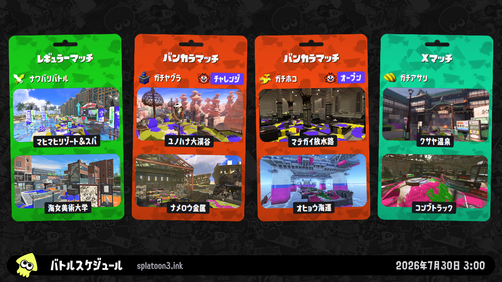</a><br><strong>バトルスケジュール一覧</strong><br><sub>Screenshot ID: <code>schedules</code></sub></td>
    <td width="33%" align="center"><a href="./tests/golden/screenshots/linux-x64/ja-JP/schedules-regular.png">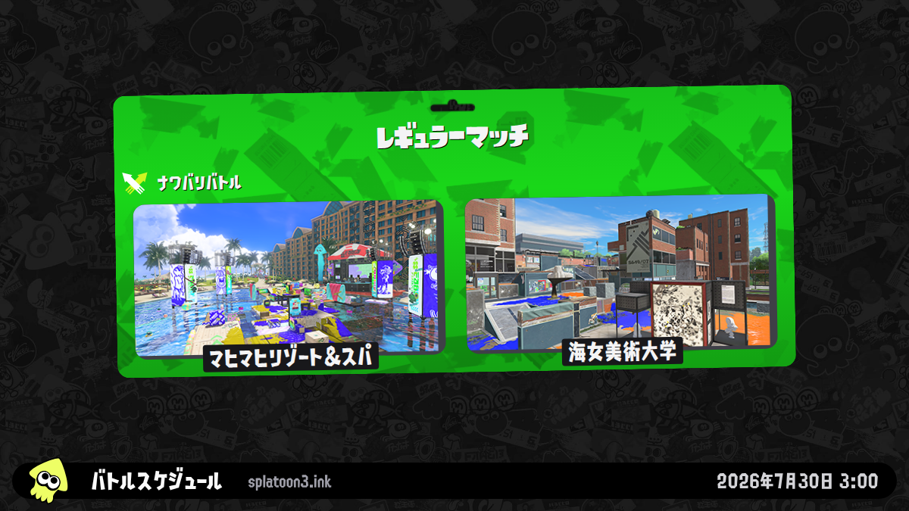</a><br><strong>レギュラーマッチ</strong><br><sub>Screenshot ID: <code>schedules-regular</code></sub></td>
    <td width="33%" align="center"><a href="./tests/golden/screenshots/linux-x64/ja-JP/schedules-anarchy.png">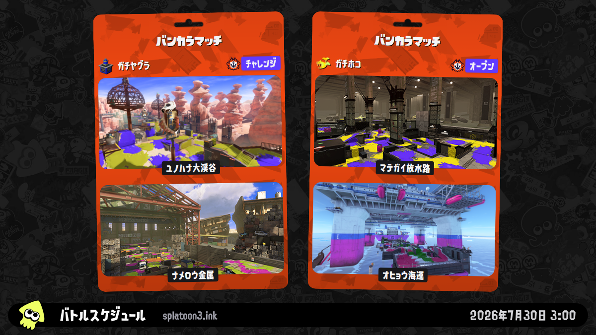</a><br><strong>バンカラマッチ</strong><br><sub>Screenshot ID: <code>schedules-anarchy</code></sub></td>
  </tr>
  <tr>
    <td align="center"><a href="./tests/golden/screenshots/linux-x64/ja-JP/schedules-x.png">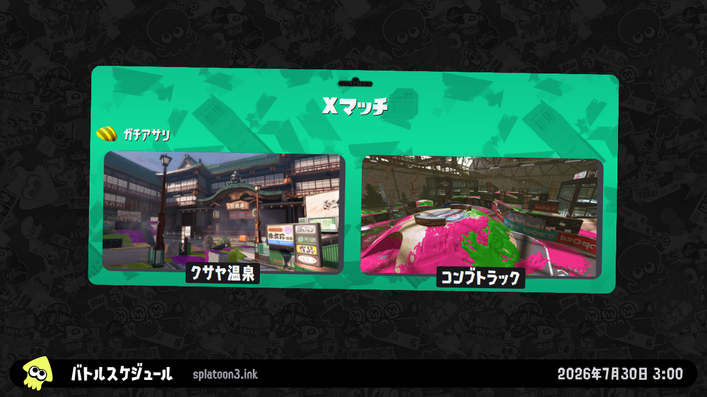</a><br><strong>X マッチ</strong><br><sub>Screenshot ID: <code>schedules-x</code></sub></td>
    <td align="center"><a href="./tests/golden/screenshots/linux-x64/ja-JP/challenges.png">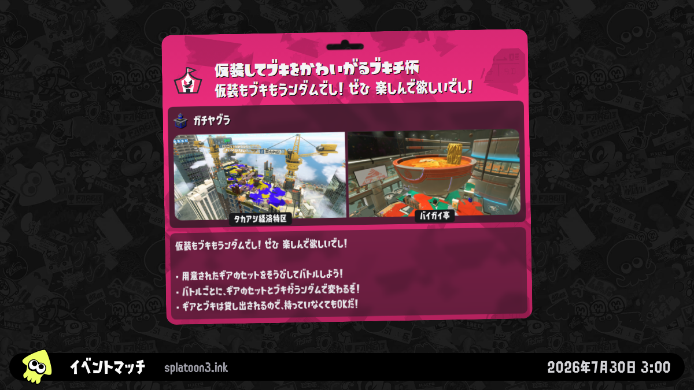</a><br><strong>イベントマッチ</strong><br><sub>Screenshot ID: <code>challenges</code></sub></td>
    <td align="center"><a href="./tests/golden/screenshots/linux-x64/ja-JP/salmon-run.png">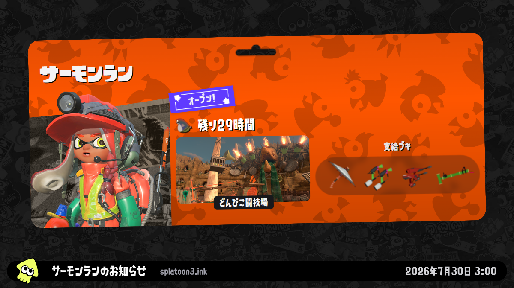</a><br><strong>サーモンラン</strong><br><sub>Screenshot ID: <code>salmon-run</code></sub></td>
  </tr>
  <tr>
    <td align="center"><a href="./tests/golden/screenshots/linux-x64/ja-JP/gear-dailydrop.png"></a><br><strong>今日のピックアップ</strong><br><sub>Screenshot ID: <code>gear-dailydrop</code></sub></td>
    <td align="center"><a href="./tests/golden/screenshots/linux-x64/ja-JP/gear-regular.png">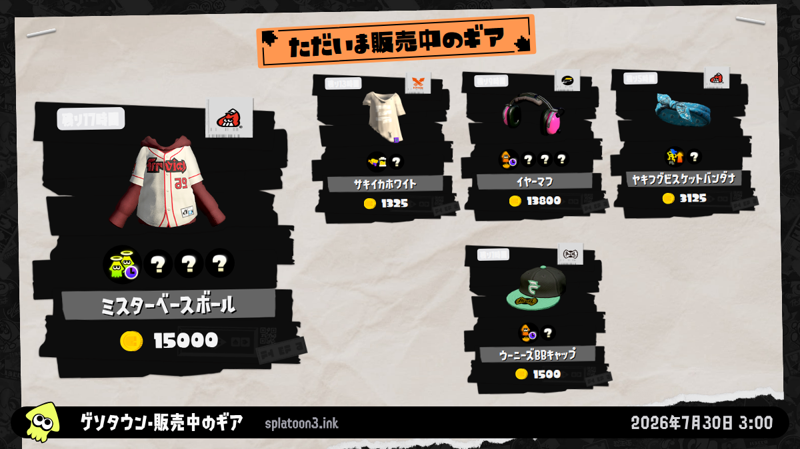</a><br><strong>販売中のギア</strong><br><sub>Screenshot ID: <code>gear-regular</code></sub></td>
    <td align="center"><a href="./tests/golden/screenshots/linux-x64/ja-JP/gear-salmon-run.png">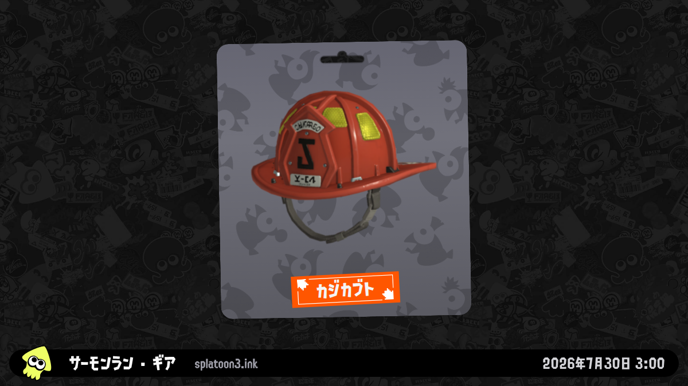</a><br><strong>サーモンラン月間ギア</strong><br><sub>Screenshot ID: <code>gear-salmon-run</code></sub></td>
  </tr>
  <tr>
    <td align="center"><a href="./tests/golden/screenshots/linux-x64/ja-JP/splatfest-na.png"></a><br><strong>フェス · NA</strong><br><sub>Screenshot ID: <code>splatfest-na</code></sub></td>
    <td align="center"><a href="./tests/golden/screenshots/linux-x64/ja-JP/splatfest-eu.png">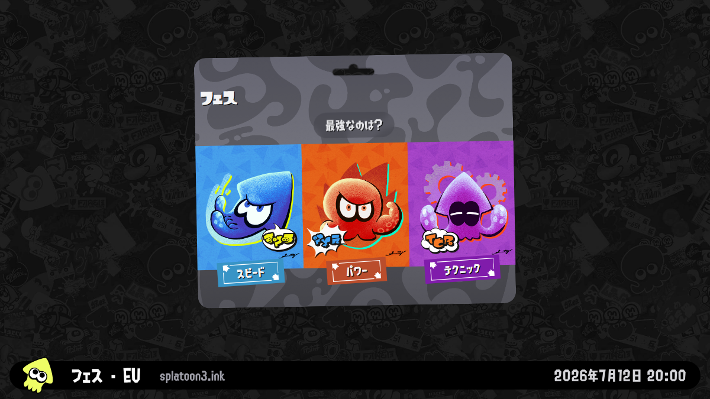</a><br><strong>フェス · EU</strong><br><sub>Screenshot ID: <code>splatfest-eu</code></sub></td>
    <td align="center"><a href="./tests/golden/screenshots/linux-x64/ja-JP/splatfest-jp.png">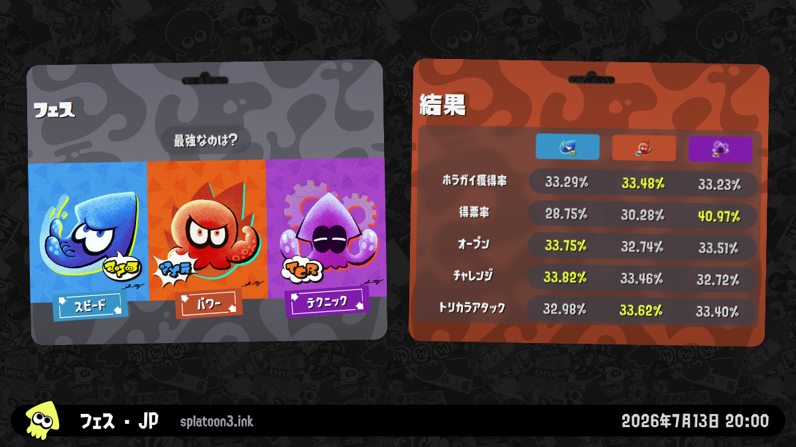</a><br><strong>フェス · JP</strong><br><sub>Screenshot ID: <code>splatfest-jp</code></sub></td>
  </tr>
  <tr>
    <td colspan="3" align="center"><a href="./tests/golden/screenshots/linux-x64/ja-JP/splatfest-ap.png"></a><br><strong>フェス · AP</strong><br><sub>Screenshot ID: <code>splatfest-ap</code></sub></td>
  </tr>
</table>

これらのプレビューは既定解像度 `1200×675` です。画像をクリックするとフルサイズで確認できます。`BOT_SCREENSHOT_RESOLUTION` は、保存する Screenshot Artifact と通知のメイン画像に共通する 4 種類の正確な 16:9 サイズから選択できます。LINE と WhatsApp には個別の `1024×576` 画像を用意し、それぞれの制限を満たしながら他サービスの画質を下げない設計です。

### 生成する画像を選ぶ

手動実行、Smoke Test、設定確認フォームには、Screenshot ID ごとに 1 つのチェックボックスが表示されます。ローカルコマンドも同じ ID をカンマ区切りで直接受け取ります。

| Screenshot ID | 内容 |
| --- | --- |
| `schedules` | レギュラー、バンカラ、X マッチ、または開催中のフェスマッチをまとめた一覧。 |
| `schedules-regular` | レギュラーマッチに絞ったカード。 |
| `schedules-anarchy` | バンカラマッチのチャレンジとオープン。 |
| `schedules-x` | X マッチに絞ったカード。 |
| `challenges` | 開催中または次回のイベントマッチと参加可能時間。 |
| `salmon-run` | 現在のサーモンランシフト。 |
| `gear-dailydrop` | ゲソタウンの今日のピックアップ。 |
| `gear-regular` | ゲソタウンで現在販売中のギア。 |
| `gear-salmon-run` | 現在のサーモンラン月間ギア。 |
| `splatfest-na` | 北米地域のフェス。 |
| `splatfest-eu` | 欧州地域のフェス。 |
| `splatfest-jp` | 日本地域のフェス。 |
| `splatfest-ap` | アジア太平洋地域のフェス。 |

選択内容は自動的に重複排除され、固定順に整列されます。チェックした順序や CLI 引数の順序によって Bot Run の結果は変わりません。

> [!IMPORTANT]
> 地域別フェスの Screenshot ID は Nintendo のデータ地域（`NA`、`EU`、`JP`、`AP`）を選択します。スクリーンショットの翻訳文だけを変更する `BOT_LOCALE` とは独立しています。古いフェスを定期実行で繰り返し通知しないため、対象になるのは開催中、開催予定、または終了後 72 時間未満です。期間外の項目は理由を記録してビルド前に自動スキップされ、ほかの選択項目は継続します。すべて対象外なら、正常な no-op として成功終了します。

## 自動化

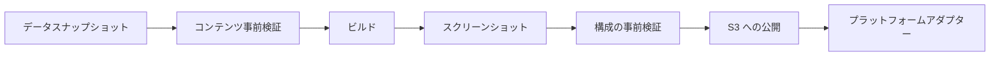

定期実行と手動実行は、すべて同じ 2 段階の処理を使用します。

1. **準備**：一貫したデータ一式を取得・検証し、画像用ページをビルドして、選択された画像を生成・保存します。
2. **公開と通知**：最初のアップロード前にすべての設定を確認し、画像と内蔵アイコンを S3 に公開してから、設定済みの宛先へ並列配信します。

| Workflow | 実行タイミング | 配信内容 |
| --- | --- | --- |
| `bot-schedules.yml` | `02:00` と `10:00` を除く UTC の偶数時 | `schedules` |
| `bot-salmon-run.yml` | UTC `02:00`、`10:00` | `schedules`、`salmon-run`、`gear-dailydrop`、`gear-regular`、`gear-salmon-run` |
| `bot-manual.yml` | 必要なときに手動実行 | 任意の Screenshot ID チェックボックス組み合わせ |
| `configuration-check.yml` | 必要なときに手動実行 | 設定確認のみ。アップロードや送信は行わない |
| `notification-smoke.yml` | 必要なときに手動実行 | 現在の画像を公開し、選択したサービスへテスト通知を 1 件送信 |

定期 Workflow 全体で、スケジュール通知は 2 時間ごとに重複なく 1 回配信されます。外部 Actions はすべて不変の Commit SHA に固定されています。クラウド上の自動実行は GitHub Actions のみをサポートします。

### 配信時刻をカスタマイズする

インストール先の既定ブランチで `.github/workflows/bot-schedules.yml` と `.github/workflows/bot-salmon-run.yml` の `on.schedule` cron 式を編集すると、各モードの配信時刻を変更できます。GitHub は式を UTC として評価します。`BOT_TIME_ZONE` は画像とメッセージに表示する時刻を変更しますが、Actions の起動時刻は変更しません。

GitHub の `on.schedule.cron` は Repository Variables や Secrets を参照できないため、配信時刻用の Variable はありません。GitHub 公式の [`on.schedule` 構文](https://docs.github.com/en/actions/reference/workflows-and-actions/workflow-syntax#onschedule)と [crontab.guru](https://crontab.guru/) を利用してください。1 日 2 回の Workflow もバトルスケジュールを選択しています。重複通知が必要な場合を除き、スケジュール専用 Workflow と同時刻に実行しないでください。

[スクリーンショット一覧](#13-個すべての-screenshot-id)は、選択できる Screenshot ID の完全な一覧でもあります。この一覧は上流の [スクリーンショット用ルート](https://github.com/misenhower/splatoon3.ink/blob/main/src/router/screenshots.js)に沿っており、選択された画像は Bot Run に保存して S3 へ公開し、各アダプターがサービス固有の Card、Embed、画像メッセージ、Template として描画します。

## 設定

Private インストールの <kbd>Settings</kbd> → <kbd>Secrets and variables</kbd> → <kbd>Actions</kbd> で設定します。**Secrets は認証情報、Variables は任意の動作変更に使用します。認証情報を Variable に保存しないでください。**

| 設定レイヤー | GitHub の設定 | 必須 |
| --- | --- | :---: |
| 描画と Workflow の選択肢 | Repository Variables | いいえ。安定した既定値を内蔵 |
| 画像公開 | Repository Secret `S3_CONFIG` | はい |
| 通知先 | 任意の `BOT_*_CONFIG` Repository Secret | いいえ。通知する場合は 1 つ以上追加 |

### Repository Variables

Workflow には安定した既定値があるため、以下の Repository Variable は**すべて任意**です。既定の動作を変更するときだけ追加してください。内蔵の言語とタイムゾーンは `zh-CN` と `Asia/Shanghai` なので、日本向けの値はクイックスタートの手順 4 で設定します。

| Variable | 必須 | 選択肢 / 既定値 | 用途 |
| --- | :---: | --- | --- |
| `BOT_LOCALE` | いいえ | 下表の 14 値；既定 `zh-CN` | スクリーンショットと通知本文の言語。 |
| `BOT_SCREENSHOT_RESOLUTION` | いいえ | `1200x675`、`1920x1080`、`2400x1350`、`3840x2160`；既定 `1200x675` | 保存用画像と通知のメイン画像の正確な寸法。 |
| `BOT_TIME_ZONE` | いいえ | IANA Time Zone；既定 `Asia/Shanghai` | 描画と通知で共有する Time Zone。 |
| `BOT_SCREENSHOT_ATTRIBUTION` | いいえ | 最大 40 文字；既定 `splatoon3.ink` | 画像下部に表示する中立的なクレジット。 |
| `BOT_RUNNER` | いいえ | 既定 `ubuntu-24.04` | 2 つの実行段階で使う GitHub Actions Runner。 |
| `BOT_ARTIFACT_RETENTION_DAYS` | いいえ | `1`–`90`；既定 `7` | 1 回分の実行アーカイブを保存する日数。 |

#### `BOT_LOCALE`

画像と通知メッセージの両方に使う値を 1 つ選択します。

| 値 | 言語 | 地域または表記 |
| --- | --- | --- |
| `de-DE` | ドイツ語 | ドイツ |
| `en-GB` | 英語 | イギリス |
| `en-US` | 英語 | アメリカ |
| `es-ES` | スペイン語 | スペイン |
| `es-MX` | スペイン語 | メキシコ |
| `fr-CA` | フランス語 | カナダ |
| `fr-FR` | フランス語 | フランス |
| `it-IT` | イタリア語 | イタリア |
| `ja-JP` | 日本語 | 日本 |
| `ko-KR` | 韓国語 | 韓国 |
| `nl-NL` | オランダ語 | オランダ |
| `ru-RU` | ロシア語 | ロシア |
| `zh-CN` | 中国語 | 簡体字 |
| `zh-TW` | 中国語 | 繁体字 |

Bot のスクリーンショット生成と通知配信は 14 値すべてに対応します。運用ドキュメントとリポジトリ内のプレビュー画像は、意図的に英語・簡体中国語・日本語の 3 言語だけを維持します。

#### `BOT_SCREENSHOT_RESOLUTION`

| 解像度 | Scale | 用途 |
| --- | :---: | --- |
| `1200x675` | 1× | 既定値。生成が最も速く、転送量と保存容量が最小 |
| `1920x1080` | 1.6× | Full HD。転送量と保存容量は中程度 |
| `2400x1350` | 2× | 高精細。転送量と保存容量が増加 |
| `3840x2160` | 3.2× | 4K 原画像。保存容量とアップロード量が増えます |

既定値は README のプレビューと一致し、Actions の実行時間、S3 の保存容量、メッセージの読み込み負荷を抑えます。より高解像度のメイン画像や保存用画像が必要な場合だけ変更してください。選択した寸法は、保存用画像、`notification-images/` オブジェクト、通知のメイン画像まで一貫して維持されます。LINE は `1 MB` 以下の専用 `1024×576` 画像を使用します。これは LINE の Flex 画像上限 `1024×1024` に収まる、クロップなしで最大の 16:9 サイズです。WhatsApp は `5 MB` のメディア制限に合わせた専用 `1024×576` 画像を使用します。どちらの表示ボタンも、選択した解像度のメイン画像を開きます。

スケジュール、イベントマッチ、サーモンラン、ギア、フェスの Icon はリポジトリ内の Asset から生成され、Content-addressed key で S3 に自動公開されます。公開 Icon URL を別途用意する必要はありません。

### `S3_CONFIG`

GitHub Actions は Workflow 内で画像を生成しますが、GitHub Artifact は認証が必要な保存用ファイルであり、LINE、Discord、WeCom などがメッセージへ直接表示できる公開画像 URL ではありません。そのため、公開処理は次の流れになります。

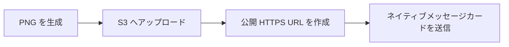

公開読み取りが必要なのは生成画像だけです。S3 の書き込み認証情報は Private インストールの Repository Secret だけに保存します。

#### Secret を設定する

Repository Secret `S3_CONFIG` に YAML オブジェクトを保存します。例の値は利用するサービスが発行した値へ置き換えてください。`publicBaseUrl` には、通知サービスが認証なしで読み取れる公開 HTTPS ルートを指定します。

```yaml
bucket: splatoon-assets
publicBaseUrl: https://splatoon.example.com
accessKeyId: your-s3-access-key
secretAccessKey: your-s3-secret-access-key
region: us-east-1
endpoint: https://s3.example.com
forcePathStyle: true
keyPrefix: splatoon3-bot
```

| Field | 区分 | 既定値 | 説明 |
| --- | :---: | --- | --- |
| `bucket` | 必須 | — | 公開先 Bucket 名。 |
| `publicBaseUrl` | 必須 | — | 認証情報を含まない公開 HTTPS の Bucket ルートまたは CDN URL。`keyPrefix` は含めません。 |
| `accessKeyId` | 必須 | — | アップロード権限を持つ専用 S3 Access Key。オブジェクトを確認できる場合は内蔵アイコンの再アップロードを省略します。 |
| `secretAccessKey` | 必須 | — | `accessKeyId` と組み合わせる Secret Key。 |
| `region` | 任意 | `us-east-1` | Provider の署名 Region。R2 は `auto`。 |
| `endpoint` | 任意 | AWS SDK 既定 | R2、MinIO、Upyun S3 などで必要。 |
| `forcePathStyle` | 任意 | `false` | MinIO と Upyun S3 では通常 `true`。 |
| `keyPrefix` | 任意 | 空 | このプロジェクトのオブジェクトに共通の名前空間を付ける場合。 |
| `sessionToken` | 任意 | 空 | 一時認証情報を使う場合のみ。 |

`endpoint` は認証が必要なアップロード API、`publicBaseUrl` は各通知サービスが認証なしで画像を取得する HTTPS ルートです。通常、この 2 つは異なるドメインです。

<details>
<summary><strong>サービスを選ぶ：公式設定リンク</strong></summary>

標準 S3 API を使用するため、特定のサービスには依存しません。すでに信頼している、または運用中のサービスを選んでください。

| Provider | 主な構成 | 公式ドキュメント |
| --- | --- | --- |
| AWS S3 / CloudFront | AWS Managed Storage と CDN | [Bucket 作成](https://docs.aws.amazon.com/AmazonS3/latest/userguide/GetStartedWithS3.html#creating-bucket) · [Access Key](https://docs.aws.amazon.com/IAM/latest/UserGuide/id_credentials_access-keys.html) · [CloudFront OAC](https://docs.aws.amazon.com/AmazonCloudFront/latest/DeveloperGuide/private-content-restricting-access-to-s3.html) |
| Cloudflare R2 | Cloudflare Storage と Custom Domain | [Get started](https://developers.cloudflare.com/r2/get-started/) · [API Token](https://developers.cloudflare.com/r2/api/tokens/) · [Public bucket](https://developers.cloudflare.com/r2/buckets/public-buckets/) |
| Backblaze B2 | Managed S3-compatible Object Storage | [S3-compatible API](https://www.backblaze.com/docs/cloud-storage-s3-compatible-api) · [Application Key](https://www.backblaze.com/docs/cloud-storage-create-and-manage-app-keys) |
| DigitalOcean Spaces | DigitalOcean Project 向け Managed Storage | [S3 compatibility](https://docs.digitalocean.com/products/spaces/reference/s3-compatibility/) · [Access Key](https://docs.digitalocean.com/products/spaces/how-to/manage-access/) |
| Wasabi | Managed S3-compatible Object Storage | [Service URL と Region](https://docs.wasabi.com/docs/service-urls-for-wasabis-storage-regions) · [Access Key](https://docs.wasabi.com/docs/creating-a-user-account-and-access-key) |
| Scaleway Object Storage | Scaleway Region の S3-compatible Storage | [AWS CLI / S3 setup](https://www.scaleway.com/en/docs/object-storage/api-cli/object-storage-aws-cli/) |
| Tigris | Global distributed S3-compatible Storage | [S3 SDK setup](https://www.tigrisdata.com/docs/sdks/s3/) |
| MinIO / AIStor | Self-hosted または Private-cloud S3 | [Bucket 作成](https://docs.min.io/aistor/reference/cli/mc-mb/) · [Access Key 作成](https://docs.min.io/aistor/reference/cli/admin/mc-admin-accesskey/mc-admin-accesskey-create/) |
| Alibaba Cloud OSS | S3 compatibility を持つ Alibaba Cloud Storage | [Amazon S3 compatibility](https://www.alibabacloud.com/help/en/oss/developer-reference/compatibility-with-amazon-s3) |
| Tencent Cloud COS | AWS S3 SDK に対応する Tencent Cloud Storage | [AWS S3 SDK setup](https://www.tencentcloud.com/document/product/436/41284) |
| Upyun S3 | S3-compatible API 経由の Upyun Storage | [S3 互換性](https://help.upyun.com/knowledge-base/aws-s3%E5%85%BC%E5%AE%B9/) · [S3 API](https://help.upyun.com/knowledge-base/s3-api/) |

</details>

#### Bot がアップロードするもの

`keyPrefix` を設定した場合は、次の各 Path の前に追加されます。

| オブジェクトの接頭辞 | 内容 | 用途と保存方針 |
| --- | --- | --- |
| `notification-images/<sha256>/` | `BOT_SCREENSHOT_RESOLUTION` の正確な寸法で最適化したメイン画像 | WeCom、Discord、Telegram、QQ、Feishu、DingTalk、Slack が表示し、通知内の表示ボタンもこの画像を開きます。 |
| `line-images/<sha256>/` | LINE 専用 `1024×576` PNG。必要な場合だけ Palette PNG へ自動圧縮 | 16:9 の全体を維持し、`1024×1024` の上限と LINE 推奨の `1 MB` 以下を満たします。 |
| `whatsapp-images/<sha256>/` | WhatsApp 専用 `1024×576` PNG | 承認済み Media Template の Image Header に使用し、WhatsApp の `5 MB` 上限以内に保ちます。 |
| `originals/<sha256>/` | 選択した解像度のまま再圧縮していない元の画像ファイル | 高解像度の保存と Publication Manifest の検証に使用します。元画像の履歴が不要なら、短い Lifecycle を設定できます。 |
| `branding-icons/<sha256>/` | スケジュール、イベントマッチ、サーモンラン、ギア、フェス用の内蔵小型アイコン | メッセージカードの見出しやアバターに使用します。自動的にアップロード・再利用され、通常は長期保存できます。 |

> [!NOTE]
> `<sha256>` はファイル内容から計算したダイジェスト値です。同じ画像内容なら同じ URL を再利用し、内容が変わった場合だけ新しい URL を作ります。そのため、後続の実行が過去の通知画像を意図せず置き換えることはありません。

最小権限や公開 URL の注意点は [S3 運用ガイド](./docs/operator-setup-links.md#s3-compatible-publication)を参照してください。

> [!TIP]
> 画像内容が変わるたびに古い URL を上書きせず、新しい版を作成します。接頭辞ごとに Lifecycle rule を設定できます。`notification-images/`、`line-images/`、`whatsapp-images/` は過去のメッセージを表示したい期間、`originals/` は元画像が必要な期間だけ保持し、小さく再利用される `branding-icons/` は通常そのまま保持します。

## 通知プラットフォーム

利用する通知サービスごとに Repository Secret を 1 つ作成します。Secret が存在し、空でなければ対応するアダプターが自動的に有効になり、設定していないサービスは無効のままです。

各サービスの Secret は YAML の配列です。同じサービスに複数のルーム、ユーザー、グループ、Webhook を設定でき、配列の各項目が 1 つの宛先になります。各項目には一意の `name` が必要です。現在の Run で選択された通知の一部だけを受け取る場合に限り、`notifications` リストを追加します。省略するとすべて受信します。宛先は独立して並列実行され、同じ宛先へのメッセージ順序は維持されます。

| 内容 | `notifications` に指定できる Screenshot ID |
| --- | --- |
| バトルスケジュール | `schedules`、`schedules-regular`、`schedules-anarchy`、`schedules-x` |
| イベントマッチ | `challenges` |
| サーモンラン | `salmon-run` |
| ギア | `gear-dailydrop`、`gear-regular`、`gear-salmon-run` |
| 地域別フェス | `splatfest-na`、`splatfest-eu`、`splatfest-jp`、`splatfest-ap` |

| サービス | メッセージ形式 | Repository Secret | 公式設定 |
| --- | --- | --- | --- |
| WeCom | `news_notice` Template Card | `BOT_WECOM_CONFIG` | [Group robot](https://developer.work.weixin.qq.com/document/path/91770) |
| Discord | Image-rich Embed | `BOT_DISCORD_CONFIG` | [Incoming Webhook](https://support.discord.com/hc/en-us/articles/228383668-Intro-to-Webhooks) |
| Telegram | Photo、HTML、URL Button | `BOT_TELEGRAM_CONFIG` | [BotFather](https://core.telegram.org/bots/features#botfather) |
| QQ グループ / ダイレクトチャット | Custom Markdown | `BOT_QQ_CONFIG` | [Official bot](https://bot.q.qq.com/wiki/develop/api-v2/dev-prepare/getting-started.html) |
| Feishu / Lark | Card Schema 2.0 | `BOT_FEISHU_CONFIG` | [Custom bot](https://open.feishu.cn/document/client-docs/bot-v3/add-custom-bot) |
| DingTalk | ActionCard | `BOT_DINGTALK_CONFIG` | [Custom robot](https://open.dingtalk.com/document/robots/custom-robot-access) |
| WhatsApp | Approved media template | `BOT_WHATSAPP_CONFIG` | [Cloud API](https://developers.facebook.com/documentation/business-messaging/whatsapp/get-started) |
| LINE | Flex Message bubble | `BOT_LINE_CONFIG` | [Messaging API](https://developers.line.biz/ja/docs/messaging-api/getting-started/) |
| Slack | Block Kit | `BOT_SLACK_CONFIG` | [Incoming Webhooks](https://docs.slack.dev/messaging/sending-messages-using-incoming-webhooks/) |

#### Secret フィールド早見表

フィールド名は大文字と小文字を区別します。各宛先では、前述の任意 `notifications` リストも使用できます。

| Repository Secret | 各宛先の必須フィールド | 任意フィールド |
| --- | --- | --- |
| `BOT_WECOM_CONFIG` | `name`、`webhookUrl` | — |
| `BOT_DISCORD_CONFIG` | `name`、`webhookUrl` | `username`、`avatarUrl` |
| `BOT_TELEGRAM_CONFIG` | `name`、`botToken`、`chatId` | `messageThreadId`、`disableNotification` |
| `BOT_QQ_CONFIG` | `name`、`appId`、`clientSecret`、`targetType`（`group` または `user`）、`targetId` | — |
| `BOT_FEISHU_CONFIG` | `name`、`webhookUrl` | `secret` |
| `BOT_DINGTALK_CONFIG` | `name`、`webhookUrl` | `secret` |
| `BOT_WHATSAPP_CONFIG` | `name`、`accessToken`、`phoneNumberId`、`recipientPhoneNumber`、`templateName`、`languageCode` | — |
| `BOT_LINE_CONFIG` | `name`、`channelAccessToken`、`targetType`（`user`、`group`、`room`）、`targetId` | `notificationDisabled` |
| `BOT_SLACK_CONFIG` | `name`、`webhookUrl` | — |

各サービスを開くと、そのままコピーできる Secret の例を確認できます。**Settings → Secrets and variables → Actions** に保存する前に、すべてのプレースホルダーを置き換えてください。

<details>
<summary><strong>WeCom · BOT_WECOM_CONFIG</strong> — Template Card と通知別ルーティング</summary>

1 つの Secret から、バトル、イベントマッチ、フェス、サーモンラン、ギアを別々の Group Robot に送信できます。

```yaml
- name: battle-schedules
  notifications:
    - schedules
    - schedules-regular
    - schedules-anarchy
    - schedules-x
    - challenges
    - splatfest-na
    - splatfest-eu
    - splatfest-jp
    - splatfest-ap
  webhookUrl: https://qyapi.weixin.qq.com/cgi-bin/webhook/send?key=REPLACE_WITH_SCHEDULES_KEY
- name: daily-updates
  notifications: [salmon-run, gear-dailydrop, gear-regular, gear-salmon-run]
  webhookUrl: https://qyapi.weixin.qq.com/cgi-bin/webhook/send?key=REPLACE_WITH_UPDATES_KEY
```

| フィールド | 必須 | 説明 |
| --- | --- | --- |
| `name` | はい | 同じ Platform Secret 内で一意となる宛先名。設定検証と配信結果に表示されます。 |
| `notifications` | いいえ | この宛先へ送る Screenshot ID。省略すると今回選択したすべての通知を受信します。 |
| `webhookUrl` | はい | WeCom からコピーした完全な Group Robot Webhook URL。URL 内の `key` は認証情報です。 |

</details>

<details>
<summary><strong>Discord · BOT_DISCORD_CONFIG</strong> — 画像付き Embed</summary>

Webhook が送信先 Channel を決定します。表示名と Avatar の上書きは任意です。

```yaml
- name: splatoon-community
  webhookUrl: https://discord.com/api/webhooks/123456789012345678/example-token
  username: Splatoon Bot
  avatarUrl: https://splatoon.example.com/bot-avatar.png
```

| フィールド | 必須 | 説明 |
| --- | --- | --- |
| `name` | はい | 同じ Platform Secret 内で一意となる宛先名。 |
| `notifications` | いいえ | この Webhook が受信する通知のサブセット。 |
| `webhookUrl` | はい | 完全な Discord Incoming Webhook URL。URL 自体が認証情報を含みます。 |
| `username` | いいえ | Webhook が送信するメッセージの表示名。 |
| `avatarUrl` | いいえ | Webhook Avatar として使う公開 HTTPS 画像。 |

</details>

<details>
<summary><strong>Telegram · BOT_TELEGRAM_CONFIG</strong> — 画像、HTML Caption、URL Button</summary>

Bot は対象 Chat へ送信できる状態である必要があります。Forum Topic では `messageThreadId` も指定します。

```yaml
- name: community-topic
  botToken: "123456:example_bot_token"
  chatId: "-1001234567890"
  messageThreadId: 42
  disableNotification: false
```

| フィールド | 必須 | 説明 |
| --- | --- | --- |
| `name` | はい | 同じ Platform Secret 内で一意となる宛先名。 |
| `notifications` | いいえ | この Chat または Topic が受信する通知のサブセット。 |
| `botToken` | はい | BotFather が発行した Token。Repository Secret 以外には保存しないでください。 |
| `chatId` | はい | User、Group、Supergroup、Channel の ID。負数は YAML で引用符を付けることを推奨します。 |
| `messageThreadId` | いいえ | Supergroup 内の正の Forum Topic ID。 |
| `disableNotification` | いいえ | `true` なら Silent Message。省略時は Telegram の既定動作です。 |

</details>

<details>
<summary><strong>QQ · BOT_QQ_CONFIG</strong> — Group / Direct Chat Markdown</summary>

この定期実行アダプターは QQ Group と Direct Chat に対応します。QQ Channel は常時接続の Gateway が別途必要なため、設定の事前検証で拒否されます。

```yaml
- name: official-group
  appId: "102000000"
  clientSecret: "example-client-secret"
  targetType: group
  targetId: GROUP_OPENID
```

| フィールド | 必須 | 説明 |
| --- | --- | --- |
| `name` | はい | 同じ Platform Secret 内で一意となる宛先名。 |
| `notifications` | いいえ | この Group または User が受信する通知のサブセット。 |
| `appId` | はい | QQ 公式 Bot の AppID。 |
| `clientSecret` | はい | Access Token の取得に使用する Bot ClientSecret。 |
| `targetType` | はい | Group OpenID は `group`、User OpenID は `user`。 |
| `targetId` | はい | QQ の公式 Interaction Event から取得した Group または User OpenID。 |

</details>

<details>
<summary><strong>Feishu / Lark · BOT_FEISHU_CONFIG</strong> — Card Schema 2.0</summary>

Custom Bot で署名検証を有効にした場合は、署名用の `secret` も指定します。

```yaml
- name: team-group
  webhookUrl: https://open.feishu.cn/open-apis/bot/v2/hook/REPLACE_WITH_HOOK_ID
  secret: "example-signing-secret"
```

| フィールド | 必須 | 説明 |
| --- | --- | --- |
| `name` | はい | 同じ Platform Secret 内で一意となる宛先名。 |
| `notifications` | いいえ | この Group が受信する通知のサブセット。 |
| `webhookUrl` | はい | Feishu または Lark からコピーした完全な Custom Bot Webhook。 |
| `secret` | いいえ | Custom Bot の Security 設定で署名検証を有効にした場合の署名鍵。 |

</details>

<details>
<summary><strong>DingTalk · BOT_DINGTALK_CONFIG</strong> — ActionCard</summary>

署名方式の Security 設定を推奨します。Keyword のみの設定では生成メッセージが拒否されることがあります。

```yaml
- name: team-group
  webhookUrl: https://oapi.dingtalk.com/robot/send?access_token=example-access-token
  secret: "SECexample-signing-secret"
```

| フィールド | 必須 | 説明 |
| --- | --- | --- |
| `name` | はい | 同じ Platform Secret 内で一意となる宛先名。 |
| `notifications` | いいえ | この Group が受信する通知のサブセット。 |
| `webhookUrl` | はい | Access Token を含む完全な Custom Robot Webhook。 |
| `secret` | いいえ | 署名を有効にした場合に使う `SEC...` 形式の署名鍵。 |

</details>

<details>
<summary><strong>WhatsApp · BOT_WHATSAPP_CONFIG</strong> — 承認済み Media Template</summary>

`IMAGE` Header、名前付き Body Parameter、動的 URL Button を持つ Template を先に承認してください。Button の Prefix は `S3_CONFIG.publicBaseUrl` と `keyPrefix` を連結した値に一致させます。

```yaml
- name: personal-updates
  accessToken: "REPLACE_WITH_ACCESS_TOKEN"
  phoneNumberId: "123456789012345"
  recipientPhoneNumber: "819012345678"
  templateName: splatoon_notification
  languageCode: ja
```

| フィールド | 必須 | 説明 |
| --- | --- | --- |
| `name` | はい | 同じ Platform Secret 内で一意となる宛先名。 |
| `notifications` | いいえ | Opt-in 済みの受信者へ送る通知のサブセット。 |
| `accessToken` | はい | 対象 WhatsApp Business Account への権限を持つ Meta Cloud API Token。 |
| `phoneNumberId` | はい | 登録済み送信番号の数値 ID。表示される電話番号そのものではありません。 |
| `recipientPhoneNumber` | はい | Opt-in 済み受信者の E.164 数字列。先頭の `+` は付けません。 |
| `templateName` | はい | 定期メッセージに使う承認済みの小文字 Template 名。 |
| `languageCode` | はい | 承認済み Template 言語の正確な Code。日本語例は `ja`。 |

</details>

<details>
<summary><strong>LINE · BOT_LINE_CONFIG</strong> — Flex Message Bubble</summary>

宛先には Push Message の受信資格が必要です。ID の Prefix は選択した宛先種別と一致させます。

```yaml
- name: personal-chat
  channelAccessToken: "example-channel-access-token"
  targetType: user
  targetId: U0123456789abcdef0123456789abcdef
  notificationDisabled: false
```

| フィールド | 必須 | 説明 |
| --- | --- | --- |
| `name` | はい | 同じ Platform Secret 内で一意となる宛先名。 |
| `notifications` | いいえ | この受信者へ送る通知のサブセット。 |
| `channelAccessToken` | はい | LINE Developers で発行した Messaging API Channel Access Token。 |
| `targetType` | はい | `user`、`group`、`room` のいずれか。 |
| `targetId` | はい | Webhook Event の Source ID。種別に応じて `U`、`C`、`R` で始まります。 |
| `notificationDisabled` | いいえ | `true` なら LINE が対応する場面で User Notification を抑制します。 |

</details>

<details>
<summary><strong>Slack · BOT_SLACK_CONFIG</strong> — Accessible Block Kit</summary>

各 Incoming Webhook は Slack App の Installation と送信先 Channel に紐付きます。

```yaml
- name: team-channel
  webhookUrl: https://hooks.slack.com/services/T/B/key
```

| フィールド | 必須 | 説明 |
| --- | --- | --- |
| `name` | はい | 同じ Platform Secret 内で一意となる宛先名。 |
| `notifications` | いいえ | この Channel が受信する通知のサブセット。 |
| `webhookUrl` | はい | Slack または Slack Gov の公式 Incoming Webhook URL。URL 自体が認証情報です。 |

</details>

[サービス別設定ガイド](./docs/operator-setup-links.md#notification-adapters)では、認証情報の前提、受信者の条件、公式手順へのリンクを詳しく説明しています。[機能監査](./docs/notification-platform-capabilities.md)では、各サービスで現在のメッセージ形式を採用した理由を説明しています。

## 信頼性

無人運用に適しているか確認したい場合は、次の仕組みを確認してください。

- データ取得には再試行とタイムアウトがあり、新しい一式が Schema 検証をすべて通過した場合だけ以前の有効データを置き換えます。
- 画像生成はアプリ、フォント、ローカル画像の準備を待ち、言語、クレジット、寸法、フッター位置、はみ出しを検査します。
- Run Manifest v6 は選択した Screenshot ID と「何を生成したか」を記録します。言語、解像度、タイムゾーン、データ ID、ファイル名、寸法、SHA-256 が対象です。
- Publication Manifest v8 は同じ Screenshot ID の選択と「何を公開したか」を記録します。通知用メイン画像、LINE・WhatsApp 専用画像、原画像、内蔵アイコン、公開 URL が対象です。
- 設定の事前検証は、最初のアップロード前に独立したエラーをまとめて報告し、Secret の値を表示しません。
- 宛先は独立して実行されます。1 つの宛先が失敗しても、ほかの宛先への配信成功は保持され、最後に失敗理由をまとめて報告します。
- CI は Git 履歴全体を Secret scan し、Syntax、Unit、Browser、Visual、Build、Workflow policy、Dependency audit を実行します。

構造検証では、対応するすべての Bot 言語で 13 種類の画像を生成します。英語・簡体中国語・日本語では Linux と macOS の Pixel Golden も管理し、差分が `0.1%` を超えると失敗します。

## ローカル開発

このセクションは、開発参加者とローカルでデバッグしたい上級ユーザー向けです。Template 利用者は読み飛ばせます。通常の利用者は Template からインストール先を作成し、Pull Request を送る開発参加者は公開ソースリポジトリを Fork してください。

Node.js 24 LTS と、Major version 11 の pnpm 11.18 以上が必要です。

```sh
git clone https://github.com/YOUR_GITHUB_USERNAME/splatoon3-bot.git
cd splatoon3-bot
git remote add upstream https://github.com/TenviLi/splatoon3-bot.git
corepack enable
pnpm install --frozen-lockfile --strict-peer-dependencies
pnpm run download-data
pnpm run verify
```

| Command | 用途 |
| --- | --- |
| `pnpm run bot:doctor <screenshot-ids> [channel]` | 設定を検証。Screenshot ID は `schedules,gear-regular` のようにカンマで区切る。 |
| `pnpm run bot:prepare <screenshot-ids>` | データ取得、ビルド、画像生成、Run Manifest 作成。 |
| `pnpm run bot:publish <screenshot-ids>` | S3 へ検証済み画像を公開。 |
| `pnpm run bot:notify <screenshot-ids> [channel]` | 設定済みサービスへ配信。 |
| `pnpm run test:update-golden` | 現在の OS 用に 3 言語の画像比較基準を生成。 |
| `pnpm run screenshots:contact-sheet -- --locale ja-JP` | 現在の OS の Golden から、全 Screenshot Artifact の名前付き一覧画像を生成。レイアウトと出力先は `--help` で確認。 |
| `pnpm run verify` | 完全なローカル検証。 |
| `pnpm run verify:actions` | OrbStack と `act` で Linux Actions を検証。 |

## コントリビューション

画像と通知の再現性を保ち、Run Plan と Manifest の境界を維持し、動作変更に対応する契約 Test を更新してください。詳しい手順は [CONTRIBUTING.md](./CONTRIBUTING.md)、脆弱性の非公開報告は [SECURITY.md](./SECURITY.md) を参照してください。

## ライセンス

[GNU General Public License v3.0](./LICENSE) で公開しています。Nintendo とは無関係の非公式ファンプロジェクトです。

Vue アプリケーションのコードは [misenhower/splatoon3.ink](https://github.com/misenhower/splatoon3.ink) を基にしています。原プロジェクトのメンテナーとコントリビューターに感謝し、MIT License の表示を [THIRD_PARTY_NOTICES.md](./THIRD_PARTY_NOTICES.md) に保持しています。
