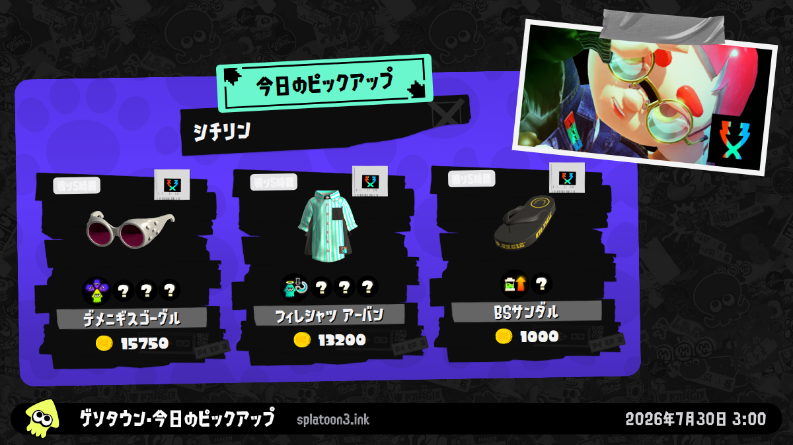
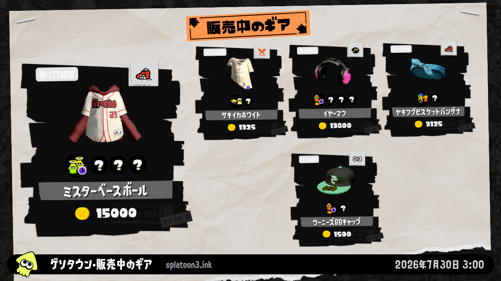

<p align="center">
  <a href="./README.md">English</a> · <a href="./README.zh-CN.md">简体中文</a> · <strong>日本語</strong>
</p>

<p align="center">
  
</p>

<h1 align="center">splatoon3-bot</h1>

<p align="center">
  Splatoon 3 のスクリーンショットを再現可能に生成し、各サービスに最適化したリッチ通知を配信します。<br>
  自分専用の Private repository を用意すれば、運用は GitHub Actions に任せられます。
</p>

<p align="center">
  <a href="https://github.com/TenviLi/splatoon3-bot/actions/workflows/ci.yml"></a>
  
  
  
</p>

<p align="center">
  <a href="#クイックスタート">クイックスタート</a> ·
  <a href="#スクリーンショット">スクリーンショット</a> ·
  <a href="#設定">設定</a> ·
  <a href="#通知プラットフォーム">通知</a> ·
  <a href="#信頼性">信頼性</a>
</p>

## 特長

`splatoon3-bot` は、検証済みの [Splatoon 3](https://splatoon3.ink/) Data Snapshot から再現可能な Screenshot Artifact を生成し、S3 互換ストレージへ公開して、設定済みの宛先へ並列配信します。

<table>
  <tr>
    <td width="33%" align="center"><strong>決定論的レンダリング</strong><br><sub>データ、時刻、言語、Viewport、フォント、画像、寸法、Visual Golden を固定。</sub></td>
    <td width="33%" align="center"><strong>ポータブルな公開</strong><br><sub>AWS S3、Cloudflare R2、MinIO、Upyun S3 などの SigV4 互換サービス。</sub></td>
    <td width="33%" align="center"><strong>ネイティブな表現</strong><br><sub>Template Card、Embed、Flex Message、Block Kit、承認済み Media Template。</sub></td>
  </tr>
  <tr>
    <td width="33%" align="center"><strong>並列・部分成功</strong><br><sub>Channel と Target を並列化し、同じ Target 内の通知順序は維持。</sub></td>
    <td width="33%" align="center"><strong>Manifest 整合性</strong><br><sub>ハッシュ、URL、寸法、描画条件、データ ID を全工程で関連付け。</sub></td>
    <td width="33%" align="center"><strong>CI ファースト</strong><br><sub>固定 SHA の Actions、厳密な YAML、Environment、監査、Linux 検証。</sub></td>
  </tr>
</table>

**WeCom、Discord、Telegram、QQ、Feishu、DingTalk、WhatsApp、LINE、Slack** の 9 アダプターを搭載しています。各サービス向けレイアウトの設計根拠は [通知プラットフォーム能力監査](./docs/notification-platform-capabilities.md) を参照してください。

## スクリーンショット

### 4 種類の決定論的 Screenshot Artifact

<table>
  <tr>
    <td align="center"><br><sub><code>schedules.ja.png</code></sub></td>
    <td align="center"><br><sub><code>salmon-run.ja.png</code></sub></td>
  </tr>
  <tr>
    <td align="center"><br><sub><code>gear-dailydrop.ja.png</code></sub></td>
    <td align="center"><br><sub><code>gear-regular.ja.png</code></sub></td>
  </tr>
</table>

論理 Viewport は常に `1200×675` です。`BOT_SCREENSHOT_RESOLUTION` で正確な 16:9 の原画像サイズを選択し、公開時には各通知サービス向けの `1024×576` 画像も生成します。

## クイックスタート

### 自分の Private repository に Fork して実行する

インストールごとに、自分の GitHub アカウントで Private repository を管理します。このリポジトリがデプロイと信頼の境界となり、コード、スケジュール、Repository Secrets、Repository Variables、Environment、配信先を所有します。

<p align="center">
  <a href="https://github.com/TenviLi/splatoon3-bot/fork"><strong>Fork または Private インストールを作成 →</strong></a>
</p>

> [!TIP]
> Hosted 運用に必要なのは GitHub Actions、S3 互換 Bucket、通知先 1 つだけです。Node.js、pnpm、Chrome、Docker、常駐サーバーを自分で用意する必要はありません。

1. 自分の GitHub アカウントにインストール用リポジトリを作成します。可視性と組織ポリシーが Private fork を許可している場合は **Fork** を使います。[Public repository の Fork は常に Public](https://docs.github.com/ja/pull-requests/collaborating-with-pull-requests/working-with-forks/about-permissions-and-visibility-of-forks#about-visibility-of-forks) になるため、Private fork を作れない場合は [GitHub Importer](https://github.com/new/import) または独立した Private mirror を利用してください。
2. [`S3_CONFIG` の例](#s3_config)から同名の Repository Secret を作成します。
3. 日本語版のクイックスタートでは LINE Messaging API を例にします。LINE Official Account と Messaging API channel を作成し、Repository Secret `BOT_LINE_CONFIG` を保存します。

   ```yaml
   - name: personal-line
     channelAccessToken: "..."
     targetType: user
     targetId: U0123456789abcdef0123456789abcdef
     notificationDisabled: false
   ```

   LINE の [Messaging API 導入手順](https://developers.line.biz/ja/docs/messaging-api/getting-started/) と [Channel access token](https://developers.line.biz/ja/docs/basics/channel-access-token/) を確認するか、[通知プラットフォーム](#通知プラットフォーム)から別のアダプターを選択してください。
4. Repository Variable `BOT_LOCALE` を `ja-JP`、`BOT_TIME_ZONE` を `Asia/Tokyo` に設定します。`BOT_SCREENSHOT_RESOLUTION` など、その他の [Repository Variables](#repository-variables) は既定値を変更するときだけ追加します。
5. <kbd>Actions</kbd> を開き、必要に応じて Workflow を有効化して、Profile `all` で **Check Bot Configuration** を実行します。アップロードや送信を行わずに設定を検証します。
6. 設定した Channel に対して **Notification Channel smoke test** を実行します。これは S3 公開と実際の配信先を確認する、意図的に副作用を持つ最終テストです。

> [!IMPORTANT]
> 本番 Credential は、自分の Private インストールの Repository Secrets にだけ保存してください。ソースコード、Pull Request、ログへ記録してはいけません。

> [!CAUTION]
> 既定ブランチの Workflow は Credential を利用できます。上流の変更を同期する前に、特に `.github/workflows/`、`bot/`、`scripts/` を確認し、漏えいした Credential は直ちにローテーションしてください。

## 自動化

<p align="center">
  <strong>Data Snapshot</strong> → <strong>Build</strong> → <strong>Screenshot</strong> → <strong>Preflight</strong> → <strong>S3</strong> → <strong>Adapters</strong>
</p>

定期実行と手動実行は、同じ 2 段階の Reusable Workflow を使用します。

1. **Prepare** は 1 つの完全な Data Snapshot を取得・検証し、Frontend を Build して、選択された Screenshot Artifact をまとめます。
2. **Publish and notify** は Archive を 1 回だけ取得し、副作用の前に設定を一括検証して、画像と内蔵 Icon を S3 に公開した後、すべての Channel と Target を同じ Job 内で並列実行します。

| Workflow | Trigger | Run Profile |
| --- | --- | --- |
| `bot-schedules.yml` | その他の UTC 偶数時 | `schedules` |
| `bot-salmon-run.yml` | UTC `02:00`、`10:00` | `all` |
| `bot-manual.yml` | 手動選択 | 任意の Profile |
| `configuration-check.yml` | 手動選択 | Preflight のみ |
| `notification-smoke.yml` | Profile と Channel を手動選択 | 完全な実配信テスト |

定期 Workflow 全体で、スケジュール通知は 2 時間ごとに重複なく 1 回配信されます。外部 Actions はすべて不変の Commit SHA に固定されています。Hosted automation は GitHub Actions のみをサポートします。

## 設定

インストール先リポジトリの <kbd>Settings</kbd> → <kbd>Secrets and variables</kbd> → <kbd>Actions</kbd> で設定します。

### Repository Variables

| Variable | 選択肢 / 既定値 | 用途 |
| --- | --- | --- |
| `BOT_LOCALE` | `en-US`、`zh-CN`、`ja-JP`；既定 `zh-CN` | スクリーンショットと通知本文の言語。 |
| `BOT_SCREENSHOT_RESOLUTION` | `1200x675`、`1920x1080`、`2400x1350`、`3840x2160`；既定 `2400x1350` | 原画像の正確な寸法。 |
| `BOT_TIME_ZONE` | IANA Time Zone；既定 `Asia/Shanghai` | 描画と通知で共有する Time Zone。 |
| `BOT_SCREENSHOT_ATTRIBUTION` | 最大 40 文字；既定 `splatoon3.ink` | Footer に表示する中立的なクレジット。 |
| `BOT_RUNNER` | 既定 `ubuntu-24.04` | 2 つの Bot Run Job で使う Runner。 |
| `BOT_ENVIRONMENT` | 既定 `production` | 公開を Gate する GitHub Environment。 |
| `BOT_CONCURRENCY_GROUP` | 既定 `splatoon3-bot-production` | Production Bot Run を直列化。 |
| `BOT_ARTIFACT_RETENTION_DAYS` | `1`–`90`；既定 `7` | Bot Run Archive の保存日数。 |

| 解像度 | Scale | 用途 |
| --- | :---: | --- |
| `1200x675` | 1× | 小さい Artifact と Visual Test |
| `1920x1080` | 1.6× | Full HD 原画像 |
| `2400x1350` | 2× | 画質と容量の推奨バランス |
| `3840x2160` | 3.2× | 4K 原画像。Archive と Upload は大きくなります |

スケジュール、サーモンラン、ギアの Icon はリポジトリ内の Asset から生成され、Content-addressed key で S3 に自動公開されます。公開 Icon URL を別途用意する必要はありません。

### `S3_CONFIG`

Repository Secret `S3_CONFIG` に、次のような厳密な YAML Mapping を保存します。

```yaml
bucket: splatoon-assets
publicBaseUrl: https://splatoon.example.com
accessKeyId: your-s3-access-key
secretAccessKey: your-s3-secret-access-key
region: us-east-1
endpoint: https://s3.example.com
forcePathStyle: true
keyPrefix: splatoon3-bot
```

**必須フィールド**

| Field | 説明 |
| --- | --- |
| `bucket` | 公開先 Bucket 名。 |
| `publicBaseUrl` | Credential を含まない Public HTTPS の Bucket root または CDN URL。`keyPrefix` は含めません。 |
| `accessKeyId` | Upload 権限を持つ専用 S3 Access Key。Object を確認できる場合は内蔵 Icon の再 Upload を省略します。 |
| `secretAccessKey` | `accessKeyId` と組み合わせる Secret Key。 |

**任意フィールド**

| Field | 既定値 | 設定する場合 |
| --- | --- | --- |
| `region` | `us-east-1` | Provider の署名 Region。R2 は `auto`。 |
| `endpoint` | AWS SDK 既定 | R2、MinIO、Upyun S3 などで必要。 |
| `forcePathStyle` | `false` | MinIO と Upyun S3 では通常 `true`。 |
| `keyPrefix` | 空 | Project Object に Namespace を付ける場合。 |
| `sessionToken` | 空 | 一時 Credential の場合のみ。 |

`endpoint` は Upload API、`publicBaseUrl` は各通知サービスが画像を取得する URL です。Publisher は通知画像、原画像、内蔵 Icon を Content-addressed object として保存し、寸法・ハッシュ・URL を Publication Manifest に記録します。

| Provider | 公式ドキュメント |
| --- | --- |
| AWS S3 / CloudFront | [Bucket 作成](https://docs.aws.amazon.com/AmazonS3/latest/userguide/GetStartedWithS3.html#creating-bucket) · [Access Key](https://docs.aws.amazon.com/IAM/latest/UserGuide/id_credentials_access-keys.html) · [CloudFront OAC](https://docs.aws.amazon.com/AmazonCloudFront/latest/DeveloperGuide/private-content-restricting-access-to-s3.html) |
| Cloudflare R2 | [Get started](https://developers.cloudflare.com/r2/get-started/) · [API Token](https://developers.cloudflare.com/r2/api/tokens/) · [Public bucket](https://developers.cloudflare.com/r2/buckets/public-buckets/) |
| MinIO / AIStor | [Bucket 作成](https://docs.min.io/aistor/reference/cli/mc-mb/) · [Access Key 作成](https://docs.min.io/aistor/reference/cli/admin/mc-admin-accesskey/mc-admin-accesskey-create/) |
| Upyun S3 | [S3 互換性](https://help.upyun.com/knowledge-base/aws-s3%E5%85%BC%E5%AE%B9/) · [S3 API](https://help.upyun.com/knowledge-base/s3-api/) |

最小権限や Public URL の注意点は [S3 Operator Guide](./docs/operator-setup-links.md#s3-compatible-publication) を参照してください。

> [!TIP]
> Content-addressed object は意図的に蓄積します。過去の通知内リンクを維持したい期間に合わせて、`notification-images/` と `originals/` の S3 Lifecycle policy を設定してください。

## 通知プラットフォーム

Channel Secret が存在し、空でなければ、そのアダプターは自動的に有効になります。各 Secret は Target Mapping の直接かつ空でない YAML Sequence です。Target の `name` は一意にし、配信対象を限定するときだけ `notifications` を追加します。

| Platform | ネイティブ表現 | Repository Secret | 公式設定 |
| --- | --- | --- | --- |
| WeCom | `news_notice` Template Card | `BOT_WECOM_CONFIG` | [Group robot](https://developer.work.weixin.qq.com/document/path/91770) |
| Discord | Image-rich Embed | `BOT_DISCORD_CONFIG` | [Incoming Webhook](https://support.discord.com/hc/en-us/articles/228383668-Intro-to-Webhooks) |
| Telegram | Photo、HTML、URL Button | `BOT_TELEGRAM_CONFIG` | [BotFather](https://core.telegram.org/bots/features#botfather) |
| QQ | Embed / Custom Markdown | `BOT_QQ_CONFIG` | [Official bot](https://bot.q.qq.com/wiki/develop/api-v2/dev-prepare/getting-started.html) |
| Feishu / Lark | Card Schema 2.0 | `BOT_FEISHU_CONFIG` | [Custom bot](https://open.feishu.cn/document/client-docs/bot-v3/add-custom-bot) |
| DingTalk | ActionCard | `BOT_DINGTALK_CONFIG` | [Custom robot](https://open.dingtalk.com/document/robots/custom-robot-access) |
| WhatsApp | Approved media template | `BOT_WHATSAPP_CONFIG` | [Cloud API](https://developers.facebook.com/documentation/business-messaging/whatsapp/get-started) |
| LINE | Flex Message bubble | `BOT_LINE_CONFIG` | [Messaging API](https://developers.line.biz/ja/docs/messaging-api/getting-started/) |
| Slack | Block Kit | `BOT_SLACK_CONFIG` | [Incoming Webhooks](https://docs.slack.dev/messaging/sending-messages-using-incoming-webhooks/) |

[Operator Setup Directory](./docs/operator-setup-links.md#notification-adapters) には全 Platform の必須 Field、Credential、送信対象条件、公式リンクがあります。[Capability Audit](./docs/notification-platform-capabilities.md) では各 Native Layout の選定理由を説明しています。

## 信頼性

- Data Snapshot は Retry と Timeout 付きで並列取得され、Schema 検証後に Atomic replace されます。
- Screenshot は Application、Font、Local image の準備完了を待ち、言語、クレジット、寸法、Footer、Overflow を検証します。
- Run Manifest v4 は Locale、Resolution、Time Zone、Data Snapshot ID、Filename、寸法、SHA-256 を記録します。
- Publication Manifest v3 は Bot Run と通知画像、原画像、内蔵 Icon、Public URL を厳密に関連付けます。
- Configuration Preflight は最初の Upload 前に独立した設定エラーをまとめ、Secret の値を表示しません。
- Channel と Target は並列実行され、成功済みの結果を保持したまま最後に失敗を集約します。
- CI は Git 履歴全体を Secret scan し、Syntax、Unit、Browser、Visual、Build、Workflow policy、Dependency audit を実行します。

Visual Test は Linux と macOS のそれぞれで、英語・簡体中国語・日本語の 4 枚組を管理します。Pixel 差分が `0.1%` を超えると失敗します。

## ローカル開発

このセクションは Contributor と高度な Operator 向けです。Hosted 運用には不要です。

Node.js 24 LTS と、Major version 11 の pnpm 11.18 以上が必要です。

```sh
git clone git@github.com:YOUR_GITHUB_USERNAME/splatoon3-bot.git
cd splatoon3-bot
corepack enable
pnpm install --frozen-lockfile --strict-peer-dependencies
pnpm run download-data
pnpm run verify
```

| Command | 用途 |
| --- | --- |
| `pnpm run bot:doctor <profile> [channel]` | 副作用なしで設定を検証。 |
| `pnpm run bot:prepare <profile>` | Download、Build、Render、Run Manifest 作成。 |
| `pnpm run bot:publish <profile>` | S3 へ検証済み画像を公開。 |
| `pnpm run bot:notify <profile> [channel]` | 設定済み Channel へ配信。 |
| `pnpm run test:update-golden` | 現在の Platform 用に 3 言語の Golden を生成。 |
| `pnpm run verify` | 完全なローカル検証。 |
| `pnpm run verify:actions` | OrbStack と `act` で Linux Actions を検証。 |

## ライセンス

[GNU General Public License v3.0](./LICENSE) で公開しています。Nintendo とは無関係の非公式ファンプロジェクトです。
