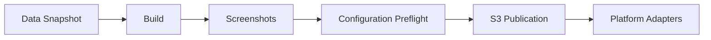
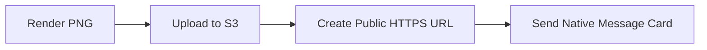

<p align="center">
  <strong>English</strong> · <a href="./README.zh-CN.md">简体中文</a> · <a href="./README.ja.md">日本語</a>
</p>

<p align="center">
  
</p>

<h1 align="center">splatoon3-bot</h1>

<p align="center">
  Deterministic Splatoon 3 screenshots and native rich notifications.<br>
  Create a private installation from the template, configure GitHub, and let Actions operate the bot for you.
</p>

<p align="center">
  <a href="https://github.com/TenviLi/splatoon3-bot/generate"></a>
  <a href="https://github.com/TenviLi/splatoon3-bot/actions/workflows/ci.yml"></a>
  
  
  
  <a href="./LICENSE"></a>
</p>

<p align="center">
  <a href="#quick-start">Quick Start</a> ·
  <a href="#preview">Screenshots</a> ·
  <a href="#configuration">Configuration</a> ·
  <a href="#automation">Automation</a> ·
  <a href="#notification-channels">Channels</a> ·
  <a href="#local-development">Development</a>
</p>

## What It Does

`splatoon3-bot` is a GitHub Actions-powered notification bot for [Splatoon 3](https://splatoon3.ink/). It fetches one consistent set of game data, renders four predictable screenshots, publishes them through an S3-compatible service, and sends a polished native message to every destination you configure.

<table>
  <tr>
    <td width="33%" align="center"><strong>Four stable screenshots</strong><br><sub>Battle schedules, Salmon Run, Daily Drop gear, and regular gear at an exact 16:9 size.</sub></td>
    <td width="33%" align="center"><strong>Bring your own S3</strong><br><sub>AWS S3, Cloudflare R2, MinIO, Upyun S3, and other SigV4-compatible services.</sub></td>
    <td width="33%" align="center"><strong>Native rich messages</strong><br><sub>Cards, Embeds, Flex Messages, Block Kit, and approved media templates—not plain-text dumps.</sub></td>
  </tr>
  <tr>
    <td width="33%" align="center"><strong>Many destinations</strong><br><sub>One platform Secret can contain multiple rooms, users, groups, or webhooks.</sub></td>
    <td width="33%" align="center"><strong>Partial success</strong><br><sub>Destinations run independently, so one failure does not discard messages already delivered elsewhere.</sub></td>
    <td width="33%" align="center"><strong>Verified automation</strong><br><sub>Configuration checks, image validation, secret scanning, tests, and reproducible Linux workflows.</sub></td>
  </tr>
</table>

Nine adapters are included: **WeCom, Discord, Telegram, QQ, Feishu, DingTalk, WhatsApp, LINE, and Slack**. See [CONTEXT.md](./CONTEXT.md) for domain terminology and [notification platform capabilities](./docs/notification-platform-capabilities.md) for the native-message design audit.

### Choose your path

| I want to… | Start here |
| --- | --- |
| Run my own bot without installing a development environment | [Quick Start](#quick-start) |
| Change language, time zone, image size, or delivery time | [Configuration](#configuration) and [Automation](#automation) |
| Connect one or more messaging platforms | [Notification Channels](#notification-channels) |
| Understand the safety model or contribute code | [Reliability](#reliability) and [Local Development](#local-development) |

## Preview

### View all four deterministic Screenshot Artifacts

<table>
  <tr>
    <td align="center"><br><sub><code>schedules.png</code></sub></td>
    <td align="center"><br><sub><code>salmon-run.png</code></sub></td>
  </tr>
  <tr>
    <td align="center"><br><sub><code>gear-dailydrop.png</code></sub></td>
    <td align="center"><br><sub><code>gear-regular.png</code></sub></td>
  </tr>
</table>

These README previews use `1200×675`. `BOT_SCREENSHOT_RESOLUTION` selects one of four exact 16:9 sizes for both the archived screenshot and the primary notification image. LINE and WhatsApp alone receive an additional `1024×576` compatibility copy for their platform limits.

## Quick Start

### Create a Private Repository from the Template

Use the template to create a separate Private repository under your own GitHub account. The generated repository is the deployment and trust boundary: it owns your schedules, credentials, settings, and delivery destinations, while this public source repository stays credential-free.

<p align="center">
  <a href="https://github.com/TenviLi/splatoon3-bot/generate"><strong>Use this template →</strong></a>
</p>

Before starting, prepare a GitHub account, one S3-compatible bucket with a public HTTPS read URL, and credentials for at least one supported messaging destination. GitHub Actions supplies the runtime. **You do not need to install Node.js, pnpm, Chrome, Docker, or a server.**

1. Select <kbd>Use this template</kbd> → <kbd>Create a new repository</kbd>, choose the owner and repository name, set visibility to **Private**, then create the repository. GitHub copies the project without linking the installation as a fork.
2. Open <kbd>Settings</kbd> → <kbd>Secrets and variables</kbd> → <kbd>Actions</kbd>. Create the `S3_CONFIG` Repository Secret from the [copy-ready example](#s3_config); this lets messaging platforms load the generated images over public HTTPS.
3. Create at least one messaging-platform Secret. The following example connects a Discord webhook:

   ```yaml
   - name: splatoon-community
     webhookUrl: https://discord.com/api/webhooks/.../...
     username: Splatoon Bot
   ```

   Save it as the Repository Secret `BOT_DISCORD_CONFIG`. Follow Discord's [webhook setup guide](https://support.discord.com/hc/en-us/articles/228383668-Intro-to-Webhooks), or choose another platform from [Notification Channels](#notification-channels).
4. Because the project default is `zh-CN`, create `BOT_LOCALE=en-US`. Set `BOT_TIME_ZONE` to your [IANA time zone](https://www.iana.org/time-zones); add `BOT_SCREENSHOT_RESOLUTION` or another [Repository Variable](#repository-variables) only when its built-in default is unsuitable.
5. Open <kbd>Actions</kbd>, enable workflows if GitHub asks, and run **Check Bot Configuration** with profile `all`. This checks every configured value without uploading an image or sending a message.
6. Run **Notification Channel smoke test** for the configured platform. It performs one real upload and sends one real message, confirming the complete path before scheduled delivery begins.

> [!IMPORTANT]
> Store credentials only as Repository Secrets in the Private installation—never in Variables, committed files, pull requests, or logs. Workflows on its default branch can use those credentials, so review changes to `.github/workflows/`, `bot/`, and `scripts/` before applying them. Repository Secrets and Variables are intentionally installation-local.

> [!NOTE]
> A repository created from the template has independent Git history and does not receive upstream changes automatically. Review new releases and security fixes before applying them to the private installation.

## Automation



Every scheduled or manual invocation uses the same two-stage Bot Run:

1. **Prepare** fetches and validates one consistent data snapshot, builds the screenshot pages, captures the selected images, and archives the complete run.
2. **Publish and notify** checks all configuration before the first upload, publishes images and built-in icons through S3, then sends to every configured destination in parallel.

| Workflow | When it runs | What it sends |
| --- | --- | --- |
| `bot-schedules.yml` | Every even UTC hour except `02:00` and `10:00` | `schedules` profile |
| `bot-salmon-run.yml` | `02:00` and `10:00` UTC | `all` profile |
| `bot-manual.yml` | On demand | Any selected profile |
| `configuration-check.yml` | On demand | Checks configuration only; never uploads or sends |
| `notification-smoke.yml` | On demand | Publishes current output and sends one real platform test |

Together, scheduled workflows deliver schedules exactly once every two hours. Official Actions are pinned to immutable commit SHAs. GitHub Actions is the only supported hosted automation surface.

### Customize delivery times

Edit the `on.schedule` cron entries in `.github/workflows/bot-schedules.yml` and `.github/workflows/bot-salmon-run.yml` on your installation's default branch. GitHub evaluates these expressions in UTC. `BOT_TIME_ZONE` changes the time shown in screenshots and messages; it does not change when Actions starts.

GitHub does not allow Repository Variables or Secrets inside `on.schedule.cron`, so there is no scheduling Variable. Use GitHub's official [`on.schedule` syntax](https://docs.github.com/en/actions/reference/workflows-and-actions/workflow-syntax#onschedule) and [crontab.guru](https://crontab.guru/) to prepare an expression. The `all` profile includes schedules; do not run it at the same time as `schedules` unless duplicate schedule messages are intentional.

<details>
<summary><strong>Run Profiles</strong></summary>

| Profile | Screenshot Artifacts | Notifications |
| --- | --- | --- |
| `schedules` | `schedules.png` | Schedules |
| `salmon-run` | `salmon-run.png` | Salmon Run |
| `gear` | Both gear images | Both gear notifications |
| `salmon-run-and-gear` | Salmon Run and both gear images | Salmon Run, then both gear notifications |
| `all` | All four images | All four notifications |

</details>

## Configuration

Configure the Private installation under <kbd>Settings</kbd> → <kbd>Secrets and variables</kbd> → <kbd>Actions</kbd>. **Secrets hold credentials; Variables change optional behavior. Never place a credential in a Variable.**

| Layer | GitHub setting | Required |
| --- | --- | :---: |
| Rendering and workflow choices | Repository Variables | No; stable defaults are built in |
| Image publication | Repository Secret `S3_CONFIG` | Yes |
| Message destinations | Any `BOT_*_CONFIG` Repository Secret | No; add at least one to deliver messages |

### Repository Variables

Every Repository Variable is optional because the workflows provide a stable default. Only add one when you want to override that default. The built-in locale and time zone are `zh-CN` and `Asia/Shanghai`, so most installations outside China will override those two.

| Repository Variable | Required | Allowed values / default | Purpose |
| --- | :---: | --- | --- |
| `BOT_LOCALE` | No | 14 supported values below; default `zh-CN` | Language shared by screenshots and notification copy. |
| `BOT_SCREENSHOT_RESOLUTION` | No | `1200x675`, `1920x1080`, `2400x1350`, `3840x2160`; default `2400x1350` | Exact Screenshot Artifact and primary notification-image size. |
| `BOT_TIME_ZONE` | No | IANA time zone; default `Asia/Shanghai` | Time zone shared by screenshots and notification formatting. |
| `BOT_SCREENSHOT_ATTRIBUTION` | No | Up to 40 characters; default `splatoon3.ink` | Platform-neutral footer credit. |
| `BOT_RUNNER` | No | Default `ubuntu-24.04` | Runner label for both Bot Run stages. |
| `BOT_ARTIFACT_RETENTION_DAYS` | No | `1`–`90`; default `7` | Retention for archived Bot Runs. |

#### `BOT_LOCALE`

Choose one value for both Screenshot Artifact text and notification copy:

| Value | Language | Regional variant |
| --- | --- | --- |
| `de-DE` | German | Germany |
| `en-GB` | English | United Kingdom |
| `en-US` | English | United States |
| `es-ES` | Spanish | Spain |
| `es-MX` | Spanish | Mexico |
| `fr-CA` | French | Canada |
| `fr-FR` | French | France |
| `it-IT` | Italian | Italy |
| `ja-JP` | Japanese | Japan |
| `ko-KR` | Korean | South Korea |
| `nl-NL` | Dutch | Netherlands |
| `ru-RU` | Russian | Russia |
| `zh-CN` | Chinese | Simplified |
| `zh-TW` | Chinese | Traditional |

Bot rendering and notification delivery support all 14 values. The operator documentation and checked-in screenshot previews intentionally remain focused on English, Simplified Chinese, and Japanese.

#### `BOT_SCREENSHOT_RESOLUTION`

Resolution presets retain the same CSS layout and use the corresponding device scale factor:

| Preset | Scale | Good default for |
| --- | :---: | --- |
| `1200x675` | 1× | Small artifacts and visual fixtures |
| `1920x1080` | 1.6× | Full HD archives |
| `2400x1350` | 2× | Recommended balance of detail and size |
| `3840x2160` | 3.2× | 4K originals; larger artifacts and uploads |

The selected dimensions are preserved end to end for the Screenshot Artifact, `notification-images/` object, and primary message image. LINE and WhatsApp receive a derived `1024×576` compatibility image because of their provider limits; their action button still opens the selected-resolution primary image.

Built-in schedules, Salmon Run, and gear icons are rendered from repository assets and published under content-addressed `branding-icons/` keys. No external icon provisioning is required.

### `S3_CONFIG`

GitHub Actions renders each Screenshot Artifact inside the workflow, but GitHub Artifacts are authenticated downloads—not public image URLs that Discord, LINE, WeCom, or another messaging platform can embed. The publish stage therefore uses this flow:



Only the generated images are publicly readable. Keep the S3 write credentials exclusively in the private installation's Repository Secret.

#### Configure the Secret

Create one Repository Secret named `S3_CONFIG` containing a YAML mapping. Replace the placeholders with values issued by your provider. `publicBaseUrl` must be the public HTTPS root that messaging platforms can read without credentials:

```yaml
bucket: splatoon-assets
publicBaseUrl: https://splatoon.example.com
accessKeyId: your-s3-access-key
secretAccessKey: your-s3-secret-access-key
region: us-east-1
endpoint: https://s3.example.com
forcePathStyle: true
keyPrefix: splatoon3-bot
```

| Field | Requirement | Default | Purpose / when to set |
| --- | :---: | --- | --- |
| `bucket` | Required | — | Destination bucket name. |
| `publicBaseUrl` | Required | — | Credential-free public HTTPS bucket-root or CDN URL. Do not append `keyPrefix`. |
| `accessKeyId` | Required | — | Dedicated S3-compatible access key with upload permission; object inspection avoids redundant icon uploads when allowed. |
| `secretAccessKey` | Required | — | Secret key paired with `accessKeyId`. |
| `region` | Optional | `us-east-1` | Use the provider's signing region; R2 uses `auto`. |
| `endpoint` | Optional | AWS SDK default | Required by R2, MinIO, Upyun S3, and other compatible services. |
| `forcePathStyle` | Optional | `false` | Commonly `true` for MinIO and Upyun S3. |
| `keyPrefix` | Optional | Empty | Namespace all project objects, for example `splatoon3-bot`. |
| `sessionToken` | Optional | Empty | Temporary session credentials only. |

`endpoint` is the authenticated upload API; `publicBaseUrl` is the credential-free HTTPS root fetched by messaging platforms. They are often different domains.

<details>
<summary><strong>Choose a provider: official setup links</strong></summary>

The publisher uses the standard S3 API and is not tied to one vendor. Choose a service you already trust or operate:

| Provider | Typical deployment | Official setup |
| --- | --- | --- |
| AWS S3 / CloudFront | AWS-managed storage and CDN | [Create a bucket](https://docs.aws.amazon.com/AmazonS3/latest/userguide/GetStartedWithS3.html#creating-bucket) · [Manage access keys](https://docs.aws.amazon.com/IAM/latest/UserGuide/id_credentials_access-keys.html) · [CloudFront OAC](https://docs.aws.amazon.com/AmazonCloudFront/latest/DeveloperGuide/private-content-restricting-access-to-s3.html) |
| Cloudflare R2 | Cloudflare storage with a custom domain | [Get started](https://developers.cloudflare.com/r2/get-started/) · [API tokens](https://developers.cloudflare.com/r2/api/tokens/) · [Public buckets](https://developers.cloudflare.com/r2/buckets/public-buckets/) |
| Backblaze B2 | Managed S3-compatible object storage | [S3-compatible API](https://www.backblaze.com/docs/cloud-storage-s3-compatible-api) · [Application keys](https://www.backblaze.com/docs/cloud-storage-create-and-manage-app-keys) |
| DigitalOcean Spaces | Managed storage for DigitalOcean projects | [S3 compatibility](https://docs.digitalocean.com/products/spaces/reference/s3-compatibility/) · [Access keys](https://docs.digitalocean.com/products/spaces/how-to/manage-access/) |
| Wasabi | Managed S3-compatible object storage | [Service URLs and regions](https://docs.wasabi.com/docs/service-urls-for-wasabis-storage-regions) · [Access keys](https://docs.wasabi.com/docs/creating-a-user-account-and-access-key) |
| Scaleway Object Storage | S3-compatible storage in Scaleway regions | [AWS CLI / S3 setup](https://www.scaleway.com/en/docs/object-storage/api-cli/object-storage-aws-cli/) |
| Tigris | Globally distributed S3-compatible storage | [S3 SDK setup](https://www.tigrisdata.com/docs/sdks/s3/) |
| MinIO / AIStor | Self-hosted or private-cloud S3 | [Create a bucket](https://docs.min.io/aistor/reference/cli/mc-mb/) · [Create an access key](https://docs.min.io/aistor/reference/cli/admin/mc-admin-accesskey/mc-admin-accesskey-create/) |
| Alibaba Cloud OSS | Alibaba Cloud object storage with S3 compatibility | [Amazon S3 compatibility](https://www.alibabacloud.com/help/en/oss/developer-reference/compatibility-with-amazon-s3) |
| Tencent Cloud COS | Tencent Cloud object storage with the AWS S3 SDK | [AWS S3 SDK setup](https://www.tencentcloud.com/document/product/436/41284) |
| Upyun S3 | Upyun storage through its S3-compatible API | [S3 compatibility](https://help.upyun.com/knowledge-base/aws-s3%E5%85%BC%E5%AE%B9/) · [S3 API](https://help.upyun.com/knowledge-base/s3-api/) |

</details>

#### What the bot uploads

The optional `keyPrefix` comes before each path below:

| Object prefix | Contents | Used for |
| --- | --- | --- |
| `notification-images/<sha256>/` | Optimized primary images at the exact `BOT_SCREENSHOT_RESOLUTION` dimensions | Embedded by WeCom, Discord, Telegram, QQ, Feishu, DingTalk, and Slack; also opened by notification action buttons. |
| `compact-images/<sha256>/` | Derived `1024×576` compatibility images | Embedded only by LINE and WhatsApp so their stricter image limits do not reduce every other Channel's image quality. |
| `originals/<sha256>/` | Unmodified Screenshot Artifact bytes at the selected resolution | High-resolution archives and Publication Manifest verification. These may use a shorter lifecycle when raw artifact history is unnecessary. |
| `branding-icons/<sha256>/` | Small built-in schedules, Salmon Run, and gear icons | Native message-card headers and avatars. They are uploaded automatically and safely reused. |

> [!NOTE]
> `<sha256>` is a digest of the file contents. An unchanged artifact reuses the same object URL; changed content receives a new URL. This prevents an image in an old notification from silently changing when a later Bot Run publishes new output.

See the [complete S3 operator guide](./docs/operator-setup-links.md#s3-compatible-publication) for provider prerequisites and least-privilege guidance.

> [!TIP]
> Each changed image creates a new version instead of overwriting an old URL. Configure lifecycle rules by prefix: retain `notification-images/` and `compact-images/` for the lifetime of historical messages, retain `originals/` only as long as raw archives are useful, and normally keep the small reused `branding-icons/` objects.

## Notification Channels

Add one Repository Secret for each platform you want to use. A present, non-empty Secret enables that adapter; an absent Secret leaves it disabled.

Each platform Secret is a YAML list, so one platform can deliver to multiple rooms, users, groups, or webhooks. Every list item is one destination and needs a unique `name`. Add `notifications: [schedules, salmon-run, gear-dailydrop, gear-regular]` only when that destination should receive a subset. Destinations run independently and in parallel, while messages for one destination keep their expected order.

| Platform | Native presentation | Repository Secret | Official setup |
| --- | --- | --- | --- |
| WeCom | `news_notice` Template Card | `BOT_WECOM_CONFIG` | [Group robot](https://developer.work.weixin.qq.com/document/path/91770) |
| Discord | Image-rich Embed | `BOT_DISCORD_CONFIG` | [Incoming Webhook](https://support.discord.com/hc/en-us/articles/228383668-Intro-to-Webhooks) |
| Telegram | Photo, safe HTML, URL button | `BOT_TELEGRAM_CONFIG` | [BotFather](https://core.telegram.org/bots/features#botfather) |
| QQ groups / direct chats | Custom Markdown | `BOT_QQ_CONFIG` | [Official bot](https://bot.q.qq.com/wiki/develop/api-v2/dev-prepare/getting-started.html) |
| Feishu / Lark | Card Schema 2.0 | `BOT_FEISHU_CONFIG` | [Custom bot](https://open.feishu.cn/document/client-docs/bot-v3/add-custom-bot) |
| DingTalk | ActionCard | `BOT_DINGTALK_CONFIG` | [Custom robot](https://open.dingtalk.com/document/robots/custom-robot-access) |
| WhatsApp | Approved media template | `BOT_WHATSAPP_CONFIG` | [Cloud API](https://developers.facebook.com/documentation/business-messaging/whatsapp/get-started) |
| LINE | Flex Message bubble | `BOT_LINE_CONFIG` | [Messaging API](https://developers.line.biz/en/docs/messaging-api/getting-started/) |
| Slack | Block Kit | `BOT_SLACK_CONFIG` | [Incoming Webhooks](https://docs.slack.dev/messaging/sending-messages-using-incoming-webhooks/) |

#### Secret field reference

Field names are case-sensitive. Every Target also accepts the optional `notifications` list described above.

| Repository Secret | Required fields in each Target | Optional fields |
| --- | --- | --- |
| `BOT_WECOM_CONFIG` | `name`, `webhookUrl` | — |
| `BOT_DISCORD_CONFIG` | `name`, `webhookUrl` | `username`, `avatarUrl` |
| `BOT_TELEGRAM_CONFIG` | `name`, `botToken`, `chatId` | `messageThreadId`, `disableNotification` |
| `BOT_QQ_CONFIG` | `name`, `appId`, `clientSecret`, `targetType` (`group` or `user`), `targetId` | — |
| `BOT_FEISHU_CONFIG` | `name`, `webhookUrl` | `secret` |
| `BOT_DINGTALK_CONFIG` | `name`, `webhookUrl` | `secret` |
| `BOT_WHATSAPP_CONFIG` | `name`, `accessToken`, `phoneNumberId`, `recipientPhoneNumber`, `templateName`, `languageCode` | — |
| `BOT_LINE_CONFIG` | `name`, `channelAccessToken`, `targetType` (`user`, `group`, or `room`), `targetId` | `notificationDisabled` |
| `BOT_SLACK_CONFIG` | `name`, `webhookUrl` | — |

The [platform setup guide](./docs/operator-setup-links.md#notification-adapters) explains credential prerequisites, recipient rules, and first-party setup links for every adapter. The [capability audit](./docs/notification-platform-capabilities.md) explains why each platform uses its current native layout.

## Reliability

For operators evaluating whether the bot is safe to run unattended:

- Data downloads use retries and timeouts, pass schema validation, and replace the previous snapshot only after the complete new snapshot is valid.
- Screenshot capture waits for the app, fonts, and local images, then checks language, attribution, dimensions, footer position, and overflow.
- Run Manifest v4 records exactly what was rendered: locale, resolution, time zone, data identity, filenames, dimensions, and SHA-256 hashes.
- Publication Manifest v4 records exactly what was uploaded: primary images, compact compatibility images, originals, built-in icons, and public URLs.
- Configuration preflight reports all independent errors before the first upload and never prints Secret values.
- Destinations run independently; successful deliveries remain successful even when another destination fails, and failures are summarized at the end.
- CI scans the complete Git history with a digest-pinned Gitleaks image, then runs syntax, unit, browser, visual, build, workflow-policy, and dependency-audit checks.

Structural screenshot validation renders all four artifacts in every supported Bot locale. English, Simplified Chinese, and Japanese also keep macOS and Linux pixel goldens; fixture network access is local-only, and pixel differences above `0.1%` fail validation.

## Local Development

This section is for contributors and advanced operators. Template users do not need it. Operators create a repository from the template; contributors should instead fork the public source repository so pull requests retain normal GitHub history.

**Requirements:** Node.js 24 LTS and pnpm 11.18 or newer within major version 11.

```sh
git clone https://github.com/YOUR_GITHUB_USERNAME/splatoon3-bot.git
cd splatoon3-bot
git remote add upstream https://github.com/TenviLi/splatoon3-bot.git
corepack enable
pnpm install --frozen-lockfile --strict-peer-dependencies
pnpm run download-data
pnpm run verify
```

| Command | Purpose |
| --- | --- |
| `pnpm run bot:doctor <profile> [channel]` | Validate configuration without side effects. |
| `pnpm run bot:prepare <profile>` | Download, build, render, and write the Run Manifest. |
| `pnpm run bot:publish <profile>` | Verify and publish through S3. |
| `pnpm run bot:notify <profile> [channel]` | Deliver configured Channels. |
| `pnpm run test:update-golden` | Regenerate all three screenshot locales for the current platform. |
| `pnpm run verify` | Run the complete focused local verification suite. |
| `pnpm run verify:actions` | Run Gitleaks and Linux Actions locally through OrbStack and `act`. |

## Contributing

Keep behavior deterministic, preserve Run Plan and Manifest boundaries, update contract tests for behavior changes, and review every changed image or payload golden deliberately. Run `pnpm run verify` before opening a pull request; use `pnpm run verify:actions` when changing Actions or Linux browser behavior.

## License

Released under the [GNU General Public License v3.0](./LICENSE). This fan-made project is not affiliated with or endorsed by Nintendo.
