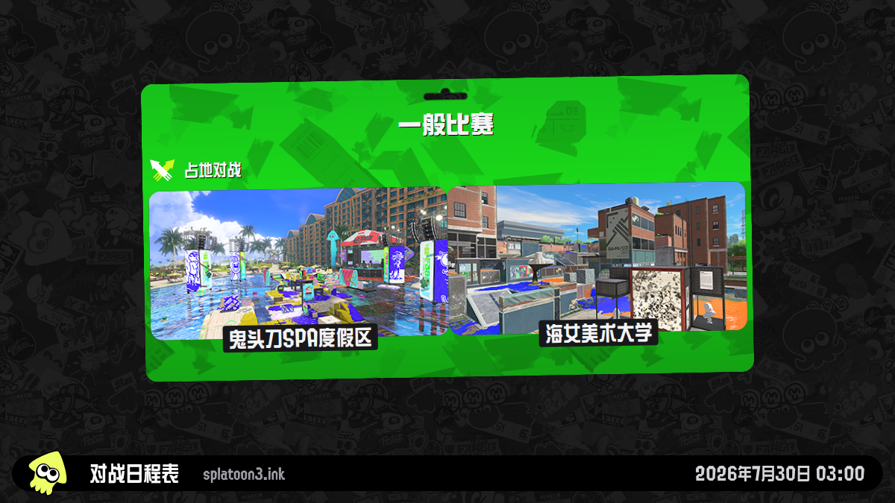
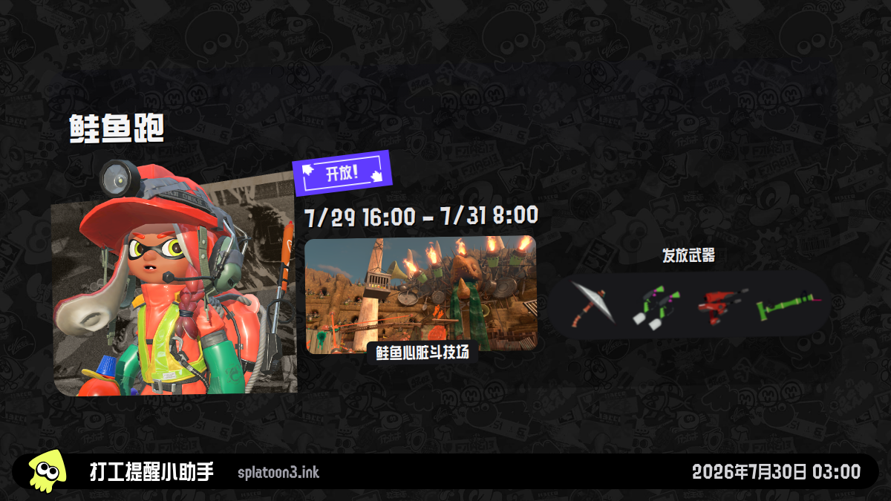
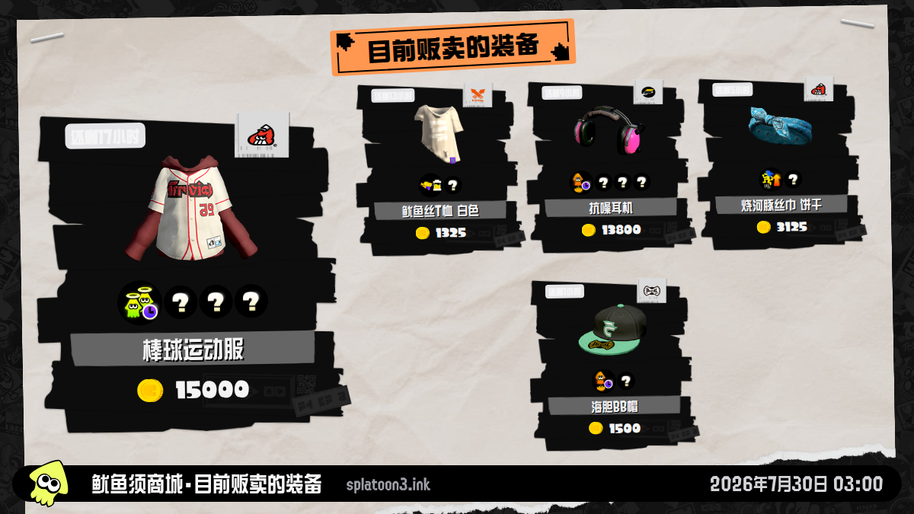
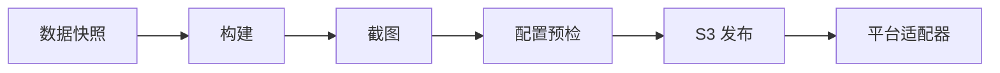
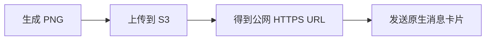

<p align="center">
  <a href="./README.md">English</a> · <strong>简体中文</strong> · <a href="./README.ja.md">日本語</a>
</p>

<p align="center">
  
</p>

<h1 align="center">splatoon3-bot</h1>

<p align="center">
  稳定生成 Splatoon 3 截图，并以各平台原生富消息推送。<br>
  从模板创建一份私有安装、配置 GitHub，后续交给 Actions 自动运行。
</p>

<p align="center">
  <a href="https://github.com/TenviLi/splatoon3-bot/generate"></a>
  <a href="https://github.com/TenviLi/splatoon3-bot/actions/workflows/ci.yml"></a>
  
  
  
</p>

<p align="center">
  <a href="#快速开始">快速开始</a> ·
  <a href="#截图预览">截图预览</a> ·
  <a href="#配置">配置</a> ·
  <a href="#自动化">自动化</a> ·
  <a href="#通知平台">通知平台</a> ·
  <a href="#本地开发">本地开发</a>
</p>

## 它能做什么

`splatoon3-bot` 是一个由 GitHub Actions 托管运行的 [Splatoon 3](https://splatoon3.ink/) 通知机器人。它每次使用同一份完整游戏数据生成四类稳定截图，通过兼容 S3 的服务发布图片，再向你配置的每个目标发送适合该平台的富消息。

<table>
  <tr>
    <td width="33%" align="center"><strong>四类稳定截图</strong><br><sub>对战日程、鲑鱼跑、今日精选装备和在售装备，尺寸始终为精确的 16:9。</sub></td>
    <td width="33%" align="center"><strong>自选 S3 服务</strong><br><sub>支持 AWS S3、Cloudflare R2、MinIO、又拍云 S3 等 SigV4 兼容服务。</sub></td>
    <td width="33%" align="center"><strong>平台原生富消息</strong><br><sub>模板卡片、Embed、Flex Message、Block Kit 与媒体模板，而不是粗糙的纯文本。</sub></td>
  </tr>
  <tr>
    <td width="33%" align="center"><strong>一个平台多个目标</strong><br><sub>同一个平台可以同时配置多个群、频道、用户或 Webhook。</sub></td>
    <td width="33%" align="center"><strong>部分成功也会保留</strong><br><sub>各目标独立并行发送，一个目标失败不会抹掉其他目标已发送的消息。</sub></td>
    <td width="33%" align="center"><strong>自动校验</strong><br><sub>配置预检、图片校验、Secret 扫描、测试和可复现的 Linux 工作流。</sub></td>
  </tr>
</table>

当前内置 **企业微信、Discord、Telegram、QQ、飞书、钉钉、WhatsApp、LINE、Slack** 九个适配器。平台能力与消息设计依据见 [通知平台能力审计](./docs/notification-platform-capabilities.md)。

### 按你的目标开始

| 你想要…… | 从这里开始 |
| --- | --- |
| 不搭建开发环境，直接运行自己的机器人 | [快速开始](#快速开始) |
| 修改语言、时区、图片尺寸或推送时间 | [配置](#配置)与[自动化](#自动化) |
| 接入一个或多个消息平台 | [通知平台](#通知平台) |
| 评估可靠性、调试或参与开发 | [可靠性](#可靠性)与[本地开发](#本地开发) |

## 截图预览

### 直接查看全部四张稳定截图

<table>
  <tr>
    <td align="center"><br><sub><code>schedules.zh-CN.png</code></sub></td>
    <td align="center"><br><sub><code>salmon-run.zh-CN.png</code></sub></td>
  </tr>
  <tr>
    <td align="center"><br><sub><code>gear-dailydrop.zh-CN.png</code></sub></td>
    <td align="center"><br><sub><code>gear-regular.zh-CN.png</code></sub></td>
  </tr>
</table>

README 中的预览图使用 `1200×675`。`BOT_SCREENSHOT_RESOLUTION` 可以从四个精确的 16:9 尺寸中选择，并同时控制归档截图和通知主图。只有 LINE 与 WhatsApp 会因为平台限制额外使用一份 `1024×576` 兼容图。

## 快速开始

### 使用模板创建你的私有安装仓库

通过模板在自己的 GitHub 账号下创建一份独立的 Private 仓库。这个安装仓库是部署与信任边界：定时任务、凭据、设置和消息目标都由你管理；公开的源仓库不保存任何用户凭据。

<p align="center">
  <a href="https://github.com/TenviLi/splatoon3-bot/generate"><strong>Use this template →</strong></a>
</p>

开始前只需准备：GitHub 账号、一个能够通过公网 HTTPS 读取图片的兼容 S3 Bucket，以及至少一个受支持消息平台的凭据。运行环境由 GitHub Actions 提供，**不需要自行部署服务器，也不需要安装 Node.js、pnpm、Chrome 或 Docker。**

1. 点击 <kbd>Use this template</kbd> → <kbd>Create a new repository</kbd>，选择 Owner 和仓库名称，将可见性设为 **Private**，然后创建仓库。GitHub 会复制完整项目，但不会把安装仓库关联为 Fork。
2. 打开 <kbd>Settings</kbd> → <kbd>Secrets and variables</kbd> → <kbd>Actions</kbd>，根据 [`S3_CONFIG` 示例](#s3_config)创建同名 Repository Secret。消息平台需要通过它取得可公网读取的截图地址。
3. 至少创建一个消息平台 Secret。以下仅以企业微信群机器人为例：在群机器人设置中取得 Webhook，并创建 Repository Secret `BOT_WECOM_CONFIG`：

   ```yaml
   - name: 对战日程群
     notifications: [schedules]
     webhookUrl: https://qyapi.weixin.qq.com/cgi-bin/webhook/send?key=...
   - name: 打工和装备群
     notifications: [salmon-run, gear-dailydrop, gear-regular]
     webhookUrl: https://qyapi.weixin.qq.com/cgi-bin/webhook/send?key=...
   ```

   参考企业微信官方的[群机器人说明](https://developer.work.weixin.qq.com/document/path/91770)，或从[通知平台](#通知平台)中选择其他适配器。
4. 默认语言已经是 `zh-CN`。如果你的时区不是 `Asia/Shanghai`，请设置 `BOT_TIME_ZONE`；只有默认值不合适时，才需要添加 `BOT_SCREENSHOT_RESOLUTION` 等其他 [Repository Variables](#repository-variables)。
5. 打开 <kbd>Actions</kbd>，按 GitHub 提示启用工作流，然后以 `all` 模式运行 **Check Bot Configuration**。它会检查所有配置，但不会上传图片或发送消息。
6. 对已配置的平台运行 **Notification Channel smoke test**。它会真实上传一次图片并发送一条消息，用来确认从 S3 到消息目标的完整链路，然后再放心交给定时任务。

> [!IMPORTANT]
> 凭据只能保存为私有安装仓库的 Repository Secrets，绝不能放进 Variables、代码、Pull Request 或日志。默认分支上的工作流可以使用这些凭据，因此同步改动前应重点审查 `.github/workflows/`、`bot/` 与 `scripts/`。Secrets 与 Variables 都是每份安装独立配置的。

> [!NOTE]
> 通过模板创建的仓库拥有独立 Git 历史，不会自动接收上游更新。请先审查新版本和安全修复，再将需要的改动同步到私有安装仓库。

## 自动化



每次定时或手动触发都执行同一个两阶段 Bot Run：

1. **准备**：获取并校验一份完整、口径一致的数据，构建截图页面，生成所选图片并归档本次运行。
2. **发布并通知**：在首次上传前检查全部配置，把截图和内置图标发布到 S3，再并行发送到每个已配置目标。

| 工作流 | 何时运行 | 发送内容 |
| --- | --- | --- |
| `bot-schedules.yml` | 除 `02:00`、`10:00` 外的每个 UTC 偶数小时 | `schedules` 模式 |
| `bot-salmon-run.yml` | UTC `02:00`、`10:00` | `all` 模式 |
| `bot-manual.yml` | 按需手动运行 | 任意所选模式 |
| `configuration-check.yml` | 按需手动运行 | 只检查配置，不上传、不发送 |
| `notification-smoke.yml` | 按需手动运行 | 发布当前图片，并向所选平台发送一条真实测试消息 |

两条定时入口合计每两小时发送一次日程且不会重复。第三方 Actions 均固定到不可变 Commit SHA；仅支持 GitHub Actions 作为托管自动化平台。

### 自定义定时推送

在安装仓库默认分支中修改 `.github/workflows/bot-schedules.yml` 与 `.github/workflows/bot-salmon-run.yml` 的 `on.schedule` cron 表达式，即可决定各模式的推送时间。GitHub 按 UTC 解释这些表达式。`BOT_TIME_ZONE` 只改变截图和消息中显示的时间，不会改变 Actions 的启动时刻。

GitHub 不允许在 `on.schedule.cron` 中读取 Repository Variables 或 Secrets，因此这里没有定时 Variable。可以参考 GitHub 官方的 [`on.schedule` 语法](https://docs.github.com/en/actions/reference/workflows-and-actions/workflow-syntax#onschedule)，并用 [crontab.guru](https://crontab.guru/) 辅助生成表达式。`all` 模式也包含日程通知；除非你确实需要重复消息，否则不要让它与 `schedules` 模式同时触发。

<details>
<summary><strong>运行模式</strong></summary>

| 模式 | 生成截图 | 发送通知 |
| --- | --- | --- |
| `schedules` | 对战日程 | 对战日程 |
| `salmon-run` | 鲑鱼跑 | 鲑鱼跑 |
| `gear` | 两张装备图 | 两条装备通知 |
| `salmon-run-and-gear` | 鲑鱼跑和两张装备图 | 鲑鱼跑及两条装备通知 |
| `all` | 全部四张图 | 全部四类通知 |

</details>

## 配置

在私有安装仓库的 <kbd>Settings</kbd> → <kbd>Secrets and variables</kbd> → <kbd>Actions</kbd> 中配置。**Secrets 用来保存凭据，Variables 只用来调整可选行为；不要把凭据放进 Variable。**

| 配置层 | GitHub 设置 | 必填 |
| --- | --- | :---: |
| 渲染与工作流选项 | Repository Variables | 否，内置稳定默认值 |
| 图片发布 | Repository Secret `S3_CONFIG` | 是 |
| 消息目的地 | 任一 `BOT_*_CONFIG` Repository Secret | 否；如需发送消息，至少添加一个 |

### Repository Variables

工作流已经为每个 Repository Variable 提供稳定默认值，因此以下 Variable **全部可选**；只有需要覆盖默认行为时才添加。内置语言和时区分别是 `zh-CN` 与 `Asia/Shanghai`。

| Variable | 必填 | 可选值 / 默认值 | 用途 |
| --- | :---: | --- | --- |
| `BOT_LOCALE` | 否 | 下表列出的 14 个值；默认 `zh-CN` | 同时控制截图与通知文案语言。 |
| `BOT_SCREENSHOT_RESOLUTION` | 否 | `1200x675`、`1920x1080`、`2400x1350`、`3840x2160`；默认 `2400x1350` | 归档截图与主要通知图片的精确尺寸。 |
| `BOT_TIME_ZONE` | 否 | IANA 时区；默认 `Asia/Shanghai` | 截图和通知共用的时区。 |
| `BOT_SCREENSHOT_ATTRIBUTION` | 否 | 最多 40 字符；默认 `splatoon3.ink` | 截图底栏的中立署名。 |
| `BOT_RUNNER` | 否 | 默认 `ubuntu-24.04` | 两个运行阶段使用的 GitHub Actions Runner。 |
| `BOT_ARTIFACT_RETENTION_DAYS` | 否 | `1`–`90`；默认 `7` | 单次运行归档的保留天数。 |

#### `BOT_LOCALE`

选择一个值，同时控制截图与通知消息中的文案：

| 值 | 语言 | 地区或文字变体 |
| --- | --- | --- |
| `de-DE` | 德语 | 德国 |
| `en-GB` | 英语 | 英国 |
| `en-US` | 英语 | 美国 |
| `es-ES` | 西班牙语 | 西班牙 |
| `es-MX` | 西班牙语 | 墨西哥 |
| `fr-CA` | 法语 | 加拿大 |
| `fr-FR` | 法语 | 法国 |
| `it-IT` | 意大利语 | 意大利 |
| `ja-JP` | 日语 | 日本 |
| `ko-KR` | 韩语 | 韩国 |
| `nl-NL` | 荷兰语 | 荷兰 |
| `ru-RU` | 俄语 | 俄罗斯 |
| `zh-CN` | 中文 | 简体 |
| `zh-TW` | 中文 | 繁体 |

Bot 截图与通知运行链路支持全部 14 个值；面向运维者的 README 与仓库截图预览仍有意只维护中、英、日三种语言。

#### `BOT_SCREENSHOT_RESOLUTION`

| 分辨率 | 缩放 | 适用场景 |
| --- | :---: | --- |
| `1200x675` | 1× | 小体积与视觉测试 |
| `1920x1080` | 1.6× | Full HD 原图 |
| `2400x1350` | 2× | 推荐的清晰度与体积平衡 |
| `3840x2160` | 3.2× | 4K 原图，归档和上传更大 |

所选尺寸会同时用于归档截图、`notification-images/` 对象和主要消息图片。LINE 与 WhatsApp 因平台图片限制使用派生的 `1024×576` 兼容图，但消息中的查看按钮仍会打开所选分辨率的主要图片。

对战日程、鲑鱼跑与装备图标由仓库内置资源生成，并按内容哈希自动发布到 S3；用户不需要另行准备公共图标 URL。

### `S3_CONFIG`

GitHub Actions 会在工作流内部生成截图，但 GitHub Artifact 是需要鉴权下载的归档，并不是企业微信、Discord、LINE 等平台可以直接嵌入消息卡片的公网图片。因此发布阶段需要经过以下流程：



只有生成的图片需要允许公网读取；S3 写入凭据始终只保存在私有安装仓库的 Repository Secret 中。

#### 配置 Secret

创建 Repository Secret `S3_CONFIG`，值为一份 YAML 对象。请将占位内容替换为服务商实际提供的值；其中 `publicBaseUrl` 必须是消息平台无需凭据即可读取的公网 HTTPS 根地址：

```yaml
bucket: splatoon-assets
publicBaseUrl: https://splatoon.example.com
accessKeyId: your-s3-access-key
secretAccessKey: your-s3-secret-access-key
region: us-east-1
endpoint: https://s3.example.com
forcePathStyle: true
keyPrefix: splatoon3-bot
```

| 字段 | 要求 | 默认值 | 说明 |
| --- | :---: | --- | --- |
| `bucket` | 必选 | — | 目标 Bucket 名称。 |
| `publicBaseUrl` | 必选 | — | 无凭据、可公网访问的 HTTPS Bucket 根地址或 CDN 地址；不要包含 `keyPrefix`。 |
| `accessKeyId` | 必选 | — | 拥有上传权限的专用 S3 Access Key；允许对象检查时可避免重复上传内置图标。 |
| `secretAccessKey` | 必选 | — | 与 `accessKeyId` 配对的 Secret Key。 |
| `region` | 可选 | `us-east-1` | 使用服务商签名 Region；R2 使用 `auto`。 |
| `endpoint` | 可选 | AWS SDK 默认值 | R2、MinIO、又拍云 S3 等兼容服务需要填写。 |
| `forcePathStyle` | 可选 | `false` | MinIO 与又拍云 S3 通常设为 `true`。 |
| `keyPrefix` | 可选 | 空 | 为所有对象增加命名空间。 |
| `sessionToken` | 可选 | 空 | 仅临时凭据需要。 |

`endpoint` 是需要凭据的上传 API，`publicBaseUrl` 是消息平台无需凭据即可读取图片的 HTTPS 根地址；两者经常不是同一个域名。

<details>
<summary><strong>选择服务商：官方配置入口</strong></summary>

发布器使用标准 S3 API，不绑定单一服务商。优先选择你已经信任或正在使用的服务：

| 服务 | 常见部署方式 | 官方配置入口 |
| --- | --- | --- |
| AWS S3 / CloudFront | AWS 托管存储与 CDN | [创建 Bucket](https://docs.aws.amazon.com/AmazonS3/latest/userguide/GetStartedWithS3.html#creating-bucket) · [管理 Access Key](https://docs.aws.amazon.com/IAM/latest/UserGuide/id_credentials_access-keys.html) · [CloudFront OAC](https://docs.aws.amazon.com/AmazonCloudFront/latest/DeveloperGuide/private-content-restricting-access-to-s3.html) |
| Cloudflare R2 | Cloudflare 存储与自定义域名 | [快速开始](https://developers.cloudflare.com/r2/get-started/) · [API Token](https://developers.cloudflare.com/r2/api/tokens/) · [公开 Bucket](https://developers.cloudflare.com/r2/buckets/public-buckets/) |
| Backblaze B2 | 托管 S3 兼容对象存储 | [S3 兼容 API](https://www.backblaze.com/docs/cloud-storage-s3-compatible-api) · [Application Key](https://www.backblaze.com/docs/cloud-storage-create-and-manage-app-keys) |
| DigitalOcean Spaces | DigitalOcean 项目的托管对象存储 | [S3 兼容性](https://docs.digitalocean.com/products/spaces/reference/s3-compatibility/) · [Access Key](https://docs.digitalocean.com/products/spaces/how-to/manage-access/) |
| Wasabi | 托管 S3 兼容对象存储 | [服务地址与 Region](https://docs.wasabi.com/docs/service-urls-for-wasabis-storage-regions) · [Access Key](https://docs.wasabi.com/docs/creating-a-user-account-and-access-key) |
| Scaleway Object Storage | Scaleway Region 中的 S3 兼容存储 | [AWS CLI / S3 配置](https://www.scaleway.com/en/docs/object-storage/api-cli/object-storage-aws-cli/) |
| Tigris | 全球分布式 S3 兼容存储 | [S3 SDK 配置](https://www.tigrisdata.com/docs/sdks/s3/) |
| MinIO / AIStor | 自托管或私有云 S3 | [创建 Bucket](https://docs.min.io/aistor/reference/cli/mc-mb/) · [创建 Access Key](https://docs.min.io/aistor/reference/cli/admin/mc-admin-accesskey/mc-admin-accesskey-create/) |
| 阿里云 OSS | 支持 S3 兼容接口的阿里云对象存储 | [Amazon S3 兼容性](https://www.alibabacloud.com/help/en/oss/developer-reference/compatibility-with-amazon-s3) |
| 腾讯云 COS | 支持 AWS S3 SDK 的腾讯云对象存储 | [AWS S3 SDK 配置](https://www.tencentcloud.com/document/product/436/41284) |
| 又拍云 S3 | 通过 S3 兼容 API 使用又拍云存储 | [AWS S3 兼容说明](https://help.upyun.com/knowledge-base/aws-s3%E5%85%BC%E5%AE%B9/) · [S3 API](https://help.upyun.com/knowledge-base/s3-api/) |

</details>

#### 机器人会上传什么

如果配置了 `keyPrefix`，它会位于以下目录之前：

| 对象目录 | 内容 | 用途与保留建议 |
| --- | --- | --- |
| `notification-images/<sha256>/` | 按 `BOT_SCREENSHOT_RESOLUTION` 精确尺寸优化的主要图片 | 企业微信、Discord、Telegram、QQ、飞书、钉钉与 Slack 直接展示；通知查看按钮也打开该图片。 |
| `compact-images/<sha256>/` | 派生的 `1024×576` 兼容图 | 仅供 LINE 与 WhatsApp 展示，避免它们更严格的平台限制降低其他渠道的图片清晰度。 |
| `originals/<sha256>/` | 所选分辨率下未经重新压缩的截图原始文件 | 用于高清归档和 Publication Manifest 校验；不需要长期保存原始归档时，可以配置更短的生命周期。 |
| `branding-icons/<sha256>/` | 内置的日程、鲑鱼跑和装备小图标 | 用于消息卡片标题或头像；由机器人自动上传并复用，通常可以长期保留。 |

> [!NOTE]
> `<sha256>` 是根据文件内容计算出的摘要。同一张图片内容不变时会复用原 URL；内容变化时才生成新 URL。这样后续运行不会悄悄替换历史消息中已经展示的图片。

更多最小权限、公网 URL 和服务商注意事项见 [S3 运维指南](./docs/operator-setup-links.md#s3-compatible-publication)。

> [!TIP]
> 图片内容变化时会创建新版本，而不是覆盖旧 URL。可以按目录配置生命周期：`notification-images/` 与 `compact-images/` 的保留时间取决于历史消息需要展示多久，`originals/` 只需保留到原始归档不再需要，体积很小且会复用的 `branding-icons/` 通常无需清理。

## 通知平台

为每个需要使用的平台创建一个 Repository Secret。Secret 存在且非空时，对应适配器自动启用；没有配置的平台保持关闭。

每个平台 Secret 都是一份 YAML 数组，因此同一个平台可以配置多个群、频道、用户或 Webhook。数组中的每一项代表一个消息目标，并且需要唯一的 `name`。只有某个目标不应接收全部内容时，才添加 `notifications: [schedules, salmon-run, gear-dailydrop, gear-regular]`。各目标独立并行发送，同一目标内仍保持消息顺序。

| 平台 | 原生消息形式 | Repository Secret | 官方配置 |
| --- | --- | --- | --- |
| 企业微信 | `news_notice` 模板卡片 | `BOT_WECOM_CONFIG` | [群机器人](https://developer.work.weixin.qq.com/document/path/91770) |
| Discord | 图片 Embed | `BOT_DISCORD_CONFIG` | [Incoming Webhook](https://support.discord.com/hc/en-us/articles/228383668-Intro-to-Webhooks) |
| Telegram | 图片、HTML、URL 按钮 | `BOT_TELEGRAM_CONFIG` | [BotFather](https://core.telegram.org/bots/features#botfather) |
| QQ 群聊 / 单聊 | 自定义 Markdown | `BOT_QQ_CONFIG` | [QQ 官方机器人](https://bot.q.qq.com/wiki/develop/api-v2/dev-prepare/getting-started.html) |
| 飞书 / Lark | Card Schema 2.0 | `BOT_FEISHU_CONFIG` | [自定义机器人](https://open.feishu.cn/document/client-docs/bot-v3/add-custom-bot) |
| 钉钉 | ActionCard | `BOT_DINGTALK_CONFIG` | [自定义机器人](https://open.dingtalk.com/document/robots/custom-robot-access) |
| WhatsApp | 已审批媒体模板 | `BOT_WHATSAPP_CONFIG` | [Cloud API](https://developers.facebook.com/documentation/business-messaging/whatsapp/get-started) |
| LINE | Flex Message | `BOT_LINE_CONFIG` | [Messaging API](https://developers.line.biz/en/docs/messaging-api/getting-started/) |
| Slack | Block Kit | `BOT_SLACK_CONFIG` | [Incoming Webhooks](https://docs.slack.dev/messaging/sending-messages-using-incoming-webhooks/) |

#### Secret 字段速查

字段名区分大小写。每个消息目标还可以使用上文介绍的可选 `notifications` 列表。

| Repository Secret | 每个消息目标的必选字段 | 可选字段 |
| --- | --- | --- |
| `BOT_WECOM_CONFIG` | `name`、`webhookUrl` | — |
| `BOT_DISCORD_CONFIG` | `name`、`webhookUrl` | `username`、`avatarUrl` |
| `BOT_TELEGRAM_CONFIG` | `name`、`botToken`、`chatId` | `messageThreadId`、`disableNotification` |
| `BOT_QQ_CONFIG` | `name`、`appId`、`clientSecret`、`targetType`（`group` 或 `user`）、`targetId` | — |
| `BOT_FEISHU_CONFIG` | `name`、`webhookUrl` | `secret` |
| `BOT_DINGTALK_CONFIG` | `name`、`webhookUrl` | `secret` |
| `BOT_WHATSAPP_CONFIG` | `name`、`accessToken`、`phoneNumberId`、`recipientPhoneNumber`、`templateName`、`languageCode` | — |
| `BOT_LINE_CONFIG` | `name`、`channelAccessToken`、`targetType`（`user`、`group` 或 `room`）、`targetId` | `notificationDisabled` |
| `BOT_SLACK_CONFIG` | `name`、`webhookUrl` | — |

[平台配置指南](./docs/operator-setup-links.md#notification-adapters)进一步说明凭据前提、接收方规则和官方教程；[平台能力审计](./docs/notification-platform-capabilities.md)解释了各适配器的原生布局选择。

## 可靠性

如果你需要评估机器人是否适合长期无人值守运行，可以从以下保障入手：

- 数据下载带重试和超时，完整通过 Schema 校验后才替换上一份有效数据。
- 截图会等待应用、字体和本地图片就绪，并检查语言、署名、尺寸、底栏位置和内容溢出。
- Run Manifest v4 精确记录“生成了什么”：语言、分辨率、时区、数据身份、文件名、尺寸和 SHA-256。
- Publication Manifest v4 精确记录“发布了什么”：通知主图、平台兼容图、原图、内置图标和公网 URL。
- 配置预检会在首次上传前一次性汇总所有独立错误，而且不会输出 Secret 内容。
- 各消息目标独立执行；某个目标失败不会撤销其他目标已经成功发送的消息，最终会统一汇总失败原因。
- CI 扫描完整 Git 历史，并运行语法、单元、浏览器、视觉、构建、工作流策略与依赖审计。

结构性截图校验会用全部 Bot 语言分别生成四张图片；中、英、日还分别维护 Linux 与 macOS 像素基线，像素差异超过 `0.1%` 即失败。

## 本地开发

本节仅供贡献者和需要本地调试的高级用户使用，模板用户可以完全跳过。普通用户通过模板创建安装仓库；希望提交 Pull Request 的贡献者则应 Fork 公开源仓库，以保留标准的 GitHub 协作历史。

要求 Node.js 24 LTS，以及 pnpm 11.18 或同一 Major 下更新版本。

```sh
git clone https://github.com/YOUR_GITHUB_USERNAME/splatoon3-bot.git
cd splatoon3-bot
git remote add upstream https://github.com/TenviLi/splatoon3-bot.git
corepack enable
pnpm install --frozen-lockfile --strict-peer-dependencies
pnpm run download-data
pnpm run verify
```

| 命令 | 用途 |
| --- | --- |
| `pnpm run bot:doctor <profile> [channel]` | 校验配置，不上传图片或发送消息。 |
| `pnpm run bot:prepare <profile>` | 下载、构建、截图并写入 Run Manifest。 |
| `pnpm run bot:publish <profile>` | 校验并通过 S3 发布。 |
| `pnpm run bot:notify <profile> [channel]` | 发送已配置的平台。 |
| `pnpm run test:update-golden` | 生成当前平台的中、英、日截图基线。 |
| `pnpm run verify` | 运行完整本地验证。 |
| `pnpm run verify:actions` | 通过 OrbStack 与 `act` 验证 Linux Actions。 |

## 参与贡献

请保持截图和通知结果可复现，维护 Run Plan 与 Manifest 的边界，并为行为变化更新相应契约测试。提交 Pull Request 前运行 `pnpm run verify`；修改 Actions 或 Linux 浏览器行为时，再运行 `pnpm run verify:actions`。

## 许可证

本项目以 [GNU General Public License v3.0](./LICENSE) 发布，是非官方同人项目，与 Nintendo 无隶属或背书关系。
