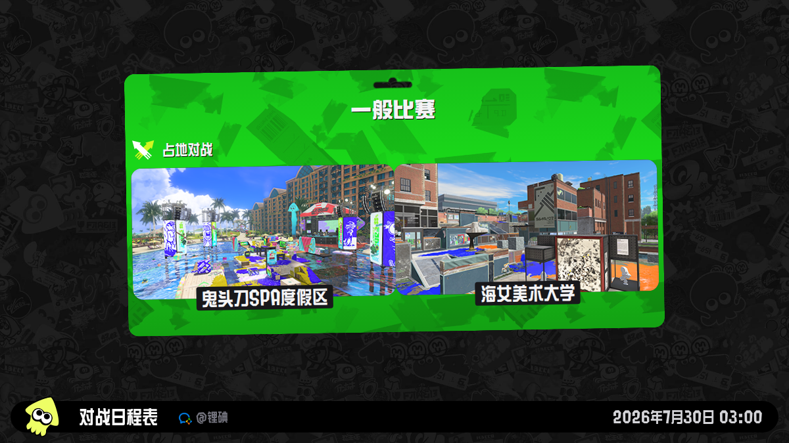
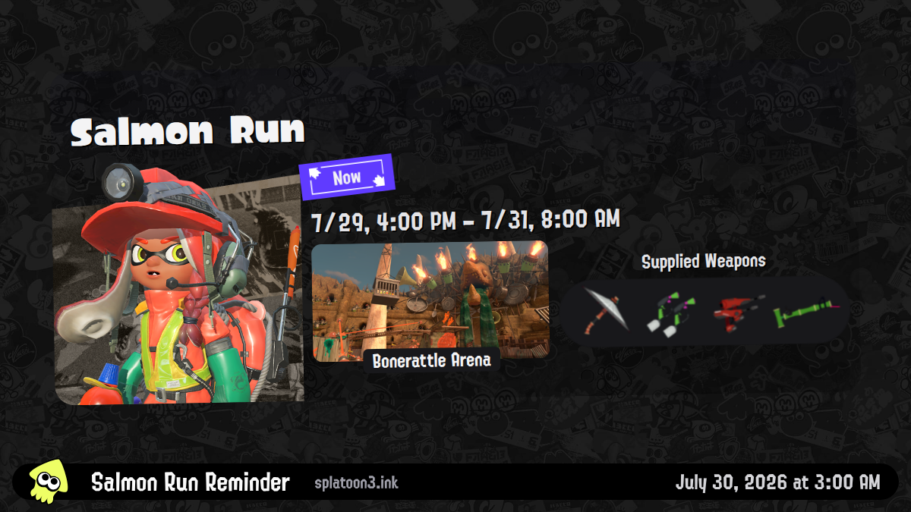
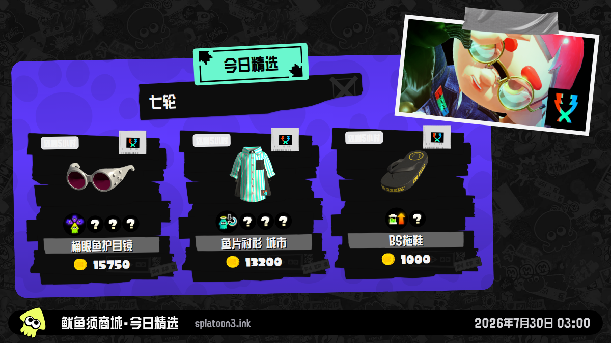
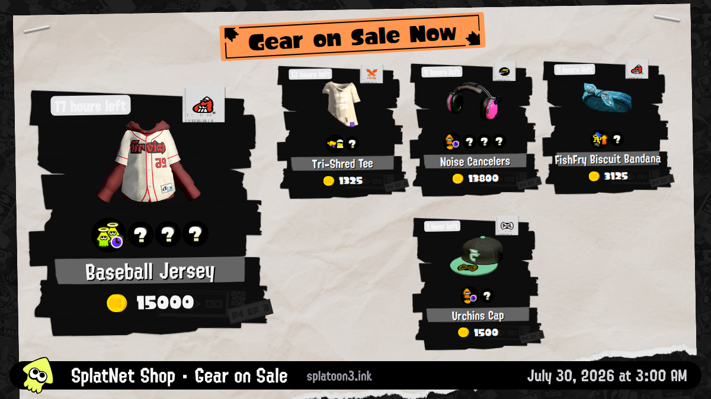

<p align="center">
  <a href="./README.md">English</a> · <strong>简体中文</strong> · <a href="./README.ja.md">日本語</a>
</p>

<p align="center">
  
</p>

<h1 align="center">splatoon3-bot</h1>

<p align="center">
  自动生成可复现的《斯普拉遁 3》截图，并通过各平台原生富消息发送。<br>
  一份经过校验的数据快照，一次可信的 Bot Run，发送到你的每个社区。
</p>

<p align="center">
  <a href="#快速开始">快速开始</a> ·
  <a href="#截图预览">截图预览</a> ·
  <a href="#仓库配置">仓库配置</a> ·
  <a href="#通知平台">通知平台</a> ·
  <a href="#本地开发">本地开发</a>
</p>

## 项目能力

- **GitHub Actions 托管运行**：无需自建服务器，也无需在本机安装 Node.js、pnpm、Chrome 或 Docker。
- **确定性截图**：固定数据、时间、视口、字体、图片加载与布局约束，并用 macOS/Linux 双平台 golden 校验。
- **通用 S3 发布**：支持 AWS S3、Cloudflare R2、MinIO、又拍云 S3 及其他 SigV4 兼容存储。
- **九个平台原生消息**：企业微信、Discord、Telegram、QQ、飞书、钉钉、WhatsApp、LINE、Slack。
- **安全配置**：Secrets 与 Variables 只存放在你自己的私有仓库；发布前会执行无副作用配置预检。

## 截图预览

### 直接查看全部四张确定性截图

<table>
  <tr>
    <td align="center"><br><sub><code>schedules.png</code></sub></td>
    <td align="center"><br><sub><code>salmon-run.png</code></sub></td>
  </tr>
  <tr>
    <td align="center"><br><sub><code>gear-dailydrop.png</code></sub></td>
    <td align="center"><br><sub><code>gear-regular.png</code></sub></td>
  </tr>
</table>

生产截图为 `2400×1350` PNG；通知平台使用额外生成的 `1024×576` 版本。页脚默认展示 `splatoon3.ink`，不包含企业微信图标。

## 快速开始

### Fork 到你自己的私有仓库并运行

每位用户都在自己的 GitHub 私有仓库中运行和定制本项目。这个仓库就是独立的部署与信任边界：Schedules、Secrets、Variables、Environments 和代码修改都由仓库所有者管理。

<p align="center">
  <a href="https://github.com/TenviLi/splatoon3-bot/fork"><strong>Fork 你的私有安装仓库 →</strong></a>
</p>

> [!TIP]
> 托管运行只需要 GitHub Actions、一个 S3 兼容存储桶和至少一个消息目标，**无需安装 Node.js、pnpm、Chrome、Docker，也无需自建服务器。**

> [!IMPORTANT]
> 如果上游仓库保持 Private 且允许 Fork，可以直接使用 **Fork**。如果上游未来变为 Public，请使用 **Use this template** 或 [GitHub Importer](https://github.com/new/import) 创建独立私有仓库；GitHub 的公开仓库 Fork 不能单独改为 Private。

| 你需要准备 | 保存位置 | 配置入口 |
| --- | --- | --- |
| 三个公开的消息图标 URL | Repository Variable `BOT_BRANDING_CONFIG` | [Variables](#1-repository-variables) |
| S3 上传凭据与公开访问 URL | Repository Secret `S3_CONFIG` | [S3 配置](#2-s3_config) |
| 至少一个消息平台目标 | 对应的 Repository Secret `BOT_*_CONFIG` | [通知平台](#通知平台) |

1. 在上游保持 Private 且允许 Fork 时，点击上方入口，在你自己的 GitHub 账号下创建私有 Fork；若 Fork 不可用或上游未来变为 Public，请改用 **Use this template** 或 [GitHub Importer](https://github.com/new/import) 创建独立私有副本。
2. 打开该仓库的 <kbd>Actions</kbd> 页面，允许工作流运行，并确认 **Splatoon3 Bot (every 2 hours)** 与 **Splatoon3 Bot (daily twice)** 已启用。
3. 打开 <kbd>Settings</kbd> → <kbd>Secrets and variables</kbd> → <kbd>Actions</kbd>。
4. 在 **Variables** 页签创建 `BOT_BRANDING_CONFIG`；在 **Secrets** 页签创建 `S3_CONFIG`。
5. 从[通知平台](#通知平台)中选择一个或多个平台，按官方教程创建机器人，再添加对应的 `BOT_*_CONFIG` Secret。配置了哪个 Secret，就自动启用哪个 adapter；不需要 `BOT_NOTIFICATION_CHANNELS`。
6. 在 Actions 页面手动运行 **Check Bot Configuration**，Profile 选择 `all`。它只校验 YAML、S3 和消息路由，不上传图片，也不发送消息。
7. 对每个目标运行一次 **Notification Channel smoke test**。确认 S3 上传和真实消息都成功后，再依赖定时任务。

> [!CAUTION]
> 不要把真实凭据、Webhook、Token、手机号或目标 ID 提交到 Git、PR、日志或 Repository Variables。同步上游改动前，应重点审查 `.github/workflows/`、`bot/` 与 `scripts/`。

## 仓库配置

所有值都配置在你自己的私有仓库：<kbd>Settings</kbd> → <kbd>Secrets and variables</kbd> → <kbd>Actions</kbd>。

### 1. Repository Variables

| Variable | 必填 | 默认值 | 用途 |
| --- | :---: | --- | --- |
| `BOT_BRANDING_CONFIG` | 是 | — | 三个公开 HTTPS 消息图标 URL 的 YAML。 |
| `BOT_TIME_ZONE` | 否 | `Asia/Shanghai` | 截图与消息共用的 IANA 时区。 |
| `BOT_SCREENSHOT_ATTRIBUTION` | 否 | `splatoon3.ink` | 截图页脚署名，最多 40 个字符。 |
| `BOT_RUNNER` | 否 | `ubuntu-24.04` | GitHub Actions Runner 标签。 |
| `BOT_ENVIRONMENT` | 否 | `production` | 发布 Job 使用的 GitHub Environment。 |
| `BOT_CONCURRENCY_GROUP` | 否 | `splatoon3-bot-production` | 串行化生产 Bot Run 的并发组。 |
| `BOT_ARTIFACT_RETENTION_DAYS` | 否 | `7` | Bot Run Artifact 保留天数，范围 1–90。 |

`BOT_BRANDING_CONFIG` 示例：

```yaml
icons:
  schedules: https://assets.example.com/icon.png
  salmonRun: https://assets.example.com/icon2.png
  gear: https://assets.example.com/icon3.png
```

图标地址是公开展示信息，因此使用 Variable；URL 不能包含账号、密码或查询 Token。

### 2. `S3_CONFIG`

`S3_CONFIG` 是唯一的发布 Secret，使用一份严格 YAML：

```yaml
bucket: splatoon-assets
region: us-east-1
endpoint: https://s3.api.upyun.com
forcePathStyle: true
keyPrefix: splatoon3-bot
publicBaseUrl: https://splatoon.example.com
credentials:
  accessKeyId: your-s3-access-key
  secretAccessKey: your-s3-secret-access-key
```

- `endpoint`：GitHub Actions 上传对象时使用的 S3 API 地址；AWS S3 通常省略。
- `publicBaseUrl`：各消息平台读取图片的公开 HTTPS 根地址，不能包含 `keyPrefix`。
- `keyPrefix`：可选对象前缀，例如 `splatoon3-bot`。
- `credentials`：建议使用只允许目标 Bucket 写入/读取所需对象的专用最小权限凭据。

| 存储 | 官方配置教程 |
| --- | --- |
| AWS S3 | [创建 Bucket](https://docs.aws.amazon.com/AmazonS3/latest/userguide/GetStartedWithS3.html#creating-bucket) · [管理 Access Key](https://docs.aws.amazon.com/IAM/latest/UserGuide/id_credentials_access-keys.html) |
| Cloudflare R2 | [开始使用](https://developers.cloudflare.com/r2/get-started/) · [创建 API Token](https://developers.cloudflare.com/r2/api/tokens/) · [公开 Bucket](https://developers.cloudflare.com/r2/buckets/public-buckets/) |
| MinIO / AIStor | [创建 Bucket](https://docs.min.io/aistor/reference/cli/mc-mb/) · [创建 Access Key](https://docs.min.io/aistor/reference/cli/admin/mc-admin-accesskey/mc-admin-accesskey-create/) |
| 又拍云 S3 | [AWS S3 兼容说明](https://help.upyun.com/knowledge-base/aws-s3%E5%85%BC%E5%AE%B9/) · [S3 API](https://help.upyun.com/knowledge-base/s3-api/) |

更多最小权限、公开 URL 与 Provider 差异见[运维配置入口汇总](./docs/operator-setup-links.md#s3-compatible-publication)。

### 3. Channel Secrets

每个 Channel Secret 都必须是一个直接、非空的 YAML Target 数组。每个 Target 必须有唯一 `name`；可选 `notifications` 只把指定通知发送到该 Target：

```yaml
- name: battle-schedules
  notifications: [schedules]
  webhookUrl: https://example.com/secret-webhook
- name: gear
  notifications: [gear-dailydrop, gear-regular]
  webhookUrl: https://example.com/another-secret-webhook
```

同一 Channel 的多个 Target 和不同 Channel 会并行发送；同一 Target 内仍按 Run Profile 顺序发送。没有匹配当前 Profile 的 Target 会被明确标记为 skipped。

## 通知平台

| 平台 | Repository Secret | 必要字段 | 原生消息形式 | 官方教程 |
| --- | --- | --- | --- | --- |
| 企业微信 | `BOT_WECOM_CONFIG` | `name`, `webhookUrl` | Template Card | [群机器人 Webhook](https://developer.work.weixin.qq.com/document/path/91770) |
| Discord | `BOT_DISCORD_CONFIG` | `name`, `webhookUrl` | Embed | [创建 Webhook](https://support.discord.com/hc/en-us/articles/228383668-Intro-to-Webhooks) |
| Telegram | `BOT_TELEGRAM_CONFIG` | `name`, `botToken`, `chatId` | 图片、HTML、URL 按钮 | [通过 BotFather 创建 Bot](https://core.telegram.org/bots/features#botfather) |
| QQ 官方机器人 | `BOT_QQ_CONFIG` | `name`, `appId`, `clientSecret`, `targetType`, `targetId` | Embed / Markdown | [注册机器人](https://bot.q.qq.com/wiki/develop/api-v2/dev-prepare/getting-started.html) |
| 飞书 | `BOT_FEISHU_CONFIG` | `name`, `webhookUrl` | Card Schema 2.0 | [添加自定义机器人](https://open.feishu.cn/document/client-docs/bot-v3/add-custom-bot) |
| 钉钉 | `BOT_DINGTALK_CONFIG` | `name`, `webhookUrl` | ActionCard | [自定义机器人接入](https://open.dingtalk.com/document/robots/custom-robot-access) |
| WhatsApp | `BOT_WHATSAPP_CONFIG` | `name`, `accessToken`, `phoneNumberId`, `recipientPhoneNumber`, `templateName`, `languageCode` | 已审核媒体模板 | [Cloud API 入门](https://developers.facebook.com/documentation/business-messaging/whatsapp/get-started) |
| LINE | `BOT_LINE_CONFIG` | `name`, `channelAccessToken`, `targetType`, `targetId` | Flex Message | [Messaging API 入门](https://developers.line.biz/en/docs/messaging-api/getting-started/) |
| Slack | `BOT_SLACK_CONFIG` | `name`, `webhookUrl` | Block Kit | [启用 Incoming Webhooks](https://docs.slack.dev/messaging/sending-messages-using-incoming-webhooks/) |

完整字段、目标资格、签名模式、配额及更多官方入口见[运维配置入口汇总](./docs/operator-setup-links.md#notification-adapters)。英文主 README 还提供了每个平台的 YAML 示例与消息设计说明。

### 企业微信示例

```yaml
- name: battle-schedules
  notifications: [schedules]
  webhookUrl: https://qyapi.weixin.qq.com/cgi-bin/webhook/send?key=...
- name: salmon-run
  notifications: [salmon-run]
  webhookUrl: https://qyapi.weixin.qq.com/cgi-bin/webhook/send?key=...
- name: gear
  notifications: [gear-dailydrop, gear-regular]
  webhookUrl: https://qyapi.weixin.qq.com/cgi-bin/webhook/send?key=...
```

## 自动化与可靠性

`Data Snapshot → Build → Screenshots → Configuration Preflight → S3 → Channel Adapters`

- `bot-schedules.yml` 在其余偶数 UTC 小时发送 `schedules`。
- `bot-salmon-run.yml` 在 `02:00` 与 `10:00` UTC 使用 `all` Profile，发送四类通知。
- 两个工作流合起来，每两小时恰好发送一次对战日程，且不会重复。
- 所有远程 Actions 固定到不可变 Commit SHA；CI 使用 Gitleaks 扫描完整 Git 历史。
- 截图、Run Manifest、Publication Manifest、S3 对象与通知 URL 通过尺寸、哈希、数据快照、时间和署名绑定。
- 一个 Channel 失败不会取消其他已经开始的 Channel；所有结果会汇总后再决定 Job 成败。

## 本地开发

本节只面向贡献者和高级运维用户，GitHub Actions 托管运行不需要这些环境。

**要求：** Node.js 24 LTS；pnpm 11.18 或 11.x 更新版本。

```sh
git clone git@github.com:YOUR_GITHUB_USERNAME/splatoon3-bot.git
cd splatoon3-bot
git remote add upstream https://github.com/TenviLi/splatoon3-bot.git
corepack enable
pnpm install --frozen-lockfile --strict-peer-dependencies
pnpm run verify
```

- `pnpm run bot:doctor all`：本地无副作用配置预检。
- `pnpm run verify`：语法、单元测试、浏览器、视觉 golden、构建与依赖审计。
- `pnpm run verify:actions`：通过 OrbStack 与 `act` 运行完整 Linux CI、S3 与企业微信本地假端点链路。

## 许可证

项目使用 [GNU GPL v3.0](./LICENSE)。这是非官方爱好者项目，与 Nintendo 无隶属或背书关系。
