<p align="center">
  <a href="./README.md">English</a> · <strong>简体中文</strong> · <a href="./README.ja.md">日本語</a>
</p>

<p align="center">
  
</p>

<h1 align="center">splatoon3-bot</h1>

<p align="center">
  稳定生成 Splatoon 3 截图，并以各平台原生富消息推送。<br>
  从模板创建一份私有安装、配置 GitHub，后续交给 Actions 自动运行。
</p>

<p align="center">
  <a href="https://github.com/TenviLi/splatoon3-bot/generate"></a>
  <a href="https://github.com/TenviLi/splatoon3-bot/actions/workflows/ci.yml"></a>
  
  
  
</p>

<p align="center">
  <a href="#快速开始">快速开始</a> ·
  <a href="#截图预览">截图预览</a> ·
  <a href="#配置">配置</a> ·
  <a href="#自动化">自动化</a> ·
  <a href="#通知平台">通知平台</a> ·
  <a href="#本地开发">本地开发</a>
</p>

## 它能做什么

`splatoon3-bot` 是一个由 GitHub Actions 托管运行的 [Splatoon 3](https://splatoon3.ink/) 通知机器人。它每次使用同一份完整游戏数据生成最多十三类稳定截图，通过兼容 S3 的服务发布图片，再向你配置的每个目标发送适合该平台的富消息。

<table>
  <tr>
    <td width="33%" align="center"><strong>十三类稳定截图</strong><br><sub>总览与专题对战日程、活动比赛、鲑鱼跑、装备及四区域祭典，尺寸始终为精确的 16:9。</sub></td>
    <td width="33%" align="center"><strong>自选 S3 服务</strong><br><sub>支持 AWS S3、Cloudflare R2、MinIO、又拍云 S3 等 SigV4 兼容服务。</sub></td>
    <td width="33%" align="center"><strong>平台原生富消息</strong><br><sub>模板卡片、Embed、Flex Message、Block Kit 与媒体模板，而不是粗糙的纯文本。</sub></td>
  </tr>
  <tr>
    <td width="33%" align="center"><strong>一个平台多个目标</strong><br><sub>同一个平台可以同时配置多个群、频道、用户或 Webhook。</sub></td>
    <td width="33%" align="center"><strong>部分成功也会保留</strong><br><sub>各目标独立并行发送，一个目标失败不会抹掉其他目标已发送的消息。</sub></td>
    <td width="33%" align="center"><strong>自动校验</strong><br><sub>配置预检、图片校验、Secret 扫描、测试和可复现的 Linux 工作流。</sub></td>
  </tr>
</table>

当前内置 **企业微信、Discord、Telegram、QQ、飞书、钉钉、WhatsApp、LINE、Slack** 九个适配器。平台能力与消息设计依据见 [通知平台能力审计](./docs/notification-platform-capabilities.md)。

## 快速开始

请按下面七步依次完成。Step 1–4 创建并配置安装仓库，Step 5 只检查配置而不上传或发送，Step 6 进行一次真实的端到端测试，Step 7 再把后续运行交给 GitHub Actions。

### 开始前需要准备

| 需要准备 | 用来做什么 | 在哪里管理 |
| --- | --- | --- |
| 一个 GitHub 账号 | 创建自己的安装仓库并运行机器人 | GitHub |
| 一个支持公网 HTTP(S) 读取的兼容 S3 Bucket | 托管消息平台需要展示的图片；建议使用 HTTPS | 你选择的对象存储服务商 |
| 至少一个受支持消息目标的凭据 | 接收机器人通知 | 企业微信、Discord、Telegram、LINE、Slack 或其他受支持平台 |

运行环境由 GitHub Actions 提供，**不需要自行安装 Node.js、pnpm、Chrome、Docker，也不需要部署服务器。**

### Step 1 — 创建私有安装仓库

点击 <kbd>Use this template</kbd> → <kbd>Create a new repository</kbd>，选择 Owner 和仓库名称，将可见性设为 **Private**，然后创建仓库。GitHub 会复制完整项目，但不会把安装仓库关联为 Fork。

<p align="center">
  <a href="https://github.com/TenviLi/splatoon3-bot/generate"><strong>Use this template →</strong></a>
</p>

这份新仓库就是你的部署与信任边界：定时任务、凭据、设置和消息目标都由你管理；公开源仓库不会保存用户凭据。

**完成标志：** 浏览器已经打开你账号下新建的 Private 仓库。

### Step 2 — 配置图片存储

在新仓库打开 <kbd>Settings</kbd> → <kbd>Secrets and variables</kbd> → <kbd>Actions</kbd> → <kbd>Secrets</kbd>，按照[可直接填写的配置与服务商指南](#s3_config)创建 Repository Secret `S3_CONFIG`。其中 `publicBaseUrl` 必须允许消息平台通过公网 HTTP 或 HTTPS 读取生成图片；建议优先使用 HTTPS，因为 LINE 与 WhatsApp 强制要求 HTTPS。写入凭据仍然只保存在 Secret 中。

**完成标志：** Repository Secrets 列表中出现 `S3_CONFIG`。

### Step 3 — 配置一个通知目标

至少创建一个平台 Secret。例如，为企业微信群机器人保存以下 YAML，并把 Repository Secret 命名为 `BOT_WECOM_CONFIG`：

```yaml
- name: 喷喷通知群
  webhookUrl: https://qyapi.weixin.qq.com/cgi-bin/webhook/send?key=...
```

这个入门示例故意省略 `screenshotIds`，因此该目标会接收每次 Bot Run 实际生成的全部内容。建议先用这种最简单的行为完成首次发送，再按需增加分类路由。参考企业微信官方的[群机器人说明](https://developer.work.weixin.qq.com/document/path/91770)，或从[通知平台](#通知平台)选择其他适配器。

**完成标志：** Repository Secrets 列表中至少出现一个 `BOT_*_CONFIG`。

### Step 4 — 设置可选的显示偏好

打开旁边的 <kbd>Variables</kbd> 标签页。默认语言和时区已经是 `zh-CN` 与 `Asia/Shanghai`；只有默认值不合适时，才创建 `BOT_LOCALE`、`BOT_TIME_ZONE`、`BOT_SCREENSHOT_RESOLUTION` 或其他 [Repository Variables](#repository-variables)。

**完成标志：** 语言、时区和分辨率符合你的预期；所有凭据仍然只存放在 Secrets 中。

### Step 5 — 检查配置（不上传、不发送）

打开 <kbd>Actions</kbd>，按 GitHub 提示启用工作流，选择 **Check Bot Configuration**，然后点击 <kbd>Run workflow</kbd>。这个表单没有 Screenshot ID 选项：它会自动检查图片存储、全部十三个 ID、所有已配置平台和每个目标的路由，但不会上传图片或发送消息。

**完成标志：** 工作流显示绿色，Summary 中出现 **Configuration is ready**。如有报错，请全部修复后再继续。

### Step 6 — 发送一次真实测试

运行 **Notification Channel smoke test**。第一次测试保留默认的 `schedules` Screenshot ID，并选择 Step 3 配置的平台。它会真实发布一张图片，并发送一条该平台的原生富消息。

**完成标志：** 工作流为绿色、消息成功到达、图片能够加载，且消息中的操作入口可以打开完整图片。

### Step 7 — 确认定时推送

Step 6 成功后，两个生产工作流就可以复用同一组 Secrets 与 Variables 自动运行。查看[自动化](#自动化)中的默认 UTC 时间；可以直接保留，也可以在下一次运行前修改。需要立即重跑时，点击对应工作流的 **Run workflow**，它会使用与定时触发完全相同的固定内容。

**完成标志：** 工作流已经启用，并且你已确认默认定时或保存了自己的 cron 表达式。

> [!IMPORTANT]
> 凭据只能保存为私有安装仓库的 Repository Secrets，绝不能放进 Variables、代码、Pull Request 或日志。默认分支上的工作流可以使用这些凭据，因此同步改动前应重点审查 `.github/workflows/`、`bot/` 与 `scripts/`。Secrets 与 Variables 都是每份安装独立配置的。

> [!NOTE]
> 通过模板创建的仓库拥有独立 Git 历史，不会自动接收上游更新。请先审查新版本和安全修复，再将需要的改动同步到 Private 安装仓库。

### 接下来可以做什么

| 你想要…… | 继续阅读 |
| --- | --- |
| 查看全部可用图片并选择 Smoke Test 内容 | [截图预览](#截图预览) |
| 修改语言、时区、图片尺寸或推送时间 | [配置](#配置)与[自动化](#自动化) |
| 增加平台、消息目标或通知路由 | [通知平台](#通知平台) |
| 评估可靠性、调试或参与开发 | [可靠性](#可靠性)与[本地开发](#本地开发) |

## 截图预览

### 全部十三个 Screenshot ID

每个可选项就是一个 **Screenshot ID（截图 ID）**。同一个值会出现在 Smoke Test 下拉框、生成的 PNG 文件名、对应的基础 Notification、本地命令，以及通知目标可选的 `screenshotIds:` 列表中。每个选中的 ID 都生成一张截图和一条基础 Notification；Target `mode` 可以把多条基础通知合并，Event Alert 只在出现新状态时额外产生。

<table>
  <tr>
    <td width="33%" align="center"><a href="./tests/golden/screenshots/linux-x64/zh-CN/schedules.png">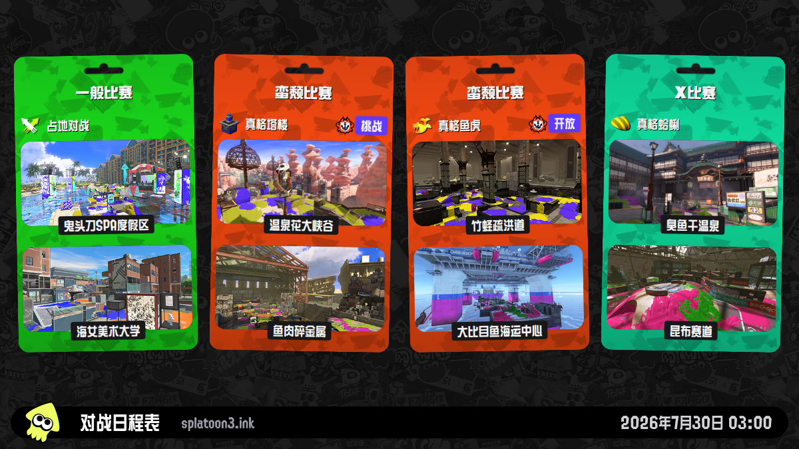</a><br><strong>对战日程总览</strong><br><sub>Screenshot ID：<code>schedules</code></sub></td>
    <td width="33%" align="center"><a href="./tests/golden/screenshots/linux-x64/zh-CN/schedules-regular.png">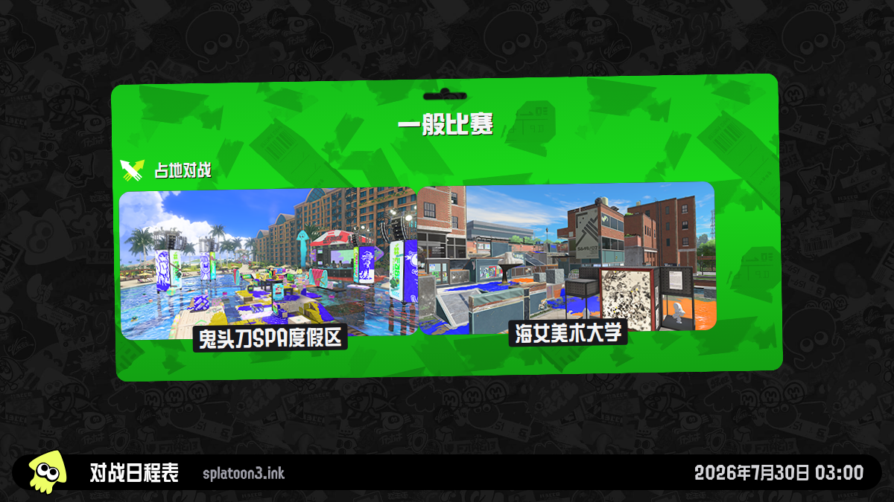</a><br><strong>一般比赛</strong><br><sub>Screenshot ID：<code>schedules-regular</code></sub></td>
    <td width="33%" align="center"><a href="./tests/golden/screenshots/linux-x64/zh-CN/schedules-anarchy.png">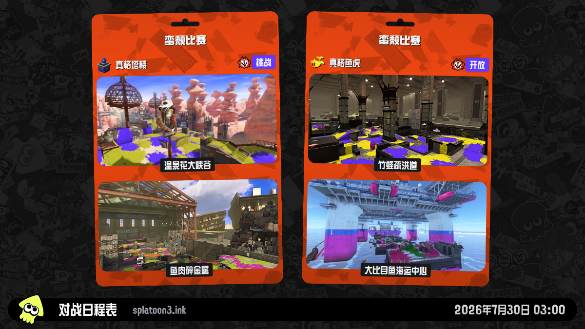</a><br><strong>蛮颓比赛</strong><br><sub>Screenshot ID：<code>schedules-anarchy</code></sub></td>
  </tr>
  <tr>
    <td align="center"><a href="./tests/golden/screenshots/linux-x64/zh-CN/schedules-x.png">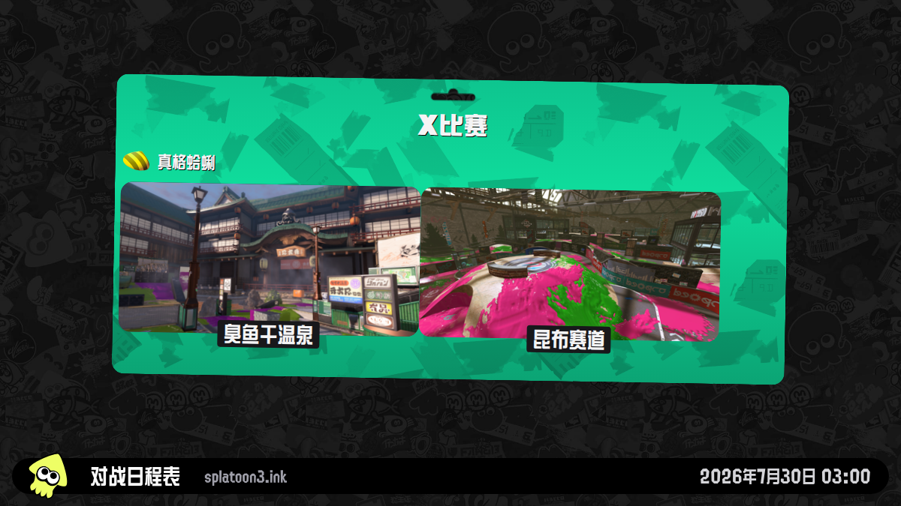</a><br><strong>X 比赛</strong><br><sub>Screenshot ID：<code>schedules-x</code></sub></td>
    <td align="center"><a href="./tests/golden/screenshots/linux-x64/zh-CN/challenges.png">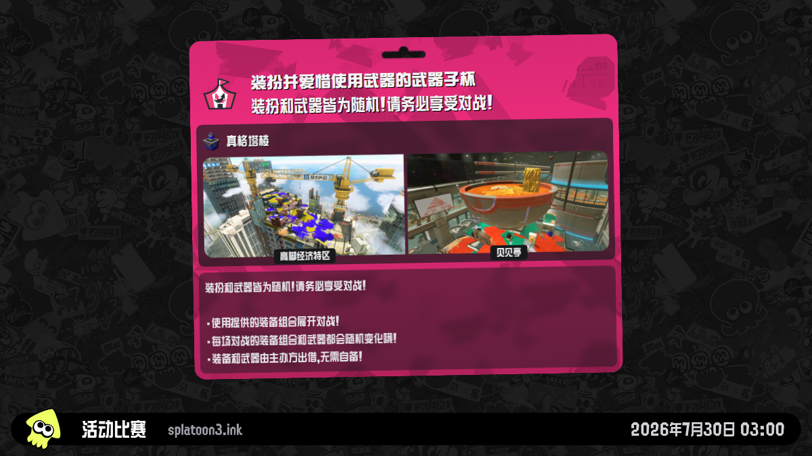</a><br><strong>活动比赛</strong><br><sub>Screenshot ID：<code>challenges</code></sub></td>
    <td align="center"><a href="./tests/golden/screenshots/linux-x64/zh-CN/salmon-run.png">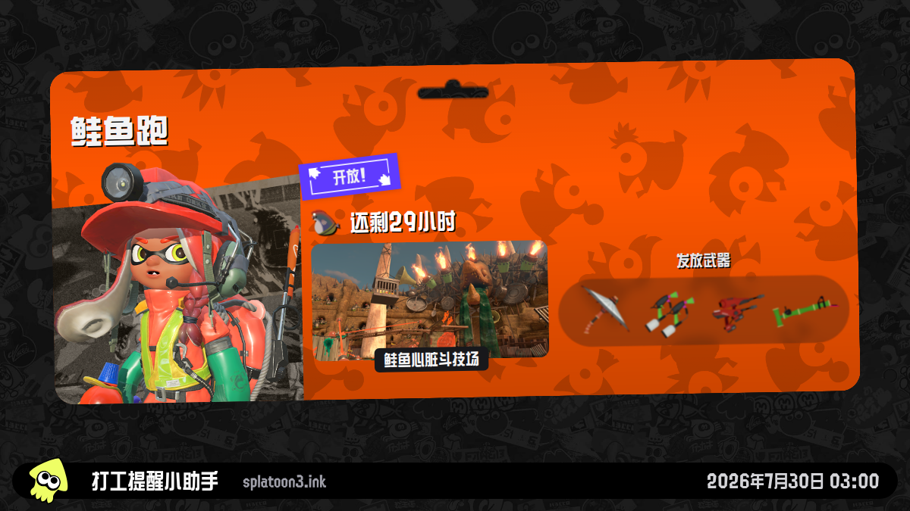</a><br><strong>鲑鱼跑</strong><br><sub>Screenshot ID：<code>salmon-run</code></sub></td>
  </tr>
  <tr>
    <td align="center"><a href="./tests/golden/screenshots/linux-x64/zh-CN/gear-dailydrop.png"></a><br><strong>今日精选</strong><br><sub>Screenshot ID：<code>gear-dailydrop</code></sub></td>
    <td align="center"><a href="./tests/golden/screenshots/linux-x64/zh-CN/gear-regular.png"></a><br><strong>在售装备</strong><br><sub>Screenshot ID：<code>gear-regular</code></sub></td>
    <td align="center"><a href="./tests/golden/screenshots/linux-x64/zh-CN/gear-salmon-run.png">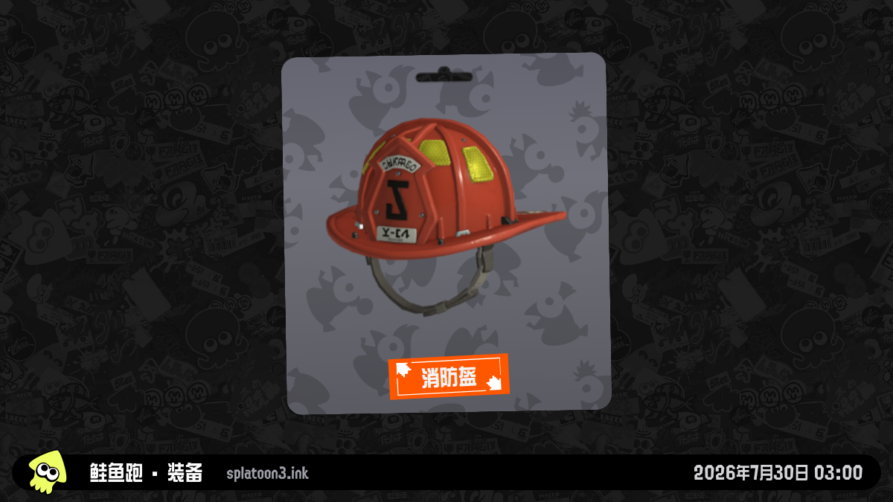</a><br><strong>鲑鱼跑月度装备</strong><br><sub>Screenshot ID：<code>gear-salmon-run</code></sub></td>
  </tr>
  <tr>
    <td align="center"><a href="./tests/golden/screenshots/linux-x64/zh-CN/splatfest-na.png">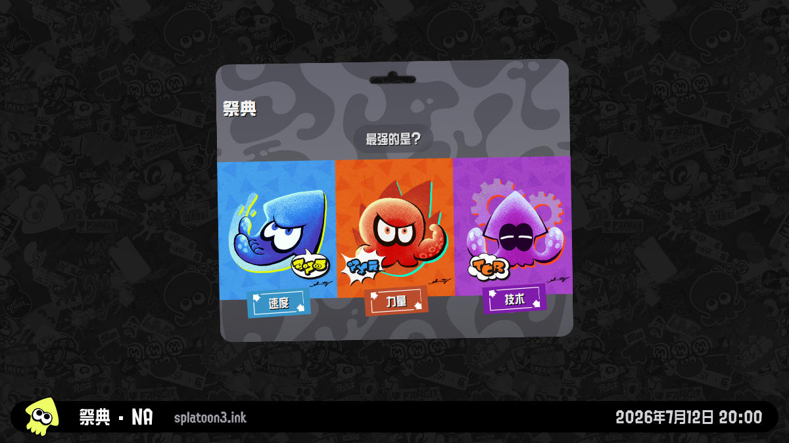</a><br><strong>祭典 · NA</strong><br><sub>Screenshot ID：<code>splatfest-na</code></sub></td>
    <td align="center"><a href="./tests/golden/screenshots/linux-x64/zh-CN/splatfest-eu.png">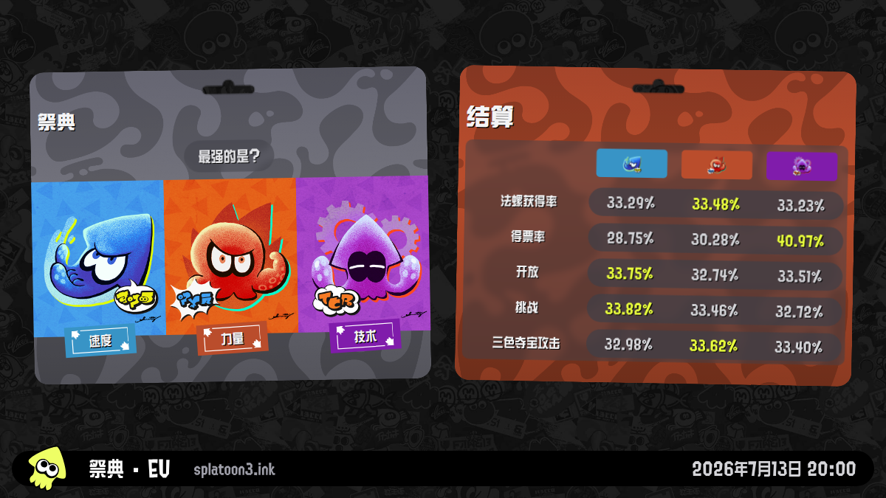</a><br><strong>祭典 · EU</strong><br><sub>Screenshot ID：<code>splatfest-eu</code></sub></td>
    <td align="center"><a href="./tests/golden/screenshots/linux-x64/zh-CN/splatfest-jp.png">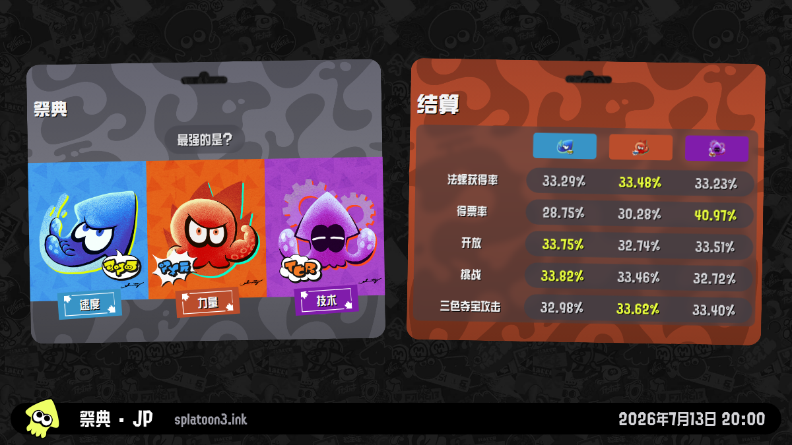</a><br><strong>祭典 · JP</strong><br><sub>Screenshot ID：<code>splatfest-jp</code></sub></td>
  </tr>
  <tr>
    <td colspan="3" align="center"><a href="./tests/golden/screenshots/linux-x64/zh-CN/splatfest-ap.png"></a><br><strong>祭典 · AP</strong><br><sub>Screenshot ID：<code>splatfest-ap</code></sub></td>
  </tr>
</table>

这些预览使用默认分辨率 `1200×675`；点击任意图片可以查看完整尺寸。`BOT_SCREENSHOT_RESOLUTION` 可以从四个精确的 16:9 尺寸中选择，并同时控制归档 Screenshot Artifact 与通知主图。LINE 与 WhatsApp 会各自使用独立的 `1024×576` 平台变体，使每个适配器能够单独落实自身限制，而不降低其他通知平台的画质。

### 选择要生成的截图

根据你的目的选择 Actions 表单：

1. **立即重跑生产任务：** 打开 **Splatoon3 Bot (every 2 hours)** 或 **Splatoon3 Bot (daily twice)**，点击 **Run workflow**。手动重跑与对应定时任务使用完全相同的固定 Screenshot ID。
2. **安全检查 Secrets 与路由：** 使用 **Check Bot Configuration**；它自动检查全部 ID 和目标，不上传、不发送。
3. **测试一条真实发送链路：** 使用 **Notification Channel smoke test**，选择一个 `screenshot_id` 和一个平台。

本地命令也接受同一组 ID，以逗号分隔即可。托管模板特意不再提供第二套多选表单；需要调整长期推送内容时，请直接修改 Fork 仓库中生产工作流的固定选项。

| Screenshot ID | 截图内容 |
| --- | --- |
| `schedules` | 普通、蛮颓、X 比赛或当前祭典模式的完整对战总览。 |
| `schedules-regular` | 只展示一般比赛的专题卡片。 |
| `schedules-anarchy` | 并列展示蛮颓比赛（挑战）与开放。 |
| `schedules-x` | 只展示 X 比赛的专题卡片。 |
| `challenges` | 当前或下一场活动比赛及可参加时段。 |
| `salmon-run` | 当前鲑鱼跑轮换。 |
| `gear-dailydrop` | 鱿鱼须商城的今日精选装备。 |
| `gear-regular` | 鱿鱼须商城当前在售装备。 |
| `gear-salmon-run` | 当前鲑鱼跑月度装备奖励。 |
| `splatfest-na` | 北美区域祭典。 |
| `splatfest-eu` | 欧洲区域祭典。 |
| `splatfest-jp` | 日本区域祭典。 |
| `splatfest-ap` | 亚太区域祭典。 |

系统会自动去重并按固定顺序处理，因此工作流声明顺序或 CLI 参数顺序不会改变 Bot Run 的结果。

> [!IMPORTANT]
> 地区祭典 Screenshot ID 选择的是 Nintendo 的数据区域：`NA`、`EU`、`JP` 或 `AP`。它与 `BOT_LOCALE` 无关；后者只改变截图中的翻译文案。为避免定时任务反复发送陈旧祭典，地区祭典仅在进行中、即将开始或结束未满 72 小时时可用。超出窗口的选项会在构建前记录原因并自动跳过；其他已选 ID 照常继续，若全部不可用则本次运行会作为正常 no-op 成功结束。

## 自动化

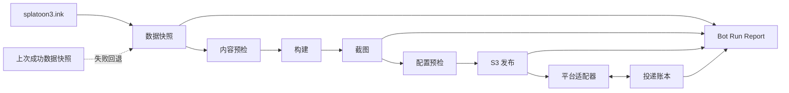

每次定时或手动触发都执行同一个两阶段 Bot Run：

1. **准备**：获取并校验一份完整、口径一致的数据；仅当上游不可用时回退到上一次校验成功的数据，继续排除已过期内容，再构建截图页面并归档本次运行。
2. **发布并通知**：恢复私有投递账本，在首次上传前检查全部配置，把截图和内置图标发布到 S3，再并行发送到每个已配置目标；失败 Job 重跑时保留已成功的 Delivery ID。

每次运行都会生成不含凭据的 `run-report.json`，并在 Actions Summary 展示完整 **Bot Run Report**：数据是 fresh 还是 fallback、快照时间与年龄、请求/实际生成/跳过的 Screenshot ID、S3 图片链接与尺寸和字节数、每个 Target 的路由与投递结果、尝试次数、可取得的平台 Request ID，以及可直接执行的排查建议。没有可用内容时会明确记录为成功 no-op；如果准备阶段很早就失败，也会明确记录“尚未取得已校验 Data Snapshot”，而不会让报告一起消失。

| 工作流 | 何时运行 | 发送内容 |
| --- | --- | --- |
| `bot-schedules.yml` | 除 `02:00`、`10:00` 外的每个 UTC 偶数小时，或按需手动重跑 | `schedules` |
| `bot-salmon-run.yml` | UTC `02:00`、`10:00`，或按需手动重跑 | `schedules`、`salmon-run`、`gear-dailydrop`、`gear-regular`、`gear-salmon-run` |
| `configuration-check.yml` | 按需手动运行 | 检查全部 Screenshot ID 和已配置目标，不上传、不发送 |
| `notification-smoke.yml` | 按需手动运行 | 发布一个选定的 Screenshot ID，并通过一个选定平台发送 |

两条定时入口合计每两小时发送一次日程且不会重复。两个生产工作流还提供无参数的 **Run workflow** 按钮，因此手动重跑不会意外改变对应的 Run Selection。第三方 Actions 均固定到不可变 Commit SHA；仅支持 GitHub Actions 作为托管自动化平台。

### 自定义定时推送

在安装仓库默认分支中修改 `.github/workflows/bot-schedules.yml` 与 `.github/workflows/bot-salmon-run.yml` 的 `on.schedule` cron 表达式，即可决定各模式的推送时间。GitHub 按 UTC 解释这些表达式。`BOT_TIME_ZONE` 只改变截图和消息中显示的时间，不会改变 Actions 的启动时刻。

GitHub 不允许在 `on.schedule.cron` 中读取 Repository Variables 或 Secrets，因此这里没有定时 Variable。可以参考 GitHub 官方的 [`on.schedule` 语法](https://docs.github.com/en/actions/reference/workflows-and-actions/workflow-syntax#onschedule)，并用 [crontab.guru](https://crontab.guru/) 辅助生成表达式。每日两次的工作流也包含对战日程；除非确实需要重复消息，否则不要让它与仅发送日程的工作流重叠。

[截图目录](#全部十三个-screenshot-id)同时也是完整的 Screenshot ID 可选清单。它遵循上游 [截图路由](https://github.com/misenhower/splatoon3.ink/blob/main/src/router/screenshots.js)；每张选中的图片都会进入 Bot Run 归档并发布到 S3，再由各平台适配器渲染为原生模板卡片、Embed、图片消息或消息模板。

## 配置

在私有安装仓库的 <kbd>Settings</kbd> → <kbd>Secrets and variables</kbd> → <kbd>Actions</kbd> 中配置。**Secrets 用来保存凭据，Variables 只用来调整可选行为；不要把凭据放进 Variable。**

| 配置层 | GitHub 设置 | 必填 |
| --- | --- | :---: |
| 渲染与工作流选项 | Repository Variables | 否，内置稳定默认值 |
| 图片发布 | Repository Secret `S3_CONFIG` | 是 |
| 消息目的地 | 任一 `BOT_*_CONFIG` Repository Secret | 否；如需发送消息，至少添加一个 |

### Repository Variables

工作流已经为每个 Repository Variable 提供稳定默认值，因此以下 Variable **全部可选**；只有需要覆盖默认行为时才添加。内置语言和时区分别是 `zh-CN` 与 `Asia/Shanghai`。

| Variable | 必填 | 可选值 / 默认值 | 用途 |
| --- | :---: | --- | --- |
| `BOT_LOCALE` | 否 | 下表列出的 14 个值；默认 `zh-CN` | 同时控制截图与通知文案语言。 |
| `BOT_SCREENSHOT_RESOLUTION` | 否 | `1200x675`、`1920x1080`、`2400x1350`、`3840x2160`；默认 `1200x675` | 归档截图与主要通知图片的精确尺寸。 |
| `BOT_TIME_ZONE` | 否 | IANA 时区；默认 `Asia/Shanghai` | 截图和通知共用的时区。 |
| `BOT_SCREENSHOT_ATTRIBUTION` | 否 | 最多 40 字符；默认 `splatoon3.ink` | 截图底栏的中立署名。 |
| `BOT_RUNNER` | 否 | 默认 `ubuntu-24.04` | 两个运行阶段使用的 GitHub Actions Runner。 |
| `BOT_ARTIFACT_RETENTION_DAYS` | 否 | `1`–`90`；默认 `7` | 单次运行归档的保留天数。 |

#### `BOT_LOCALE`

选择一个值，同时控制截图与通知消息中的文案：

| 值 | 语言 | 地区或文字变体 |
| --- | --- | --- |
| `de-DE` | 德语 | 德国 |
| `en-GB` | 英语 | 英国 |
| `en-US` | 英语 | 美国 |
| `es-ES` | 西班牙语 | 西班牙 |
| `es-MX` | 西班牙语 | 墨西哥 |
| `fr-CA` | 法语 | 加拿大 |
| `fr-FR` | 法语 | 法国 |
| `it-IT` | 意大利语 | 意大利 |
| `ja-JP` | 日语 | 日本 |
| `ko-KR` | 韩语 | 韩国 |
| `nl-NL` | 荷兰语 | 荷兰 |
| `ru-RU` | 俄语 | 俄罗斯 |
| `zh-CN` | 中文 | 简体 |
| `zh-TW` | 中文 | 繁体 |

Bot 截图与通知运行链路支持全部 14 个值；面向运维者的 README 与仓库截图预览仍有意只维护中、英、日三种语言。

#### `BOT_SCREENSHOT_RESOLUTION`

| 分辨率 | 缩放 | 适用场景 |
| --- | :---: | --- |
| `1200x675` | 1× | 默认值；生成最快、上传与存储最小 |
| `1920x1080` | 1.6× | Full HD，上传与存储开销适中 |
| `2400x1350` | 2× | 更高清，上传与存储开销更大 |
| `3840x2160` | 3.2× | 4K 原图，归档和上传更大 |

默认值与 README 预览保持一致，同时减少 Actions 用时、S3 存储和消息加载开销；只有确实需要更高清的主图或归档时才建议调高。所选尺寸会同时用于归档截图、`notification-images/` 对象和主要消息图片。LINE 使用独立且不超过 `1 MB` 的 `1024×576` 图片；它正好是 LINE `1024×1024` Flex 图片硬限制内最大的无裁切 16:9 矩形。WhatsApp 则使用独立、符合 `5 MB` 媒体限制的 `1024×576` 图片。两个平台的查看按钮仍会打开所选分辨率的主要图片。

对战日程、活动比赛、鲑鱼跑、装备与祭典图标都由仓库内置资源生成，并按内容哈希自动发布到 S3；用户不需要另行准备公共图标 URL。

### `S3_CONFIG`

GitHub Actions 会在工作流内部生成截图，但 GitHub Artifact 是需要鉴权下载的归档，并不是企业微信、Discord、LINE 等平台可以直接嵌入消息卡片的公网图片。因此发布阶段需要经过以下流程：

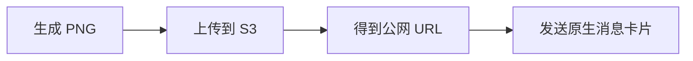

只有生成的图片需要允许公网读取；S3 写入凭据始终只保存在私有安装仓库的 Repository Secret 中。

#### 配置 Secret

创建 Repository Secret `S3_CONFIG`，值为一份 YAML 对象。请将占位内容替换为服务商实际提供的值；其中 `publicBaseUrl` 必须是消息平台无需凭据即可读取的公网 HTTP 或 HTTPS 根地址：

```yaml
bucket: splatoon-assets
publicBaseUrl: https://splatoon.example.com
accessKeyId: your-s3-access-key
secretAccessKey: your-s3-secret-access-key
```

| 字段 | 要求 | 默认值 | 说明 |
| --- | :---: | --- | --- |
| `bucket` | 必选 | — | 目标 Bucket 名称。 |
| `publicBaseUrl` | 必选 | — | 无凭据、可公网访问的 HTTP 或 HTTPS Bucket 根地址/CDN 地址；建议使用 HTTPS，LINE 与 WhatsApp 强制要求 HTTPS；不要包含 `keyPrefix`。 |
| `accessKeyId` | 必选 | — | 拥有上传权限的专用 S3 Access Key；允许对象检查时可避免重复上传内置图标。 |
| `secretAccessKey` | 必选 | — | 与 `accessKeyId` 配对的 Secret Key。 |
| `region` | 可选 | `us-east-1` | 使用服务商签名 Region；R2 使用 `auto`。 |
| `endpoint` | 可选 | 未设置 | R2、MinIO、又拍云 S3 等兼容服务需要填写。 |
| `forcePathStyle` | 可选 | AWS SDK 默认值（`false`） | MinIO 与又拍云 S3 通常设为 `true`。 |
| `keyPrefix` | 可选 | 未设置 | 为所有对象增加命名空间。 |
| `sessionToken` | 可选 | 未设置 | 仅临时凭据需要。 |

`endpoint` 是需要凭据的上传 API，`publicBaseUrl` 是消息平台无需凭据即可读取图片的 HTTP(S) 根地址；两者经常不是同一个域名。

<details>
<summary><strong>选择服务商：官方配置入口</strong></summary>

发布器使用标准 S3 API，不绑定单一服务商。优先选择你已经信任或正在使用的服务：

| 服务 | 常见部署方式 | 官方配置入口 |
| --- | --- | --- |
| AWS S3 / CloudFront | AWS 托管存储与 CDN | [创建 Bucket](https://docs.aws.amazon.com/AmazonS3/latest/userguide/GetStartedWithS3.html#creating-bucket) · [管理 Access Key](https://docs.aws.amazon.com/IAM/latest/UserGuide/id_credentials_access-keys.html) · [CloudFront OAC](https://docs.aws.amazon.com/AmazonCloudFront/latest/DeveloperGuide/private-content-restricting-access-to-s3.html) |
| Cloudflare R2 | Cloudflare 存储与自定义域名 | [快速开始](https://developers.cloudflare.com/r2/get-started/) · [API Token](https://developers.cloudflare.com/r2/api/tokens/) · [公开 Bucket](https://developers.cloudflare.com/r2/buckets/public-buckets/) |
| Backblaze B2 | 托管 S3 兼容对象存储 | [S3 兼容 API](https://www.backblaze.com/docs/cloud-storage-s3-compatible-api) · [Application Key](https://www.backblaze.com/docs/cloud-storage-create-and-manage-app-keys) |
| DigitalOcean Spaces | DigitalOcean 项目的托管对象存储 | [S3 兼容性](https://docs.digitalocean.com/products/spaces/reference/s3-compatibility/) · [Access Key](https://docs.digitalocean.com/products/spaces/how-to/manage-access/) |
| Wasabi | 托管 S3 兼容对象存储 | [服务地址与 Region](https://docs.wasabi.com/docs/service-urls-for-wasabis-storage-regions) · [Access Key](https://docs.wasabi.com/docs/creating-a-user-account-and-access-key) |
| Scaleway Object Storage | Scaleway Region 中的 S3 兼容存储 | [AWS CLI / S3 配置](https://www.scaleway.com/en/docs/object-storage/api-cli/object-storage-aws-cli/) |
| Tigris | 全球分布式 S3 兼容存储 | [S3 SDK 配置](https://www.tigrisdata.com/docs/sdks/s3/) |
| MinIO / AIStor | 自托管或私有云 S3 | [创建 Bucket](https://docs.min.io/aistor/reference/cli/mc-mb/) · [创建 Access Key](https://docs.min.io/aistor/reference/cli/admin/mc-admin-accesskey/mc-admin-accesskey-create/) |
| 阿里云 OSS | 支持 S3 兼容接口的阿里云对象存储 | [Amazon S3 兼容性](https://www.alibabacloud.com/help/en/oss/developer-reference/compatibility-with-amazon-s3) |
| 腾讯云 COS | 支持 AWS S3 SDK 的腾讯云对象存储 | [AWS S3 SDK 配置](https://www.tencentcloud.com/document/product/436/41284) |
| 又拍云 S3 | 通过 S3 兼容 API 使用又拍云存储 | [AWS S3 兼容说明](https://help.upyun.com/knowledge-base/aws-s3%E5%85%BC%E5%AE%B9/) · [S3 API](https://help.upyun.com/knowledge-base/s3-api/) |

</details>

#### 机器人会上传什么

如果配置了 `keyPrefix`，它会位于以下目录之前：

| 对象目录 | 内容 | 用途与保留建议 |
| --- | --- | --- |
| `notification-images/<sha256>/` | 按 `BOT_SCREENSHOT_RESOLUTION` 精确尺寸优化的主要图片 | 企业微信、Discord、Telegram、QQ、飞书、钉钉与 Slack 直接展示；通知查看按钮也打开该图片。 |
| `line-images/<sha256>/` | LINE 专用 `1024×576` PNG，仅在必要时自适应转换为调色板 PNG | 供 LINE 展示；保持完整 16:9 画面，低于 `1024×1024` 硬限制，并达到官方建议的 `1 MB` 以内目标。 |
| `whatsapp-images/<sha256>/` | WhatsApp 专用 `1024×576` PNG | 用作已审批媒体模板的图片 Header，并保持在 WhatsApp 的 `5 MB` 图片限制以内。 |
| `originals/<sha256>/` | 所选分辨率下未经重新压缩的截图原始文件 | 用于高清归档和 Publication Manifest 校验；不需要长期保存原始归档时，可以配置更短的生命周期。 |
| `branding-icons/<sha256>/` | 内置的日程、活动比赛、鲑鱼跑、装备和祭典小图标 | 用于消息卡片标题或头像；由机器人自动上传并复用，通常可以长期保留。 |

> [!NOTE]
> `<sha256>` 是根据文件内容计算出的摘要。同一张图片内容不变时会复用原 URL；内容变化时才生成新 URL。这样后续运行不会悄悄替换历史消息中已经展示的图片。

更多最小权限、公网 URL 和服务商注意事项见 [S3 运维指南](./docs/operator-setup-links.md#s3-compatible-publication)。

> [!TIP]
> 图片内容变化时会创建新版本，而不是覆盖旧 URL。可以按目录配置生命周期：`notification-images/`、`line-images/` 与 `whatsapp-images/` 的保留时间取决于历史消息需要展示多久，`originals/` 只需保留到原始归档不再需要，体积很小且会复用的 `branding-icons/` 通常无需清理。

## 通知平台

为每个需要使用的平台创建一个 Repository Secret。Secret 存在且非空时，对应适配器自动启用；没有配置的平台保持关闭。

每个平台 Secret 都是一份 YAML 数组。数组中的每一项代表一个消息目标（**Target**），并且需要唯一的 `name`，因此同一个 Secret 可以配置多个群、频道、用户或 Webhook。

路由分为两步：

1. **本次运行选择生成什么。** 生产工作流在代码中固定选择，定时触发与手动重跑完全一致；Smoke Test 从下拉框中选择一个 ID。
2. **`screenshotIds` 选择某个目标接收什么。** 只有该目标需要接收一部分内容时，才在目标内部添加这个字段。

> **实际投递内容 = 本次运行生成的 ID ∩ 目标的 `screenshotIds`。** 省略 `screenshotIds` 时，该目标接收本次运行实际生成的全部内容。

交集为空时，该目标不会收到消息。如果一个平台的全部目标都不匹配，普通生产运行会将该平台标记为跳过；Smoke Test 因为明确指定了要验证的平台，会在没有匹配目标时提前失败，避免产生“测试成功但没有发送”的假象。

各目标相互独立并行发送，同一目标内仍保持操作顺序。每次发送前，私有投递账本都会检查稳定 Delivery ID：同一次 Bot Run 中已成功的操作直接保留，只有失败项才会重试。后续的定时 Bot Run 即使内容恰好未变，也会照常发送周期通知。账本通过 GitHub Actions Cache 恢复与保存，不会上传到公开 S3 地址。

#### 所有平台通用的 Target 字段

| 字段 | 必填 | 默认值 | 用途 |
| --- | :---: | --- | --- |
| `name` | 是 | — | 同一平台 Secret 内唯一的目标名，会出现在预检与 Bot Run Report 中。 |
| `screenshotIds` | 否 | 本次实际 Run Selection | 只把列出的 Screenshot ID 路由到该目标。 |
| `mode` | 否 | `individual` | `individual` 为每条 Notification 发送一条原生消息；`digest` 请求平台原生的多内容摘要。 |
| `alerts` | 否 | 关闭 | 为路由到该目标的 Screenshot ID 开启状态变化提醒。 |

Digest 不是把通用文本粗暴拼接起来，而是由 Adapter 选择平台原生形式：

| 平台 | `mode: digest` 的实际表现 |
| --- | --- |
| Discord | 单条消息最多十个富 Embed；更多内容自动继续下一条。 |
| LINE | Flex Message Carousel，每个 Carousel 最多十二张 Bubble。 |
| 钉钉 | FeedCard，多于单条预算时自动拆分。 |
| Slack | 一条紧凑的多内容 Block Kit 消息。 |
| 企业微信 | 摘要 Template Card；超过十项时拆分且不丢内容。 |
| Telegram、QQ、飞书 / Lark、WhatsApp | 明确回退为逐条发送；Bot Run Report 会保留实际结果。 |

下面的 Discord Target 会把五类周期消息合成 Digest，同时订阅重要状态变化：

```yaml
- name: daily-digest
  screenshotIds: [challenges, salmon-run, gear-dailydrop, gear-regular, splatfest-na]
  mode: digest
  alerts:
    includePeriodic: true
    challengeReminderMinutes: [60, 15]
    bigRun: true
    randomWeapons: true
    splatfest: true
    gearWatchlist:
      primaryPowerIds: [从数据快照取得的能力_ID]
  webhookUrl: https://discord.com/api/webhooks/替换为_ID/替换为_TOKEN
```

| `alerts` 字段 | 必填 | 含义 |
| --- | :---: | --- |
| `includePeriodic` | 否 | 默认 `true`；设置为 `false` 时，该 Target 只接收 Event Alert。 |
| `challengeReminderMinutes` | 否 | 不重复的正整数分钟阈值，例如 `[60, 15]`；进入最近一个阈值窗口时形成一次状态提醒。 |
| `bigRun` | 否 | 当前 Big Run 轮换只提醒一次。 |
| `randomWeapons` | 否 | 当前鲑鱼跑轮换包含随机武器时只提醒一次。 |
| `splatfest` | 否 | 区域祭典开始、结束和结果可用时提醒。 |
| `gearWatchlist.gearIds` | 否 | 匹配当前 SplatNet 装备库存的稳定装备 ID。 |
| `gearWatchlist.primaryPowerIds` | 否 | 匹配当前库存的稳定主能力 ID；出现 `gearWatchlist` 时，装备或能力列表至少填写一个。 |

只有相关 Screenshot ID 同时存在于本次有效 Run Selection 与该 Target 路由中，Event Alert 才会参与判断。目前支持 Challenge 提前提醒、Big Run、全随机武器、祭典开始/结束/结果，以及装备关注清单。稳定身份来自事件状态而不是每次重新生成的图片 URL，因此状态没有变化就不会重复发送。Event Alert 始终单独投递，使每个状态变化都有独立的重试结果；`mode` 只控制周期性基础 Notification。设置 `alerts.includePeriodic: false` 可以建立“只收提醒”的 Target；默认 `true` 表示在周期消息之外追加提醒。装备关注使用归档 `data/gear.json` 与 locale 文件中的稳定 `__splatoon3ink_id`。

| 内容 | `screenshotIds` 可填写的值 |
| --- | --- |
| 对战日程 | `schedules`、`schedules-regular`、`schedules-anarchy`、`schedules-x` |
| 活动比赛 | `challenges` |
| 鲑鱼跑 | `salmon-run` |
| 装备 | `gear-dailydrop`、`gear-regular`、`gear-salmon-run` |
| 各区域祭典 | `splatfest-na`、`splatfest-eu`、`splatfest-jp`、`splatfest-ap` |

| 平台 | 原生消息形式 | Repository Secret | 官方配置 |
| --- | --- | --- | --- |
| 企业微信 | `news_notice` 模板卡片 | `BOT_WECOM_CONFIG` | [群机器人](https://developer.work.weixin.qq.com/document/path/91770) |
| Discord | 图片 Embed | `BOT_DISCORD_CONFIG` | [Incoming Webhook](https://support.discord.com/hc/en-us/articles/228383668-Intro-to-Webhooks) |
| Telegram | 图片、HTML、URL 按钮 | `BOT_TELEGRAM_CONFIG` | [BotFather](https://core.telegram.org/bots/features#botfather) |
| QQ 群聊 / 单聊 | 自定义 Markdown | `BOT_QQ_CONFIG` | [QQ 官方机器人](https://bot.q.qq.com/wiki/develop/api-v2/dev-prepare/getting-started.html) |
| 飞书 / Lark | Card Schema 2.0 | `BOT_FEISHU_CONFIG` | [自定义机器人](https://open.feishu.cn/document/client-docs/bot-v3/add-custom-bot) |
| 钉钉 | ActionCard | `BOT_DINGTALK_CONFIG` | [自定义机器人](https://open.dingtalk.com/document/robots/custom-robot-access) |
| WhatsApp | 已审批媒体模板 | `BOT_WHATSAPP_CONFIG` | [Cloud API](https://developers.facebook.com/documentation/business-messaging/whatsapp/get-started) |
| LINE | Flex Message | `BOT_LINE_CONFIG` | [Messaging API](https://developers.line.biz/en/docs/messaging-api/getting-started/) |
| Slack | Block Kit | `BOT_SLACK_CONFIG` | [Incoming Webhooks](https://docs.slack.dev/messaging/sending-messages-using-incoming-webhooks/) |

#### Secret 字段速查

字段名区分大小写。每个目标都可以使用可选的 `screenshotIds`、`mode` 与 `alerts`；下表重复列出它们，方便单独查看任意平台配置。

| Repository Secret | 每个消息目标的必选字段 | 可选字段 |
| --- | --- | --- |
| `BOT_WECOM_CONFIG` | `name`、`webhookUrl` | `screenshotIds`、`mode`、`alerts` |
| `BOT_DISCORD_CONFIG` | `name`、`webhookUrl` | `screenshotIds`、`mode`、`alerts`、`username`、`avatarUrl` |
| `BOT_TELEGRAM_CONFIG` | `name`、`botToken`、`chatId` | `screenshotIds`、`mode`、`alerts`、`messageThreadId`、`disableNotification` |
| `BOT_QQ_CONFIG` | `name`、`appId`、`clientSecret`、`targetType`（`group` 或 `user`）、`targetId` | `screenshotIds`、`mode`、`alerts` |
| `BOT_FEISHU_CONFIG` | `name`、`webhookUrl` | `screenshotIds`、`mode`、`alerts`、`secret` |
| `BOT_DINGTALK_CONFIG` | `name`、`webhookUrl` | `screenshotIds`、`mode`、`alerts`、`secret` |
| `BOT_WHATSAPP_CONFIG` | `name`、`accessToken`、`phoneNumberId`、`recipientPhoneNumber`、`templateName`、`languageCode` | `screenshotIds`、`mode`、`alerts` |
| `BOT_LINE_CONFIG` | `name`、`channelAccessToken`、`targetType`（`user`、`group` 或 `room`）、`targetId` | `screenshotIds`、`mode`、`alerts`、`notificationDisabled` |
| `BOT_SLACK_CONFIG` | `name`、`webhookUrl` | `screenshotIds`、`mode`、`alerts` |

展开下面的平台即可取得可复制的 Secret 内容。保存到 **Settings → Secrets and variables → Actions** 前，请替换所有占位值。

<details>
<summary><strong>企业微信 · BOT_WECOM_CONFIG</strong> — 模板卡片与分类路由</summary>

一个 Secret 可以把对战、活动比赛、祭典、鲑鱼跑和装备分别发送到不同群机器人：

```yaml
- name: battle-schedules
  screenshotIds:
    - schedules
    - schedules-regular
    - schedules-anarchy
    - schedules-x
    - challenges
    - splatfest-na
    - splatfest-eu
    - splatfest-jp
    - splatfest-ap
  webhookUrl: https://qyapi.weixin.qq.com/cgi-bin/webhook/send?key=REPLACE_WITH_SCHEDULES_KEY
- name: daily-updates
  screenshotIds: [salmon-run, gear-dailydrop, gear-regular, gear-salmon-run]
  webhookUrl: https://qyapi.weixin.qq.com/cgi-bin/webhook/send?key=REPLACE_WITH_UPDATES_KEY
```

| 字段 | 必选 | 说明 |
| --- | --- | --- |
| `name` | 是 | 平台 Secret 内唯一、便于识别的目标名称，用于配置校验和发送报告。 |
| `screenshotIds` | 否 | 发送到此目标的 Screenshot ID；省略时接收本次 Run Selection 生成的全部内容。 |
| `webhookUrl` | 是 | 从企业微信复制的完整群机器人 Webhook，其中的 `key` 属于敏感凭据。 |

</details>

<details>
<summary><strong>Discord · BOT_DISCORD_CONFIG</strong> — 图片 Embed</summary>

Webhook 决定目标频道，显示名称和头像覆盖均为可选：

```yaml
- name: splatoon-community
  screenshotIds: [schedules]
  webhookUrl: https://discord.com/api/webhooks/123456789012345678/example-token
  username: Splatoon Bot
  avatarUrl: https://splatoon.example.com/bot-avatar.png
```

| 字段 | 必选 | 说明 |
| --- | --- | --- |
| `name` | 是 | 平台 Secret 内唯一的目标名称，用于校验和发送报告。 |
| `screenshotIds` | 否 | 此 Webhook 接收的 Screenshot ID 子集。 |
| `webhookUrl` | 是 | 完整的 Discord Incoming Webhook URL，URL 本身包含凭据。 |
| `username` | 否 | 此 Webhook 发送消息时使用的显示名称。 |
| `avatarUrl` | 否 | 用作 Webhook 头像的公网 HTTPS 图片。 |

</details>

<details>
<summary><strong>Telegram · BOT_TELEGRAM_CONFIG</strong> — 图片、HTML 说明与 URL 按钮</summary>

机器人必须已经能够向目标会话发消息；论坛话题还需要 `messageThreadId`：

```yaml
- name: community-topic
  screenshotIds: [schedules]
  botToken: "123456:example_bot_token"
  chatId: "-1001234567890"
  messageThreadId: 42
  disableNotification: false
```

| 字段 | 必选 | 说明 |
| --- | --- | --- |
| `name` | 是 | 平台 Secret 内唯一的目标名称。 |
| `screenshotIds` | 否 | 此会话或话题接收的 Screenshot ID 子集。 |
| `botToken` | 是 | BotFather 签发的机器人 Token，只应保存在 Repository Secret 中。 |
| `chatId` | 是 | 用户、群组、超级群组或频道 ID；YAML 中建议给负数 ID 加引号。 |
| `messageThreadId` | 否 | 超级群组内大于零的论坛话题 ID。 |
| `disableNotification` | 否 | `true` 表示静默发送；省略时使用 Telegram 默认行为。 |

</details>

<details>
<summary><strong>QQ · BOT_QQ_CONFIG</strong> — 群聊或单聊 Markdown</summary>

此定时适配器支持 QQ 群聊和单聊。QQ 频道要求独立维护在线 Gateway 长连接，因此频道目标会在配置预检时被拒绝：

```yaml
- name: official-group
  screenshotIds: [schedules]
  appId: "102000000"
  clientSecret: "example-client-secret"
  targetType: group
  targetId: GROUP_OPENID
```

| 字段 | 必选 | 说明 |
| --- | --- | --- |
| `name` | 是 | 平台 Secret 内唯一的目标名称。 |
| `screenshotIds` | 否 | 此群聊或用户接收的 Screenshot ID 子集。 |
| `appId` | 是 | QQ 官方机器人的 AppID。 |
| `clientSecret` | 是 | 用于获取访问令牌的机器人 ClientSecret。 |
| `targetType` | 是 | 群 OpenID 使用 `group`，用户 OpenID 使用 `user`。 |
| `targetId` | 是 | 从 QQ 官方交互事件中取得的群或用户 OpenID。 |

</details>

<details>
<summary><strong>飞书 / Lark · BOT_FEISHU_CONFIG</strong> — Card Schema 2.0</summary>

如果自定义机器人启用了签名校验，请同时填写签名 `secret`：

```yaml
- name: team-group
  screenshotIds: [schedules]
  webhookUrl: https://open.feishu.cn/open-apis/bot/v2/hook/REPLACE_WITH_HOOK_ID
  secret: "example-signing-secret"
```

| 字段 | 必选 | 说明 |
| --- | --- | --- |
| `name` | 是 | 平台 Secret 内唯一的目标名称。 |
| `screenshotIds` | 否 | 此群聊接收的 Screenshot ID 子集。 |
| `webhookUrl` | 是 | 从飞书或 Lark 复制的完整自定义机器人 Webhook。 |
| `secret` | 否 | 在机器人安全设置中启用签名校验时配置的签名密钥。 |

</details>

<details>
<summary><strong>钉钉 · BOT_DINGTALK_CONFIG</strong> — ActionCard</summary>

建议采用加签安全设置；仅使用关键词规则可能会拒绝机器人生成的消息：

```yaml
- name: team-group
  screenshotIds: [schedules]
  webhookUrl: https://oapi.dingtalk.com/robot/send?access_token=example-access-token
  secret: "SECexample-signing-secret"
```

| 字段 | 必选 | 说明 |
| --- | --- | --- |
| `name` | 是 | 平台 Secret 内唯一的目标名称。 |
| `screenshotIds` | 否 | 此群聊接收的 Screenshot ID 子集。 |
| `webhookUrl` | 是 | 包含 Access Token 的完整自定义机器人 Webhook。 |
| `secret` | 否 | 启用加签时使用的 `SEC...` 签名密钥。 |

</details>

<details>
<summary><strong>WhatsApp · BOT_WHATSAPP_CONFIG</strong> — 已审批媒体模板</summary>

请先创建并审批包含 `IMAGE` Header、命名 Body 参数和动态 URL 按钮的模板；按钮前缀必须等于 `S3_CONFIG.publicBaseUrl` 加 `keyPrefix`。此适配器要求 `publicBaseUrl` 使用 HTTPS：

```yaml
- name: personal-updates
  screenshotIds: [schedules]
  accessToken: "REPLACE_WITH_ACCESS_TOKEN"
  phoneNumberId: "123456789012345"
  recipientPhoneNumber: "8613800000000"
  templateName: splatoon_notification
  languageCode: zh_CN
```

| 字段 | 必选 | 说明 |
| --- | --- | --- |
| `name` | 是 | 平台 Secret 内唯一的目标名称。 |
| `screenshotIds` | 否 | 此已授权接收者接收的 Screenshot ID 子集。 |
| `accessToken` | 是 | 拥有对应 WhatsApp Business Account 权限的 Meta Cloud API Token。 |
| `phoneNumberId` | 是 | 已注册发送号码的数字 ID，不是对外显示的手机号码。 |
| `recipientPhoneNumber` | 是 | 已明确授权接收消息的 E.164 数字号码，不包含前导 `+`。 |
| `templateName` | 是 | 每次定时消息使用的已审批小写模板名称。 |
| `languageCode` | 是 | 模板已审批语言版本的精确代码，例如 `zh_CN`。 |

</details>

<details>
<summary><strong>LINE · BOT_LINE_CONFIG</strong> — Flex Message</summary>

目标必须具备 Push Message 接收资格，`S3_CONFIG.publicBaseUrl` 必须使用 HTTPS，并且 ID 前缀要与目标类型一致：

```yaml
- name: personal-chat
  screenshotIds: [schedules]
  channelAccessToken: "example-channel-access-token"
  targetType: user
  targetId: U0123456789abcdef0123456789abcdef
  notificationDisabled: false
```

| 字段 | 必选 | 说明 |
| --- | --- | --- |
| `name` | 是 | 平台 Secret 内唯一的目标名称。 |
| `screenshotIds` | 否 | 此接收者接收的 Screenshot ID 子集。 |
| `channelAccessToken` | 是 | 在 LINE Developers 签发的 Messaging API Channel Access Token。 |
| `targetType` | 是 | `user`、`group` 或 `room`。 |
| `targetId` | 是 | Webhook 事件中的来源 ID；按类型分别以 `U`、`C` 或 `R` 开头。 |
| `notificationDisabled` | 否 | `true` 时在 LINE 支持的场景下抑制用户通知。 |

</details>

<details>
<summary><strong>Slack · BOT_SLACK_CONFIG</strong> — 无障碍 Block Kit</summary>

每个 Incoming Webhook 都绑定到对应 Slack App 安装和目标频道：

```yaml
- name: team-channel
  screenshotIds: [schedules]
  webhookUrl: https://hooks.slack.com/services/T/B/key
```

| 字段 | 必选 | 说明 |
| --- | --- | --- |
| `name` | 是 | 平台 Secret 内唯一的目标名称。 |
| `screenshotIds` | 否 | 此频道接收的 Screenshot ID 子集。 |
| `webhookUrl` | 是 | Slack 或 Slack Gov 官方 Incoming Webhook URL，URL 本身属于凭据。 |

</details>

[平台配置指南](./docs/operator-setup-links.md#notification-adapters)进一步说明凭据前提、接收方规则和官方教程；[平台能力审计](./docs/notification-platform-capabilities.md)解释了各适配器的原生布局选择。

## 可靠性

如果你需要评估机器人是否适合长期无人值守运行，可以从以下保障入手：

- 数据下载带重试和超时；只有新数据完整通过 Schema 与 SHA-256 校验后才会替换 Actions Cache 中上次成功的快照。回退时会明确展示快照年龄，并继续跳过已过期的日程与活动。
- 截图会等待应用、字体和本地图片就绪，并检查语言、署名、尺寸、底栏位置和内容溢出。
- Run Manifest v6 记录所选 Screenshot ID，并精确记录“生成了什么”：语言、分辨率、时区、数据身份、文件名、尺寸和 SHA-256。
- Publication Manifest v8 记录同一组 Screenshot ID，并精确记录“发布了什么”：通知主图、LINE 与 WhatsApp 平台专用图、原图、内置图标和公网 URL。
- 配置预检会在首次上传前一次性汇总所有独立错误，而且不会输出 Secret 内容。
- Adapter 能力接口统一管理资源协议与图片变体、消息预算、原生 Digest 策略、重试/幂等能力和平台回执提取。
- 私有投递账本记录稳定 Delivery ID、尝试次数、成功/失败与平台 Request ID。重跑失败的发布 Job 时只重试失败项；中断后结果不明确的操作会主动停止，避免无记录的重复发送。
- Adapter 只会自动重试限流、临时服务端错误等“平台明确拒绝”的请求。网络异常导致投递结果无法确认时会记为 `uncertain`；非幂等平台会主动停止并提示人工核对，LINE 则可凭稳定 Retry Key 安全重试。
- `run-report.json` 与 Actions Summary 串联快照来源、请求/有效/跳过的 ID、图片 URL 和尺寸、全部 Channel/Target 结果与修复建议，而且不包含凭据。
- CI 扫描完整 Git 历史，并运行语法、单元、浏览器、视觉、构建、工作流策略与依赖审计。

结构性截图校验会用全部 Bot 语言分别生成十三张图片；中、英、日还分别维护 Linux 与 macOS 像素基线，像素差异超过 `0.1%` 即失败。

## 本地开发

本节仅供贡献者和需要本地调试的高级用户使用，模板用户可以完全跳过。普通用户通过模板创建安装仓库；希望提交 Pull Request 的贡献者则应 Fork 公开源仓库，以保留标准的 GitHub 协作历史。

要求 Node.js 24 LTS，以及 pnpm 11.18 或同一 Major 下更新版本。

```sh
git clone https://github.com/YOUR_GITHUB_USERNAME/splatoon3-bot.git
cd splatoon3-bot
git remote add upstream https://github.com/TenviLi/splatoon3-bot.git
corepack enable
pnpm install --frozen-lockfile --strict-peer-dependencies
pnpm run download-data
pnpm run verify
```

| 命令 | 用途 |
| --- | --- |
| `pnpm run bot:doctor <screenshot-ids> [channel]` | 校验配置；Screenshot ID 用逗号分隔，例如 `schedules,gear-regular`。 |
| `pnpm run bot:prepare <screenshot-ids>` | 下载、构建、截图并写入 Run Manifest。 |
| `pnpm run bot:publish <screenshot-ids>` | 校验并通过 S3 发布。 |
| `pnpm run bot:notify <screenshot-ids> [channel]` | 发送已配置的平台。 |
| `pnpm run bot:report` | 输出当前不含凭据的 Bot Run Report。 |
| `pnpm run bot:capabilities` | 输出经过机器校验的 Adapter 能力契约。 |
| `pnpm run test:update-golden` | 生成当前平台的中、英、日截图基线。 |
| `pnpm run screenshots:contact-sheet -- --locale zh-CN` | 从当前平台的 Golden 生成包含全部截图类型和名称的总览图；通过 `--help` 查看布局与输出选项。 |
| `pnpm run verify` | 运行完整本地验证。 |
| `pnpm run verify:actions` | 通过 OrbStack 与 `act` 验证 Linux Actions。 |

## 参与贡献

请保持截图和通知结果可复现，维护 Run Plan 与 Manifest 的边界，并为行为变化更新相应契约测试。完整流程见 [CONTRIBUTING.md](./CONTRIBUTING.md)；安全漏洞请按 [SECURITY.md](./SECURITY.md) 私下报告。

## 许可证

本项目以 [GNU General Public License v3.0](./LICENSE) 发布，是非官方同人项目，与 Nintendo 无隶属或背书关系。

本项目的 Vue 应用代码源自 [misenhower/splatoon3.ink](https://github.com/misenhower/splatoon3.ink)，谨向原项目的维护者与贡献者致谢；其 MIT 许可证声明完整保留于 [THIRD_PARTY_NOTICES.md](./THIRD_PARTY_NOTICES.md)。
